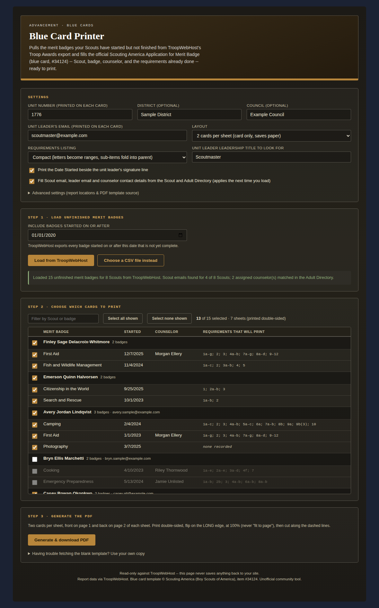

# Blue Card Printer

A single-file custom page for TroopWebHost that runs TroopWebHost's own **Troop Awards "Blue Cards" export** (every merit badge your Scouts have started but not yet completed), lets a leader check off which ones to print, then fills the official Scouting America **Application for Merit Badge** ("blue card", item #34124, fillable PDF) with the Scout's name and address, the badge, the counselor (when one is assigned), and the requirements already completed. It hands back a finished, ready-to-print PDF.



Restricted: the export lives on TroopWebHost's Awards menu. A login without access is detected automatically (TroopWebHost redirects it) and shown a plain "restricted" message. You can still use the tool with a CSV that someone with access downloaded (**Choose a CSV file instead**).

## Required roles

| Report | Menu_Item_ID | Needed for | Roles that can reach it |
|---|---|---|---|
| Export Troop Awards Advancement Files (Blue Cards) | 45954 (Form_ID 1689 -> 1690) | Required (or use a CSV file instead) | **Not yet verified.** It sits in the same Awards menu group as Pending Awards (45952, Adult Leader / Rank Advancement), so those are the likely roles. |
| Scout Directory | 46012 | Optional (Scout email) | Adult, Scout, Membership, Rank Advancement |
| Adult Directory | 46013 | Optional (leader email, counselor contact details) | Adult, Scout, Membership, Rank Advancement |

The Blue Cards row could not be checked from the files this tool was built from (a HAR capture and a sample CSV carry no role information). To confirm it, match `Menu_Item_ID` 45954 in your site's **Task Menu Items** export against the **Task Role** export, the same way the other tools' tables were built. A site administrator can change which tasks each role holds (**Menu > Administration > Security Configuration > Assign Tasks to Roles**), so confirm against your own site.

The two directory lookups are pure enrichment. If either is unavailable the cards are still produced with those boxes left blank, and the page says which lookup was skipped.

## What it does

1. **Settings.** Unit number auto-fills from the page title (e.g. "Troop 123 Town" -> `123`). Council and District are not available from TroopWebHost, so they are one-time manual settings remembered in your browser. Everything on the page saves itself as you change it.
2. **Step 1 - Load.** Pick a "started on or after" date (default: Jan 1 of six years ago) and click **Load from TroopWebHost**. The page performs the same three requests your browser makes on the Troop Awards export page and reads the CSV that comes back.
3. **Step 2 - Choose.** Badges are grouped by Scout. Tick individual badges, a whole Scout, or use the filter box with **Select all / none shown**. The last column previews exactly which requirement labels will print.
4. **Step 3 - Generate.** Downloads one PDF. A single card is named `<Scout> <Badge> <Unit>.pdf` (the pattern the form's own instructions suggest); several cards download as `Blue_Cards.pdf`.

### What gets printed

| On the card | Comes from |
|---|---|
| Name (all three panels), Address, City/State/Zip | CSV: `ScoutName`, `ScoutAddress`, `ScoutCity`/`ScoutState`/`ScoutZip` |
| Merit badge (all three panels) | CSV: `MeritBadge` (a trailing `*` Eagle marker is stripped) |
| Requirement grid | CSV: `CompletedRequirements` (see below) |
| Name of counselor | CSV: `CounselorName` (blank for most badges) |
| Counselor address, city/zip, phone, email | Adult Directory, only if the counselor is a registered adult in your troop |
| Scout email | Scout Directory (matched by name; `Email`, else `Email #2`) |
| Unit number, District, Council | Settings |
| Leader's email | Settings, or auto-detected from the Adult Directory |
| Date beside the unit leader's signature line | CSV: `DateStarted` (optional checkbox, on by default) |

**Left blank on purpose:** signatures, *Counselor Initial*, *Date of approval*, *Date completed*. Those are for people to write.

### The requirement grid

The card has 22 requirement columns. TroopWebHost can record far more items than that (a nearly finished First Aid badge has ~97), so the default **Compact** listing:

- treats a listed parent as covering its children (`03.` plus `03.a`-`03.e` -> `3`; `2.b` plus `2.b.01`-`2.b.03` -> `2b`),
- turns runs of letters into ranges (`01.a`...`01.g` -> `1a-g`, `5.a`,`5.c` -> `5a,c`),
- keeps unfinished sub-items visible (`09.b.1`,`09.b.3`,`09.b.4` with no `09.b` -> `9b(1,3-4)`),
- folds runs of three or more whole requirements (`11.`-`14.` -> `11-14`).

The top block of the card (template columns 12-22) fills first, then the bottom block (columns 1-11). Anything that still does not fit is written into the Counselor's Record **Remarks** box as "Also completed: ..." and flagged in the table, never silently dropped. **As recorded** mode skips the compaction and prints one cell per recorded item.

### Layout

- **2 cards per sheet (default):** crops just the card strip out of each template page and stacks two per sheet, front on page 1 and back on page 2. The template's instruction text is left off. This uses half the cardstock.
- **1 card per page:** the whole template page (card plus the instructions text), front then back.

Either way: print **double-sided, flip on the long edge, at 100%** (not "fit to page"), then cut along the dashed lines. Print one test sheet before a big batch.

## Installation

1. Open `blue-card.html` and copy its entire contents.
2. In TroopWebHost, go to **Manage Custom Pages**.
3. Create a new Custom Page (or edit an existing one) and paste the whole block into the HTML editor.
4. Save, then open the page.

This only works pasted directly into TroopWebHost's own site (same-origin) because it relies on your logged-in session. It will not work in an external site or a local preview.

The blank template is fetched at run time from this repo's staged copy, `blue-card-template.pdf` in this folder (via `raw.githubusercontent.com`, which allows cross-origin reads). No stable official Scouting America URL for the *fillable* version was identified, so none is assumed. If that fetch is ever blocked, use the file picker under Step 3 to supply your own copy of the fillable #34124 PDF. It is the same file. The staged PDF's own metadata credits Tom Stalnaker, Chester County Council, as author of this fillable version; the form content is (c) Scouting America.

## Endpoints used

Reverse-engineered from a captured HAR, not from documentation.

| Purpose | Request | Read/Write |
|---|---|---|
| Prompt page (date + button) | `GET FormDetail.aspx?Menu_Item_ID=45954&Stack=2` | Read |
| Run the export | `POST FormDetail.aspx` (the page's own `<form id="easyform">`, "Started Since" date set, button `BUTTON7` "Download Blue Cards File") -> `302` -> `FormCSV.aspx?Menu_Item_ID=45954&Form_ID=1690&Stack=2&ID=1&FK=0` | Read (generates a file; saves nothing) |
| Scout Directory | `FormReport.aspx?Menu_Item_ID=46012&Stack=1&ReportFormat=XLS` | Read |
| Adult Directory | `FormReport.aspx?Menu_Item_ID=46013&Stack=1&ReportFormat=XLS` | Read |

The CSV has the columns `ScoutName, MeritBadge, DateStarted, ScoutAddress, ScoutCity, ScoutState, ScoutZip, CounselorName, CompletedRequirements` (requirements separated by `;`).

Every ID has a matching field under **Advanced settings**, so nothing needs editing in the file.

## Implementation notes (durable warnings, not just history)

- **A redirect means two different things here.** Elsewhere in this repo `res.redirected` means "access denied". This export is the exception: a successful POST *is* a `302` to `FormCSV.aspx`. So the initial page GET treats any redirect as denied, and the POST treats a redirect as denied only if it does not land on `FormCSV.aspx`. Do not "fix" this to the usual rule.
- **The date box and the button are found by label, not by hard-coded `ENTRY` id.** The row containing "Started Since" is located on the fetched page (falling back to the only `ENTRY` text box), and the button by its "Blue Cards" title. The whole `easyform` is then serialized with `FormData`, so every hidden field (`Pass`, `Current_URL`, `OLD...`, the radios) travels exactly as the browser sends it. The POST this tool builds was checked field-for-field against the browser's own POST in the HAR (22 of 22 fields identical).
- **The CSV is parsed by a small RFC 4180 parser, not SheetJS.** A spreadsheet library would coerce cells: `10.` could become the number `10`, `01.a` and zero-padded tokens are at risk, and `DateStarted` could collapse to a 2-digit year.
- **Text is decoded as UTF-8 with a Windows-1252 fallback**, so an accented name never turns into replacement characters. Characters outside what the PDF's standard font can encode are transliterated or replaced with `?` rather than aborting a whole batch.
- **`DateStarted` keeps its calendar date.** Values like `5/19/2024 11:59:00 PM` are not time-zone converted.
- **pdf-lib gotchas found with this template (all handled in `bcpFlatten`):**
  - `Remarks1` is a *rich-text* field. pdf-lib refuses to regenerate its appearance unless it has been set, so it is always set (to `''` when unused).
  - `form.flatten()` deletes the template's kid widgets but leaves their references in each page's `/Annots`, producing a file with dangling references (poppler prints "Invalid XRef entry"). They are pruned after flattening.
  - `embedFont` writes the font dictionary only at `save()`. Embedding pages from an unsaved document leaves font references dangling and the text vanishes, so each flattened card is round-tripped through `save()` + `load()` first.
  - Requirement cells are rotated 90 degrees, so available text length is the widget's *height*, not its width.
- **Blank card + tiny overlays.** The blank flattened template is embedded once per PDF; each card is only a text overlay (page content and resources stripped before filling) drawn on top. A 15-card job is under 1 MB instead of ~3 MB, and it scales to a whole troop.
- **Name matching between the CSV and the directories** compares word tokens ("First Middle Last" vs "Last, First"), supports multi-word surnames and directory nicknames, ignores accents and apostrophes, and returns *no match* rather than guessing when two people fit.
- **Leadership-title matching is exact per token**, so "Assistant Scoutmaster" is never mistaken for "Scoutmaster".
- **Privacy:** the directories are read only to look up emails and counselor contact details for the cards being printed; the directory data itself is discarded after matching. Nothing is written back to TroopWebHost or sent anywhere except to your own browser.

## Troubleshooting

- **"Restricted"**: your login cannot reach the Troop Awards export. Ask your TroopWebHost administrator for access, or get the CSV from someone who has it and use **Choose a CSV file instead**.
- **"Could not find the 'Started Since' date box"**: TroopWebHost may have changed the export page, or the Menu_Item_ID under Advanced settings is wrong for your site. Open the export page by hand and read `Menu_Item_ID` from its address.
- **"...no unfinished merit badges..."**: nothing was started on or after that date. Try an earlier date.
- **Scout emails or counselor details are blank**: the directory lookups are best-effort. A Scout goes unmatched if the export's name differs from the directory's (e.g. a legal name vs a preferred name), or if two people match. Type the value in by hand on the printed card.
- **Leader email is blank**: nobody in the Adult Directory holds the exact Leadership title in Settings (some troops use, e.g., "Scoutmaster (SM)"). Adjust the title or type the email.
- **"Could not generate the PDF"**: the template fetch was blocked. Use the file picker under Step 3 with your own copy of the fillable #34124 PDF.
- **Text looks off on the physical card**: check that you printed at 100% (not "fit to page") and double-sided on the long edge.

## Testing

`test_harness.js` runs 32 unit assertions on the pure logic and an end-to-end suite in headless Chromium against `fake_twh.js`, a local HTTP server that issues real `302`s. It covers the happy path, enrichment, selection, both layouts, the single-card filename, overflow into Remarks, access denied on the GET, a POST redirected elsewhere, directories denied, CSV upload (including empty and wrong files), and the template-fetch fallback. PDFs are checked with `qpdf --check`, `pdftotext`, and `pdftoppm` (zero warnings).

All data in `fixtures.js` and the screenshots is synthetic. `gen_screenshots.js` regenerates the images in `screenshots/`.

```
npm i playwright pdf-lib
node test_harness.js
node gen_screenshots.js
```
