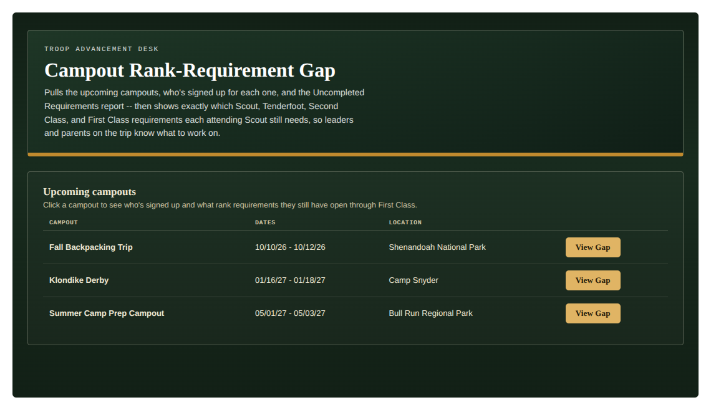
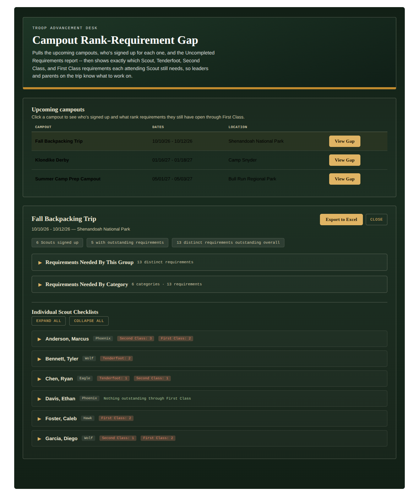
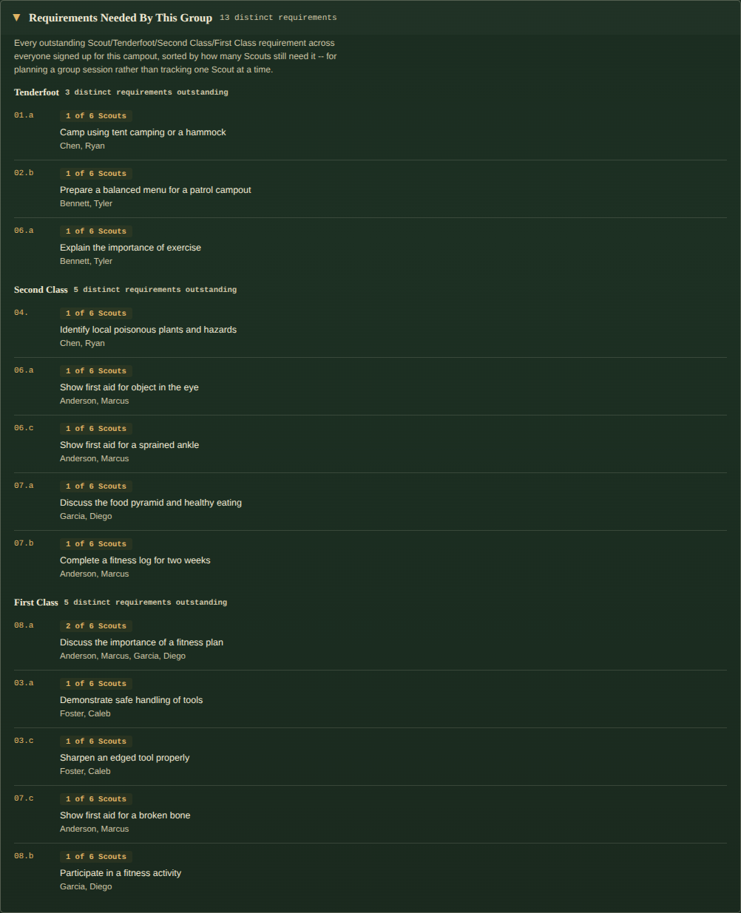
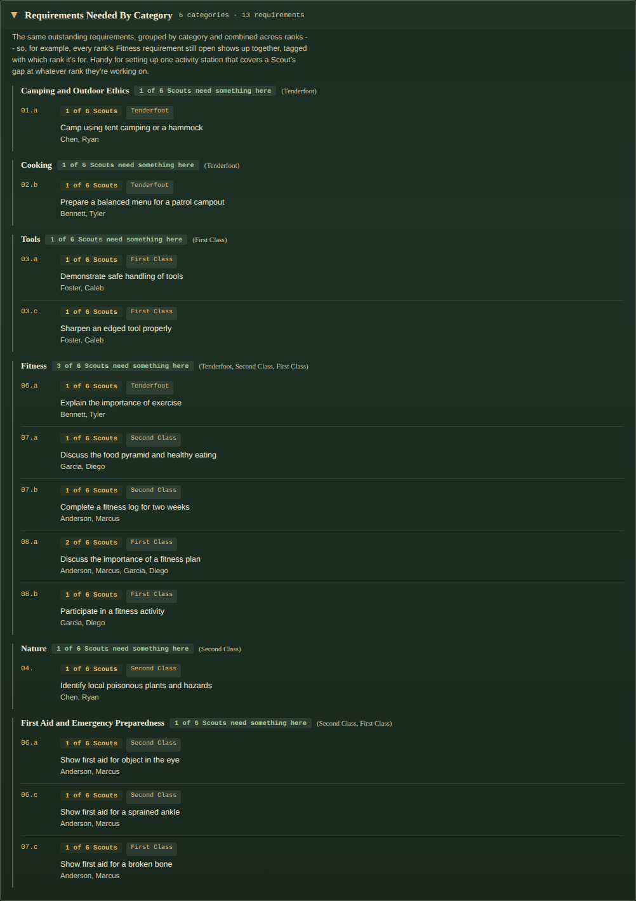
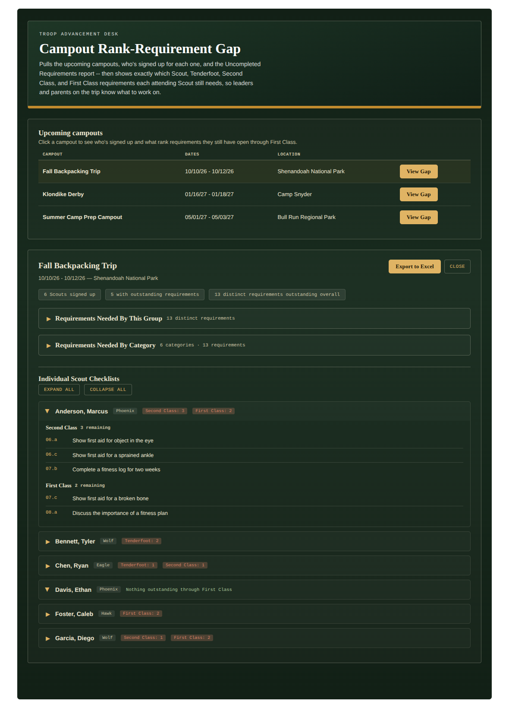
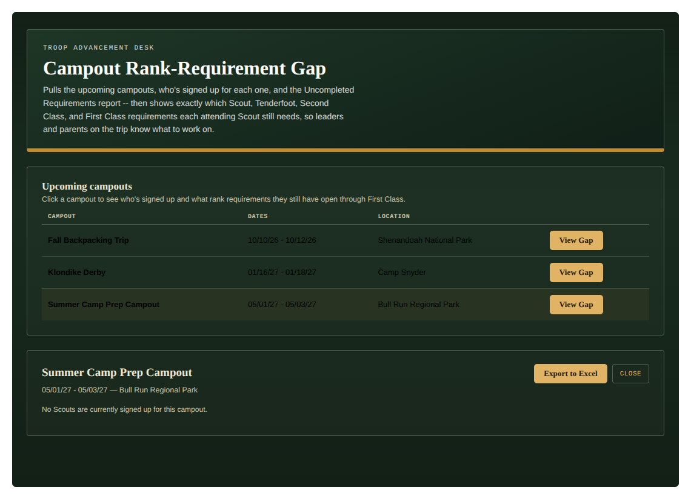

# Campout Rank-Requirement Gap

A single-file custom page for TroopWebHost that pulls the upcoming campouts, who's currently signed up for each one, and the Uncompleted Requirements report — then shows exactly which Scout, Tenderfoot, Second Class, and First Class requirements each attending Scout still needs. No manual cross-referencing between the calendar, the sign-up list, and the advancement report.

Leader-only: the Upcoming Events list and the Uncompleted Requirements report both require Adult Leader access on TroopWebHost. A Scout or parent login is detected automatically (the same redirect-based check the other tools use) and shown a plain "restricted" message rather than a guessed-at scoped view — there's no self-service equivalent for another family's sign-up list or advancement data.

## What it shows

1. **Upcoming campouts** — every calendar event of type "Campout" between today and the edge of TroopWebHost's own "Upcoming Events" list, with dates and location. Click one to drill in.
2. **Individual Scout Checklists** — for everyone signed up for that campout, their outstanding Scout/Tenderfoot/Second Class/First Class requirements, grouped by rank, in a collapsible card per Scout. A Scout with nothing outstanding through First Class is shown as such rather than an empty card.
3. **Requirements Needed By This Group** — the same requirements inverted: one row per requirement, sorted by how many attending Scouts still need it, for planning a group session instead of tracking one Scout at a time.
4. **Requirements Needed By Category** — the same requirements grouped into the official rank-requirement categories (Camping and Outdoor Ethics, Cooking, Tools, Fitness, etc.), **combined across ranks when the category name is identical** — e.g. one "Fitness" group covering the Tenderfoot, Second Class, and First Class Fitness requirements together, each line tagged with which rank it's for. Categories that are named differently across ranks (Second Class's "Cooking and Tools" vs. Tenderfoot/First Class's plain "Cooking") are kept separate on purpose — they're genuinely different requirement groupings, not just a repeat.
5. **Export to Excel** — downloads a workbook with one tab per view above (Summary, Attendees, By Scout, By Requirement, By Category), so the same data can be printed or shared off-site.

*(Fake/placeholder data shown above — not a real troop's calendar.)*

*(Fake/placeholder Scouts shown above — not a real troop's records.)*

Both group-level sections open on demand rather than dumping everything on screen at once:

Per-Scout cards work the same way, independently of the group sections:

A campout with nobody signed up yet shows a plain empty state instead of an empty table:

*(All Scout names, patrols, and requirement counts above are made up for these screenshots.)*

## Installation

1. Open the file and copy its entire contents.
2. In TroopWebHost, go to **Manage Custom Pages**.
3. Create a new Custom Page (or edit an existing one) and paste the whole block into the HTML editor.
4. Save, then open the page.

This only works pasted directly into TroopWebHost's own site (same-origin) — it relies on your logged-in session to fetch reports. It will not work copied into an external site or previewed elsewhere.

## How to use it

1. The page loads the upcoming campouts and the Uncompleted Requirements report automatically — nothing to click to get started.
2. Click a campout row (or its **View Gap** button) to load who's signed up and their requirement gaps. Attendee lists are cached per campout for the rest of the session, so re-clicking a campout you've already viewed doesn't re-fetch it.
3. Click **Requirements Needed By This Group** or **Requirements Needed By Category** to expand those sections; click a Scout's card to expand their individual checklist. **Expand All** / **Collapse All** apply to the Scout cards only.
4. Click **Export to Excel** to download everything currently loaded for that campout as a `.xlsx` workbook. The button is disabled until a campout's data has finished loading.
5. Click **Close** to collapse the results and pick a different campout.

Everything this page does is read-only report/page fetches — no TroopWebHost data is ever modified.

## Reports used

Every URL below was reverse-engineered from captured network requests, not from official documentation, since TroopWebHost has no public API.

| Report | Menu_Item_ID / Form_ID |
|---|---|
| Upcoming Events list | 56931 (Form_ID 163) |
| Campout event detail (attendee list) | 56931 (Form_ID 259, keyed by event `ID`) |
| Uncompleted Requirements for Rank Advancement | 46046 — the same report OA Tracker's "Rank is the only thing left" section already uses |

If something needs correcting, the values live in one place — search this file for `CONFIG` near the top of the `<script>` block.

## Category mapping

The category-to-code mapping in `CRG_CATEGORIES` was supplied directly rather than reverse-engineered, and was cross-checked against every distinct requirement code that actually appears in a real Uncompleted Requirements export for Tenderfoot, Second Class, and First Class — every code matched a supplied category, with none left over. There's a defensive "Other / Uncategorized" fallback bucket wired in for both the by-category and export views, in case a future BSA requirement renumbering ever introduces a code that doesn't match — so data fails visibly into an obviously-named bucket instead of silently disappearing.

## Implementation notes (durable warnings, not just history)

These are lessons from real bugs, kept here so they aren't reintroduced by a future edit:

- **Never match a table column by an unqualified substring.** An early version looked up the "Event" column with a plain substring match, which matched the "Event **Type**" header first and silently pointed every row at the wrong cell. Column lookup now checks for an exact header match before falling back to substring, in `crgColIndex()`.
- **TroopWebHost renders "no data" as a colspan placeholder row, not an empty `<tbody>`.** A campout with zero Scouts signed up still gets one `<tr><td colspan="N">No data is currently available to display.</td></tr>` row. Both the events-list and attendee-list parsers skip any row whose cell count is short of the table's header count, rather than matching that message's exact wording — catches the placeholder generically even if TroopWebHost ever rewords it.
- **`<a>` tags don't truly inherit color for the theme-probe's sentinel trick.** Browsers give anchors their own User-Agent-stylesheet default link color rather than inheriting from an ancestor, so the sentinel-inheritance check used for every other probed value (background colors, border colors) can't tell "TroopWebHost styled this yellow" apart from "nothing styled this, browser default kicked in" for the one probed anchor. This is normally masked because TroopWebHost's real site CSS always sets an explicit color on `.navlink > a` — but it broke visibly when rendering this page standalone (for these screenshots) with no TroopWebHost stylesheet present, misreading the browser's default link-blue as the site's accent color. Fixed by comparing against an unclassed control anchor in `crgProbeSiteTheme()` and only trusting the value if it differs from that control.
- **Reset button `appearance` explicitly.** `.crg-btn` / `.crg-btn-ghost` set `-webkit-appearance:none; appearance:none;` — without it, some browser/theme combinations render native OS button chrome over the custom background instead of the intended styling.
- **Table text needs an explicit color, not just inherited.** This file is a pasted-in fragment with no `<!DOCTYPE html>` of its own — it relies on TroopWebHost's own page doctype for standards-mode rendering. Standards mode inherits `color` into `<table>` normally, but browser quirks-mode (triggered by *any* page with no doctype at all) has a long-standing legacy behavior where `<table>` does not inherit `color` from ancestors, falling back to black. This wouldn't surface on the real TroopWebHost site (which is always standards-mode), but it's exactly the kind of assumption this project tries not to lean on — `#crg-root tbody td` now sets `color:var(--parchment)` explicitly rather than relying on inheritance reaching through a `<table>`.
- **Access control here is a redirect, not an HTTP error.** Same as every other tool in this repo: `fetch()` follows redirects transparently, so the tell that a login can't reach a given page is `res.redirected`, not a non-2xx status.

## Troubleshooting

- **A pull comes back empty with no error message**: open Tools → Reporting Options on TroopWebHost. If it's set to "PDF only," the Uncompleted Requirements report link may return a PDF instead of data, which SheetJS can't read.
- **"No upcoming campouts found" but the calendar clearly has some**: check that the Event Type column literally reads "Campout" (case-insensitive) on your site — `CRG_CAMPOUT_EVENT_TYPE` in CONFIG assumes that exact label.
- **A campout doesn't show every Scout you'd expect**: the Upcoming Events list returns up to 100 rows by default; if your troop calendar has more than 100 events between now and its far horizon, older upcoming events could be pushed off the list. Not yet wired to request a larger page size — see the comment on `CRG_EVENTS_LIST_URL`.
- **Export to Excel doesn't trigger a download**: this is the first tool in this repo that *writes* a file rather than only reading reports. If TroopWebHost's page environment has a restrictive Content-Security-Policy or iframe sandboxing, it could block the client-side download `XLSX.writeFile()` normally triggers. Check the browser console for a CSP error if this happens.
- **A Scout's name doesn't match between the attendee list and the Uncompleted Requirements report**: matching is deliberately loose (last name + first word of first name only, ignoring middle names/initials/suffixes) via `normName()`, the same approach OA Tracker uses — but a Scout listed under meaningfully different names in the two exports (e.g. a nickname in one and a legal name in the other) won't match. Worth a spot-check the first time this runs against a real campout.
