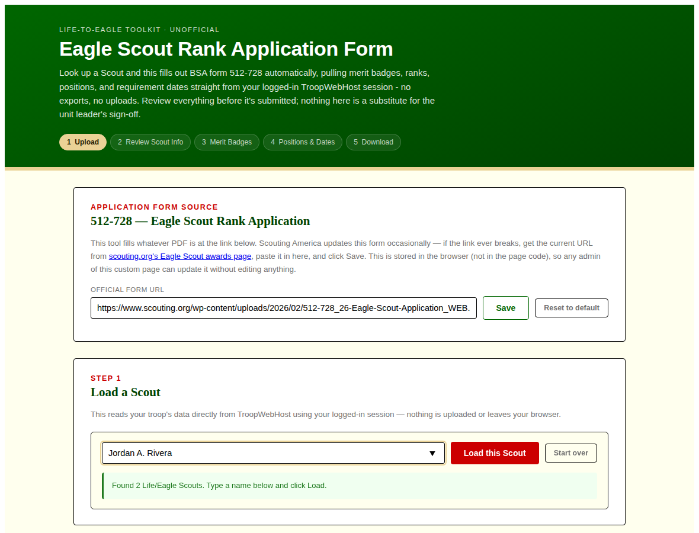
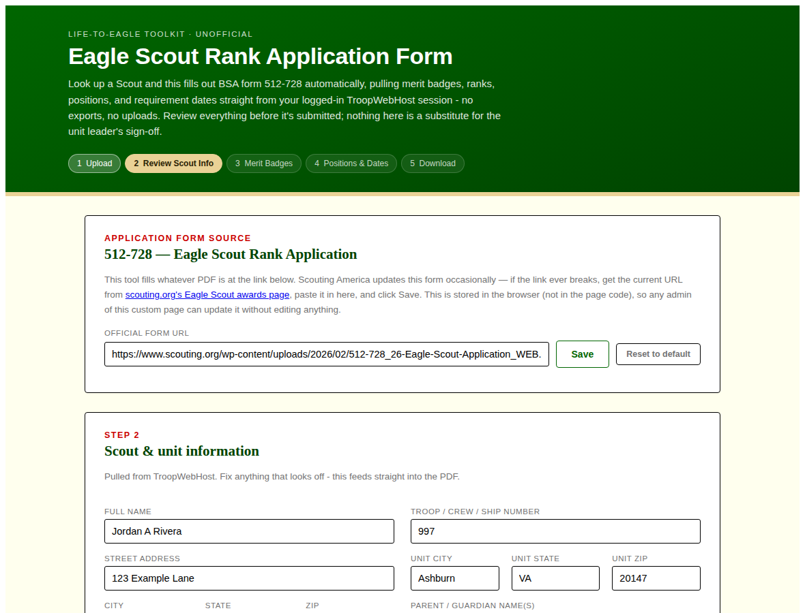
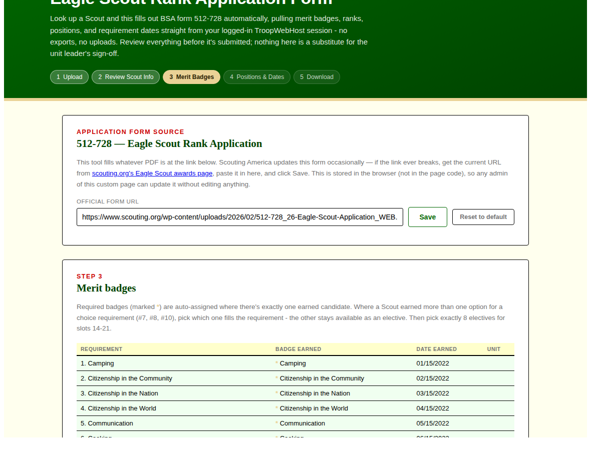
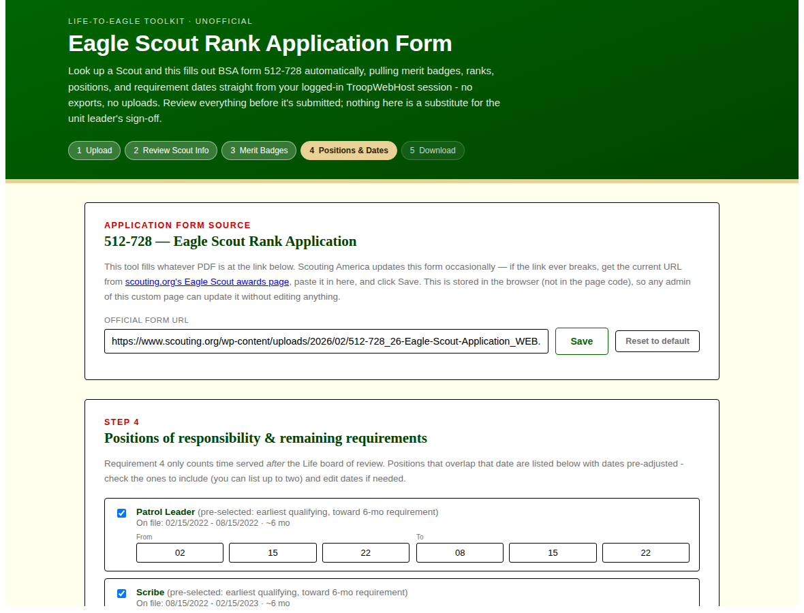
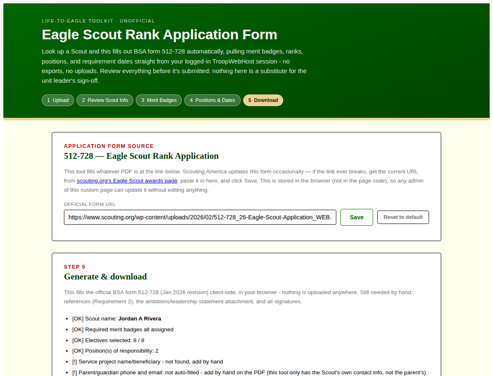

# Eagle Scout Rank Application Form (TroopWebHost auto-filler)

A single self-contained HTML page that leaders, parents, or Scouts can paste
into a [TroopWebHost](https://www.troopwebhost.org/) custom page. It reads a
Scout's live advancement data straight out of TroopWebHost (no exports, no
uploads, no manual data entry for most fields) and fills out BSA form
512-728, the Eagle Scout Rank Application.

**This is an unofficial, unaffiliated community tool.** It is not produced,
reviewed, or endorsed by the Boy Scouts of America or TroopWebHost. Always
have a unit leader review the generated PDF before it's submitted - this
tool is a time-saver, not a substitute for that review.

## Screenshots

The screenshots below are generated from a scripted demo run against fully
made-up data (name, address, dates, badges - none of it is a real Scout),
so you can see the wizard end-to-end without any real Scout's information.

**Step 1 - Load a Scout.** Type a name to search the roster (leaders) or
pick from your own linked Scout(s) (parents/Scouts).

**Step 2 - Review Scout & unit info.** Everything pulled straight from
TroopWebHost, editable before it goes any further.

**Step 3 - Merit badges.** Required badges are auto-assigned when there's
exactly one earned candidate for a slot; choice requirements (like #10:
Swimming/Hiking/Cycling) let you pick which earned badge fills the slot.

**Step 4 - Positions of responsibility.** Pre-selected chronologically,
earliest-first after the Life board of review, picking just enough to
satisfy the 6-month requirement. Note in this demo data a fake "OA Vice
Chief" position was deliberately included to confirm it's correctly
excluded - only "OA Troop Representative" counts toward this requirement.

**Step 5 - Generate & download.** A final checklist flags anything that
still needs a human's attention (references, the service project writeup,
signatures, and parent/guardian contact info this tool has no way to know).

## What it does

- Looks up a Scout by name (leaders see the full roster filtered to Life and
  Eagle rank; parents/Scouts see their own linked Scout(s) via "My Scouts")
- Pulls profile info, rank history, merit badge history, and Eagle
  requirement dates directly from TroopWebHost's own report pages, using the
  browser's already-logged-in session - nothing is uploaded anywhere
- Walks through a 5-step wizard: load Scout -> review basic info -> assign
  required + elective merit badges -> pick position(s) of responsibility ->
  download the filled PDF
- Fills the official 512-728 PDF client-side (via
  [pdf-lib](https://github.com/Hopding/pdf-lib)) and triggers a download -
  nothing is sent to any server other than TroopWebHost and wherever the
  admin-configured PDF source URL points
- Matches your troop's own site colors automatically by reading TroopWebHost's
  live CSS at load time, instead of hardcoding one color scheme
- Applies a few Eagle-specific rules automatically, with everything editable
  before download:
  - Only earned merit badges are offered; required-slot vs. elective
    assignment follows the earliest-earned badge by default
  - Only "OA Troop Representative" counts as a qualifying Order of the Arrow
    position of responsibility - other OA offices are excluded
  - Positions of responsibility are pre-selected in chronological order
    (earliest after the Life board of review first), picking just enough to
    satisfy the 6-month requirement

## What it doesn't do

- It does not submit anything on your Scout's behalf - the PDF download is
  the last step, and everything is meant to be reviewed by hand afterward
- It does not know your parent/guardian's phone or email (TroopWebHost
  doesn't expose that alongside the Scout's own record) - those two fields
  are deliberately left blank for you to fill in, rather than silently
  guessing
- It doesn't replace the actual Scout-Unit Leader conference, service
  project paperwork, or reference-letter process

## Quick start

See [SETUP.md](./SETUP.md) for full install instructions. In short:

1. Copy the contents of `eagle-scout-rank-application-form.html`
2. Paste into a new TroopWebHost Custom Page
3. Edit the `TWH_CONFIG` block near the bottom of the script to match your
   troop's Menu_Item_IDs (see SETUP.md for how to find them)
4. Save and open the page while logged into TroopWebHost

## Before you distribute this to your own troop

TroopWebHost's Terms of Service (clause 11, as of this writing) restricts
accessing TroopWebHost's web services by means other than their own HTML UI
and prohibits reverse engineering. This tool works by having your own
browser - already logged in as you - fetch pages TroopWebHost itself serves
to you, the same way clicking a link would. It doesn't scrape another
person's session, bypass authentication, or hit any endpoint you couldn't
otherwise reach by clicking through the site yourself. That said, this is a
judgment call and not legal advice: if you plan to distribute this beyond
your own troop, consider reaching out to TroopWebHost first.

## Known TroopWebHost quirks this tool works around

- TWH's page editor corrupts multi-byte UTF-8 on save, so this file is kept
  pure ASCII (no smart quotes, em dashes, or emoji)
- Every button uses `type="button"` and calls `preventDefault()`, since TWH
  wraps custom page content in an ASP.NET `<form>` that would otherwise
  trigger a full-page postback on any click
- Requests to TWH are made sequentially, not in parallel, to avoid
  session-state races that can silently return the wrong Scout's data
- TWH returns a 302 redirect (not a clean 403) when the logged-in account
  lacks access to a page; `fetch()` follows redirects transparently, so this
  tool explicitly checks `res.redirected` and treats it as "no access"
  rather than parsing whatever page it landed on
- Every request has a 15-second timeout, since a login with no access to a
  leader-only page has been observed to hang rather than fail cleanly

## License

MIT - see [LICENSE](./LICENSE). Use it, fork it, adapt it for your own
troop's TroopWebHost configuration.
