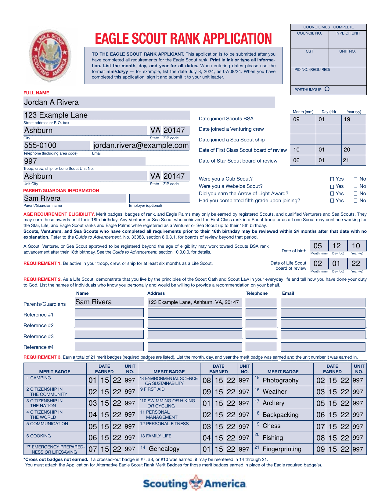
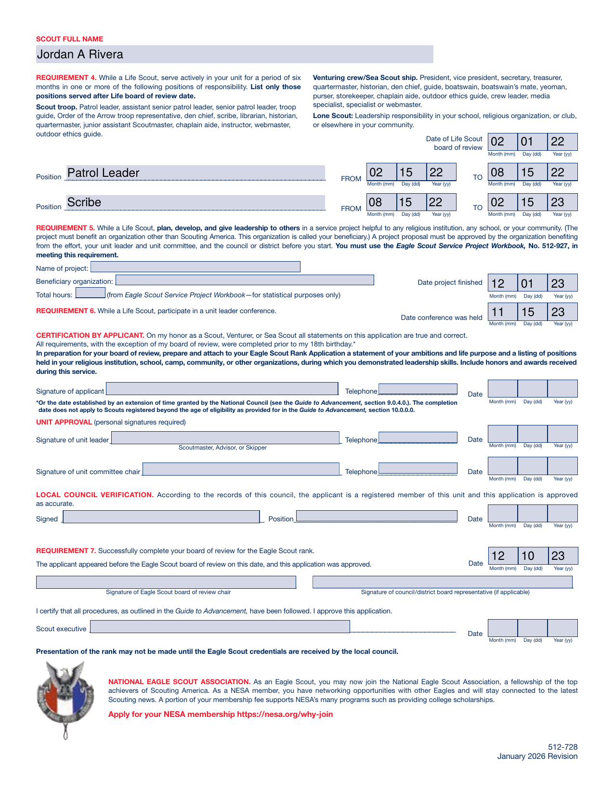

# Eagle Scout Rank Application Form (TroopWebHost auto-filler)

A single self-contained HTML page that leaders, parents, or Scouts can paste
into a [TroopWebHost](https://www.troopwebhost.org/) custom page. It reads a
Scout's live advancement data straight out of TroopWebHost (no exports, no
uploads, no manual data entry for most fields) and fills out BSA form
512-728, the Eagle Scout Rank Application.

**This is an unofficial, unaffiliated community tool.** It is not produced,
reviewed, or endorsed by the Boy Scouts of America or TroopWebHost. Always
have a unit leader review the generated PDF before it's submitted - this
tool is a time-saver, not a substitute for that review.

## What it does

- Looks up a Scout by name (leaders see the full roster filtered to Life and
  Eagle rank; parents/Scouts see their own linked Scout(s) via "My Scouts";
  a Scout logged in directly under their own account loads their own record
  automatically, with no picker at all)
- Pulls profile info, rank history, merit badge history, and Eagle
  requirement dates directly from TroopWebHost's own report pages, using the
  browser's already-logged-in session - nothing is uploaded anywhere
- Walks through a 5-step wizard: load Scout -> review basic info -> assign
  required + elective merit badges -> pick position(s) of responsibility ->
  download the filled PDF
- Fills the official 512-728 PDF client-side (via
  [pdf-lib](https://github.com/Hopding/pdf-lib)) and triggers a download -
  nothing is sent to any server other than TroopWebHost and wherever the
  admin-configured PDF source URL points
- Matches your troop's own site colors automatically by reading TroopWebHost's
  live CSS at load time, instead of hardcoding one color scheme
- Applies a few Eagle-specific rules automatically, with everything editable
  before download:
  - Only earned merit badges are offered; required-slot vs. elective
    assignment follows the earliest-earned badge by default
  - Only "OA Troop Representative" counts as a qualifying Order of the Arrow
    position of responsibility - other OA offices are excluded
  - Positions of responsibility are pre-selected in chronological order
    (earliest after the Life board of review first), picking just enough to
    satisfy the 6-month requirement

## Screenshots

The screenshots below are generated from a scripted demo run against fully
made-up data (name, address, dates, badges - none of it is a real Scout),
so you can see the wizard end-to-end without any real Scout's information.

**Step 1 - Load a Scout.** Type a name to search the roster (leaders) or
pick from your own linked Scout(s) (parents/Scouts).

**Step 2 - Review Scout & unit info.** Everything pulled straight from
TroopWebHost, editable before it goes any further.

**Step 3 - Merit badges.** Required badges are auto-assigned when there's
exactly one earned candidate for a slot; choice requirements (like #10:
Swimming/Hiking/Cycling) let you pick which earned badge fills the slot.

**Step 4 - Positions of responsibility.** Pre-selected chronologically,
earliest-first after the Life board of review, picking just enough to
satisfy the 6-month requirement. Note in this demo data a fake "OA Vice
Chief" position was deliberately included to confirm it's correctly
excluded - only "OA Troop Representative" counts toward this requirement.

**Step 5 - Generate & download.** A final checklist flags anything that
still needs a human's attention (references, the service project writeup,
signatures, and parent/guardian contact info this tool has no way to know).

**The filled PDF itself.** Clicking "Generate & download" produces the
actual filled application - this is the real, official 512-728 form (Jan
2026 revision), filled by the tool's real pdf-lib logic against the same
fake Scout data as above.

## What it doesn't do

- It does not submit anything on your Scout's behalf - the PDF download is
  the last step, and everything is meant to be reviewed by hand afterward
- It does not know your parent/guardian's phone or email (TroopWebHost
  doesn't expose that alongside the Scout's own record) - those two fields
  are deliberately left blank for you to fill in, rather than silently
  guessing
- It doesn't replace the actual Scout-Unit Leader conference, service
  project paperwork, or reference-letter process

## Quick start

1. Copy the contents of `eagle-scout-rank-application-form.html`
2. Paste into a new TroopWebHost Custom Page
3. At the top of the page, set the "Application form source" URL to wherever
   your troop keeps the current official 512-728 PDF
4. Save and open the page while logged into TroopWebHost

The `TWH_CONFIG` block near the bottom of the script holds the
`Menu_Item_ID`/`Form_ID` values this tool fetches. These have matched
exactly across every TroopWebHost installation checked so far, so you
likely won't need to change anything - but if a page comes back empty on
your site, a HAR capture (browser DevTools -> Network tab -> "Save all as
HAR") of the equivalent page loaded through TWH's own menu is the fastest
way to find the real values to swap in.

## Required TWH access

This tool only reads pages the logged-in account could already reach by
clicking through TWH's own menu - it never bypasses permissions. What it
needs depends on who's running it:

| Login type | TWH pages it needs to reach | If access is missing |
| --- | --- | --- |
| Unit leader | Advancement Hub (roster, rank/position, merit badges, Eagle requirements) and the Membership Hub (profile) | Falls back to trying the logged-in account's own self-service access instead |
| Parent | "My Scouts" (their linked Scout's profile, rank/position, merit badges, Eagle requirements) | Falls back to trying the Scout-direct links below |
| Scout (logged in directly) | "My Personal Information", "My Rank Advancement", "My Merit Badges" | Tool shows a clear error naming which specific page it couldn't reach |

Exact Task/Role names are configured per council/troop, so they aren't
listed here - if a page comes back inaccessible for someone who should
have it, check that their TWH Role includes whichever of the menu items
above they're missing.

## Known TroopWebHost quirks this tool works around

- TWH's page editor corrupts multi-byte UTF-8 on save, so this file is kept
  pure ASCII (no smart quotes, em dashes, or emoji)
- Every button uses `type="button"` and calls `preventDefault()`, since TWH
  wraps custom page content in an ASP.NET `<form>` that would otherwise
  trigger a full-page postback on any click
- Requests to TWH are made sequentially, not in parallel, to avoid
  session-state races that can silently return the wrong Scout's data
- TWH returns a 302 redirect (not a clean 403) when the logged-in account
  lacks access to a page; `fetch()` follows redirects transparently, so this
  tool explicitly checks `res.redirected` and treats it as "no access"
  rather than parsing whatever page it landed on
- Every request has a 15-second timeout, since a login with no access to a
  leader-only page has been observed to hang rather than fail cleanly

## License

MIT - see [LICENSE](./LICENSE). Use it, fork it, adapt it for your own
troop's TroopWebHost configuration.
