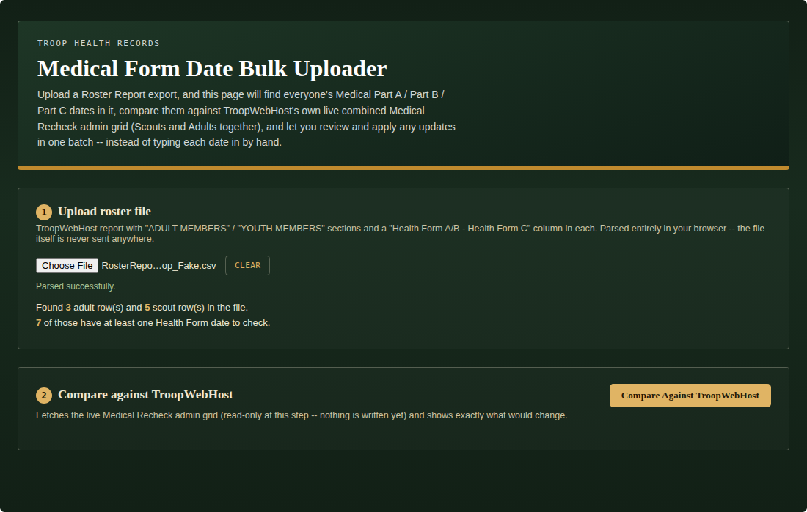
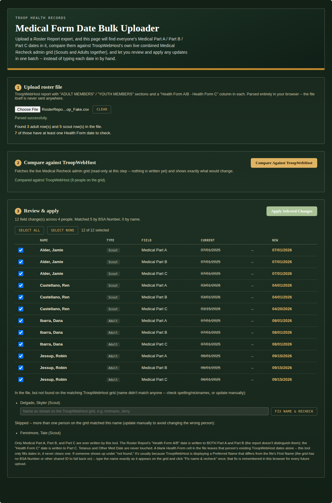
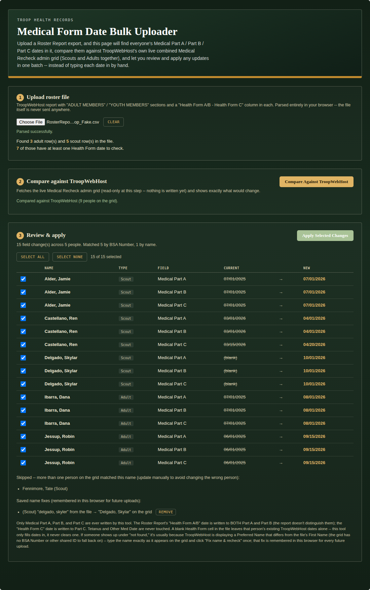
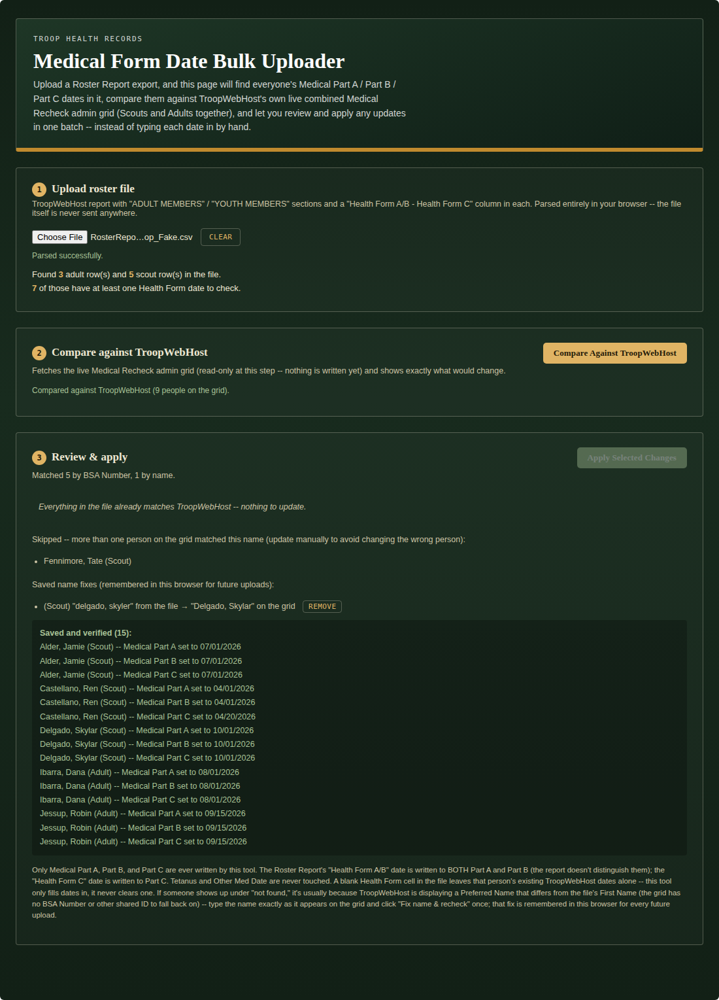
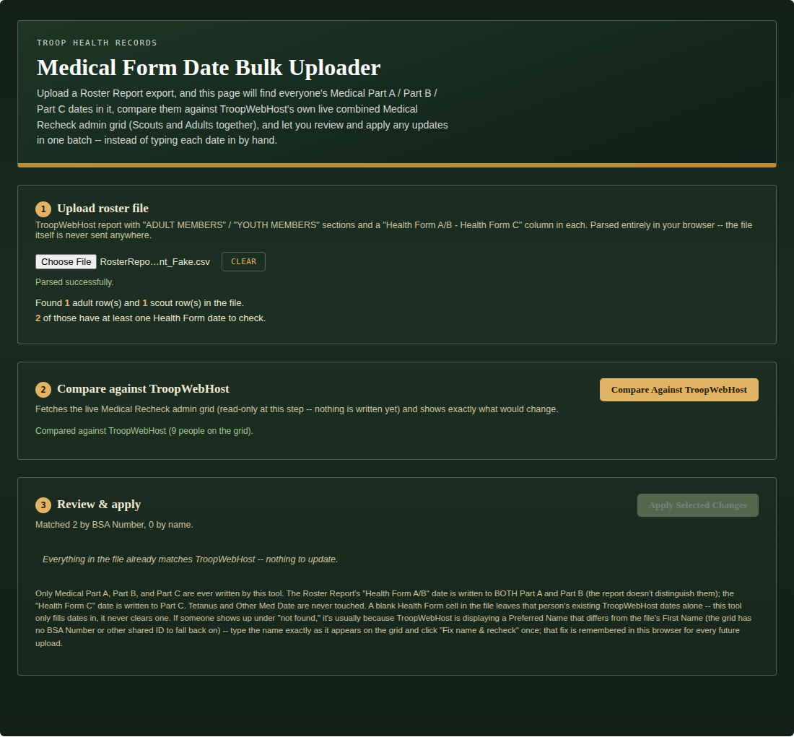
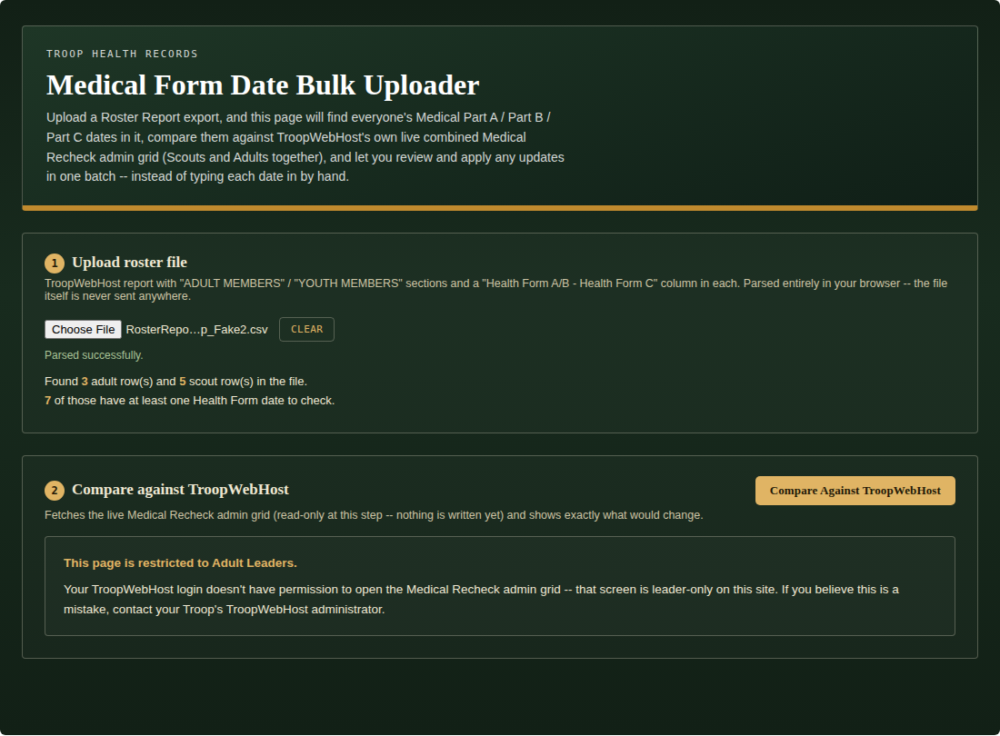

# Medical Form Date Bulk Uploader

A single-file custom page for TroopWebHost that reads a Roster Report export, compares everyone's Medical Part A / Part B / Part C dates in it against TroopWebHost's own live combined Medical Recheck admin grid (Scouts and Adults together), and lets a leader review and apply any updates in one batch instead of typing each date in by hand.

Leader-only: the Medical Recheck admin grid requires Adult Leader access on TroopWebHost. A Scout or parent login is detected automatically (the same redirect-based check the other tools in this repo use) and shown a plain "restricted" message rather than a guessed-at scoped view.

## What it does

1. **Upload roster file** — a TroopWebHost Roster Report export with "ADULT MEMBERS" / "YOUTH MEMBERS" sections and a "Health Form A/B - Health Form C" column in each. Parsed entirely in the browser; the file itself is never sent anywhere.
2. **Compare against TroopWebHost** — fetches the live Medical Recheck admin grid (read-only at this step) and matches every person in the file against a real row on the grid, in order of preference:
   - **By BSA Number** (primary): cross-references TroopWebHost's own BSA ID admin grids to resolve each person's internal database ID directly, immune to nickname or Preferred Name differences entirely.
   - **By name** (fallback): last name + first word of first name, type-aware so a same-named parent and child can never cross-match.
   - **By a manual name fix** (last resort): for the rare person neither of the above can resolve.
3. **Review & apply** — every field that would change, with a checkbox per field, grouped so a whole person's changes are easy to scan. Anyone the file couldn't match is listed separately as "not found" or "ambiguous" and is never auto-applied.
4. **Save to TroopWebHost** — writes the selected changes back to the real Medical Recheck grid, asks for confirmation first, and refetches afterward to confirm each change actually stuck before reporting success.



*(All names, BSA numbers, and dates in every screenshot below are made up for documentation purposes — not a real troop's data.)*

Comparing against TroopWebHost shows exactly what would change, matched by BSA Number wherever possible:



Jessup, Robin's three changes matched even though the uploaded file's First Name for that row is "Morgan" — TroopWebHost is displaying a Preferred Name, and the BSA Number match resolved it automatically without needing a name fix at all. Delgado, Skylar (spelled differently on the grid than in the file, with no BSA Number recorded either place) landed in "not found," with an inline box to fix it once. Fennimore, Tate has two people on the grid sharing that exact name and no BSA Number to disambiguate them, so it's skipped rather than risk changing the wrong one.

Typing the name exactly as TroopWebHost shows it resolves the match immediately and is remembered for every future upload:



Applying reports exactly what was saved and verified, per field:



A file that already matches TroopWebHost exactly shows a plain empty state instead of an empty table:



And a login without Adult Leader access sees a plain restricted message rather than a guessed-at partial view:



*(Every name, BSA number, and date across all six screenshots above is fictional — none of it is a real troop's data.)*

## Installation

1. Open `medical-date-bulk-uploader.html`, copy its entire contents.
2. In TroopWebHost, go to **Manage Custom Pages**.
3. Create a new Custom Page (or edit an existing one) and paste the whole block into the HTML editor.
4. Save, then open the page.

This only works pasted directly into TroopWebHost's own site (same-origin) — it relies on your logged-in session to fetch and save records. It will not work copied into an external site or previewed elsewhere.

## How to use it

1. Export a Custom Report from ScoutBook Plus following the TroopWebHost instructions [here](https://www.troopwebhost.org/Help.aspx?ID=558#gsc.tab=0) and use the **Choose File** button to upload it here.
2. Click **Compare Against TroopWebHost**.
3. Review the table. Uncheck anything you don't want applied. For anyone listed under "not found," type their name exactly as TroopWebHost shows it and click **Fix name & recheck** — that fix is remembered in this browser for every future upload.
4. Click **Apply Selected Changes**, confirm, and check the save report for anything that didn't verify.

## Endpoints used

Every URL below was reverse-engineered from captured network requests, not from official documentation, since TroopWebHost has no public API.

| Purpose | Menu_Item_ID / Form_ID | Read/Write |
|---|---|---|
| Medical Recheck admin grid (combined Scout + Adult) | 56934 (Form_ID 9224) | **Read + Write** |
| BSA ID admin grid — Scouts (Name + BSA ID + internal person ID) | 56934 (Form_ID 3547) | Read only |
| BSA ID admin grid — Adults | 56934 (Form_ID 3548) | Read only |

The Medical Recheck grid is read **and written** — the BSA ID grids are read-only lookups used purely for matching, never touched.

TroopWebHost previously exposed Medical Recheck as two separate grids (Scout Form_ID 2065, Adult Form_ID 3545) before consolidating into the single combined grid above. If your installation still shows the old two-grid version, the config constants near the top of the `<script>` block (search for `CONFIG`) are the only place that needs updating.

## Implementation notes (durable warnings, not just history)

These are lessons from real bugs or deliberate design decisions, kept here so they aren't reintroduced by a future edit:

- **The Medical Recheck grid is TroopWebHost's own "easyform" mechanism, not an ASP.NET postback.** There's no `__VIEWSTATE` or `__EVENTVALIDATION` anywhere on that page. It's a single `<form id="easyform">` holding an OLD-value hidden input plus a live input for every editable cell across every row on the page, with the server diffing OLD vs. submitted-new per field to decide what changed. The only sane way to save one person's update is to fetch the whole page fresh, mutate just that person's input(s) in the fetched DOM, and serialize the page's own `<form>` element with a real `FormData` — never hand-build the field list. `mfuFetchGrid()` / `mfuApplySelected()` do exactly this.
- **Column IDs and grid IDs (e.g. `44322`, `40130`) are internal database IDs specific to one troop's TWH install.** Never hardcoded — each row's date inputs are found by column position relative to header text ("Medical Part A" / "Medical Part B" / "Medical Part C"), and each row's type comes from that same row's own "Adult" Yes/No column, not from which URL was fetched.
- **Pagination is handled by asking for everything, not by walking pages.** This grid (and the BSA ID grids) can page at a default of 100 rows. Rather than track page state, `mfuFetchExpandedDoc()` resubmits the freshly-fetched, byte-for-byte unedited form once with `NewRowsPerPage=ALL` — exactly what choosing "ALL" from the dropdown does by hand — and uses that response from then on. Since nothing was edited before that resubmit, it's exactly as safe as loading the page and picking "ALL" manually.
- **TroopWebHost's internal person ID is shared across every admin grid for that person**, confirmed by inspecting the same person's row on both the Medical Recheck grid and a BSA ID grid. `mfuRowInternalId()` reads it from the `CHILDCB<gridId>ROW<n>` hidden input that's a direct child of each `<tr>` (not inside a `<td>`), by attribute prefix — never by the numeric grid ID itself.
- **BSA Number is the preferred match key, not name, because TroopWebHost can display a Preferred Name that differs from the Roster Report's First Name.** Confirmed case: a grid row displaying "Jessup, Robin" had the exact same BSA ID as "Jessup, Morgan" in the Roster Report — same person. Resolving through the BSA ID admin grids to get TroopWebHost's internal person ID, then matching directly on that ID, sidesteps the name question entirely for anyone with a BSA Number on file in both places. `mfuGetBsaIdLookup()` builds this cross-reference; it never throws even if those pages can't be reached, since name matching is still a valid (if less reliable) fallback.
- **Name matching, when it's needed, is type-aware.** Since Scouts and Adults now share one combined grid, the fallback match key includes each row's own type (`mfuMatchKey()`) so a same-named parent and child can never cross-match — a real risk that didn't exist back when Scouts and Adults were on separate grids.
- **A manual name-alias override exists for the rare person even BSA Number and name matching can't resolve** (typically: no BSA Number on file anywhere, and a Preferred Name mismatch). It's stored in this browser's `localStorage` (`mfuLoadAliases`/`mfuSaveAliases`), keyed to the exact literal name as it appears in the uploaded file, and applies automatically to every future upload once set.
- **Ambiguous name matches are never auto-applied.** If more than one person of the same type on the grid normalizes to the same fallback key (e.g. two people who happen to share a name, with no BSA Number to tell them apart), both are listed under "ambiguous" for a leader to handle by hand — silently updating the wrong person's medical dates is far worse than leaving one row unautomated.
- **The Roster Report's "Health Form A/B" date is written to BOTH Medical Part A and Medical Part B**, since the report only gives one combined date for that pair, not two separate ones. Tetanus and Other Med Date are never touched — that data isn't in this report at all.
- **A blank Health Form cell in the file only ever leaves TroopWebHost's existing date alone — it never clears one.** This tool fills dates in; it doesn't remove them.
- **A real database write deserves verification, not just a 200 response.** After posting, this page refetches the grid fresh and confirms each changed field actually reflects the new value before reporting success to the leader.
- **Access control here is a redirect, not an HTTP error.** Same as every other tool in this repo: `fetch()` follows redirects transparently, so the tell that a login can't reach a given page is `res.redirected`, not a non-2xx status.

## Troubleshooting

- **"This page is restricted to Adult Leaders"** on a login you believe should have access: the Medical Recheck grid and the BSA ID grids all require Adult Leader permission on TroopWebHost itself — this page doesn't add any new restriction, it just detects and reports TroopWebHost's own.
- **Someone shows up under "not found"**: almost always a Preferred Name mismatch with no BSA Number on file anywhere to bridge it automatically. Type the name exactly as TroopWebHost's grid shows it into the inline box and click "Fix name & recheck" — that fix is remembered for every future upload. Double-check spelling either way; matching is exact, not fuzzy, once you're past the normalized last-name-plus-first-word stage.
- **Someone shows up under "ambiguous"**: two or more people of the same type on the grid share that normalized name and neither has a BSA Number on file to tell them apart. Update that person's dates directly on TroopWebHost.
- **A field you expected to change isn't in the review table**: TroopWebHost's date for that field already matches the file exactly — nothing to do. Check the "Matched X by BSA Number, Y by name" line to confirm the person was found at all.
- **Save reports "did not verify" for a field**: the save posted, but the refetch didn't see the new value reflected — worth checking that person's record directly on TroopWebHost before assuming the write silently failed.
- **A warning about "Rows Per Page" or pagination controls still showing after requesting ALL**: an unusually large troop may be hitting a server-side cap this hasn't been tested against. Open the real admin grid directly to check whether everyone is actually there.

## Screenshots

Generated by `gen_screenshots.js`, which drives the actual shipped `medical-date-bulk-uploader.html` in headless Chromium against an in-memory fake TroopWebHost backend — no live site, no real data. Requires Playwright and a Chromium binary it can find (via `PLAYWRIGHT_BROWSERS_PATH`, a system install, or the `PW_CHROME_PATH` environment variable this script also checks). Run from this folder:

```
node gen_screenshots.js
```

Output lands in `./screenshots/*.png`, matching the six images above.
