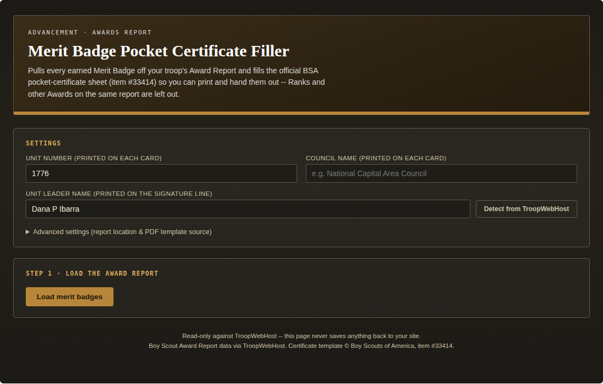
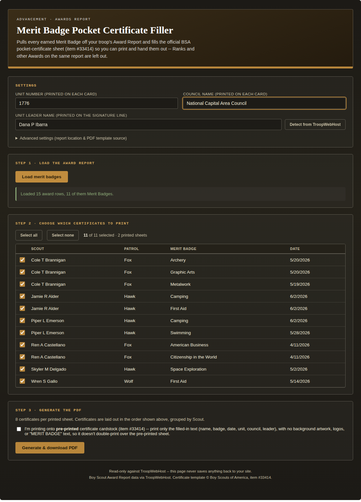
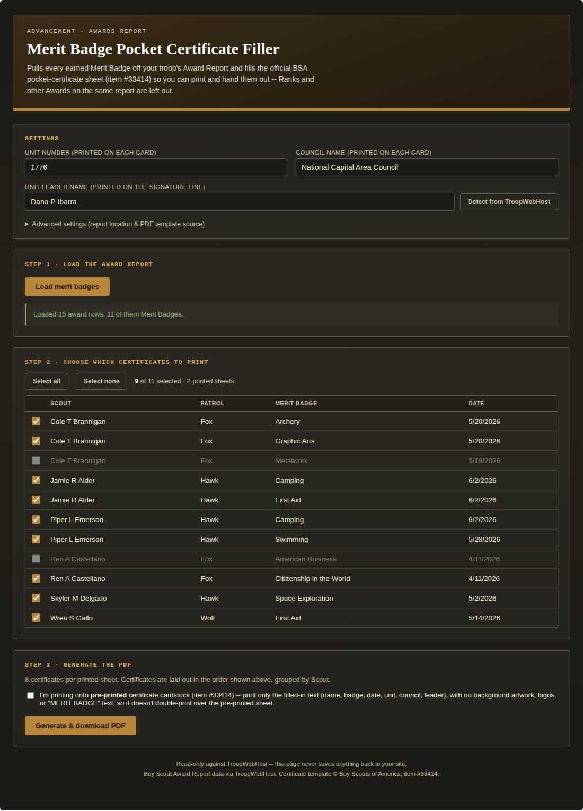
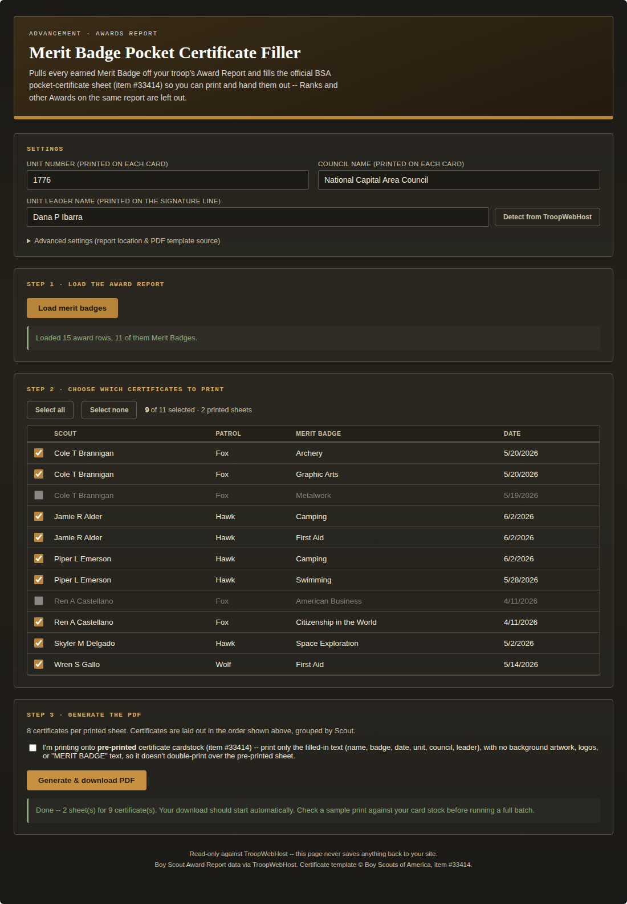
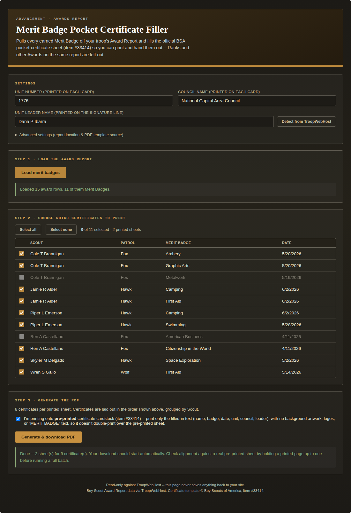
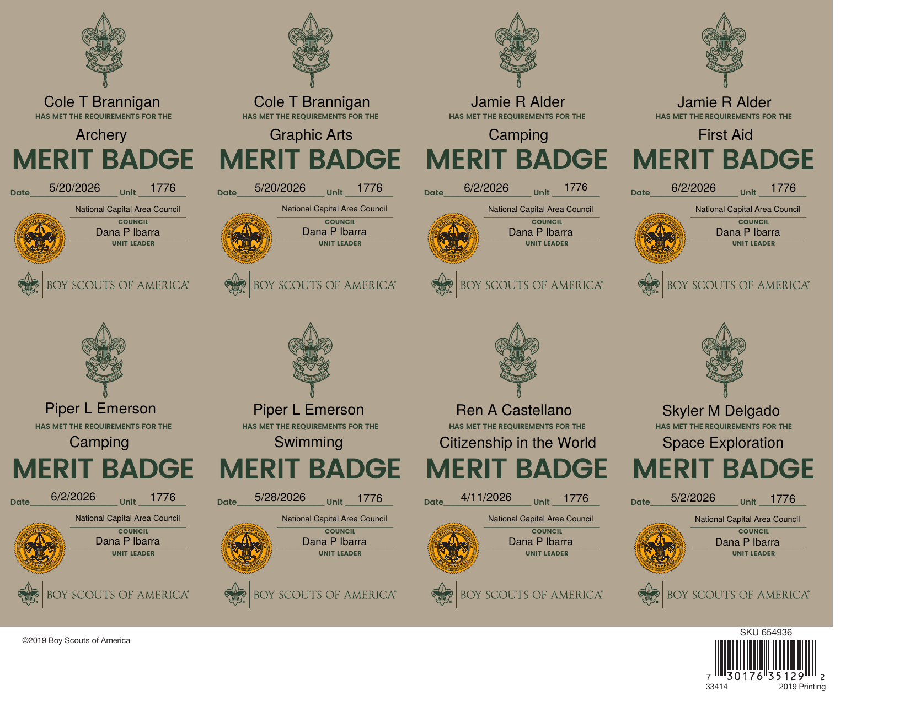
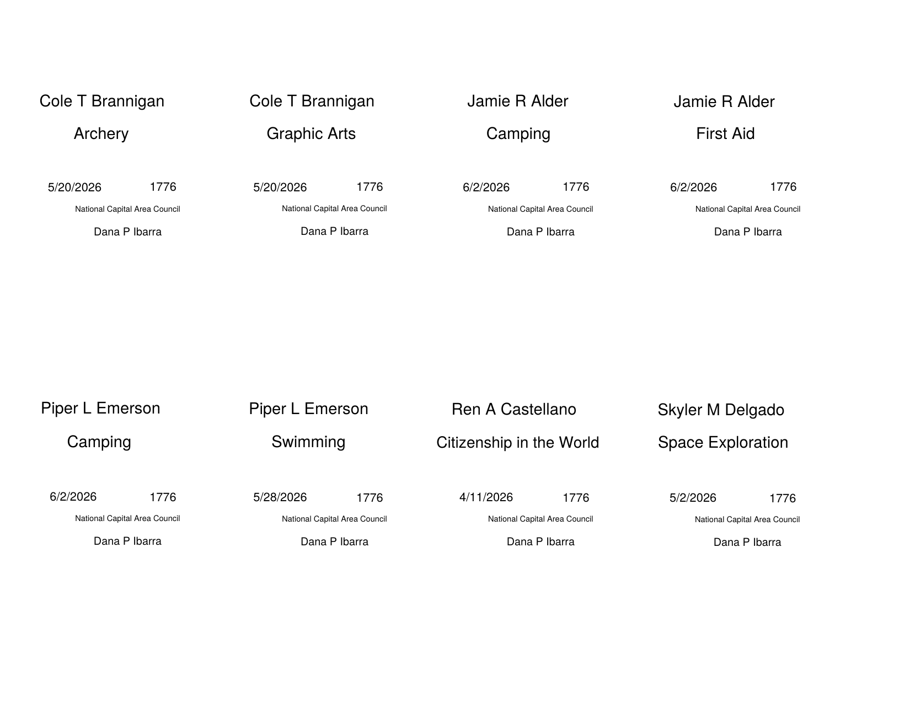

# Merit Badge Pocket Certificate Filler

A single-file custom page for TroopWebHost that pulls the troop's Award Report, keeps only the rows where Type is "Merit Badge" (Ranks and other Awards on the same report are left out), lets a leader check off which ones to print, then fills the official BSA "Merit Badge Pocket Certificate" PDF (item #33414, 8 cards per sheet) and hands back a finished, ready-to-print PDF. Unit Leader name can auto-detect from TroopWebHost's own Adult Directory instead of being typed by hand.

Restricted: the Award Report is only available to the Adult Leader and Rank Advancement roles on TroopWebHost (see [Required roles](#required-roles)). A Scout or parent login is detected automatically (the same redirect-based check the other tools in this repo use) and shown a plain "restricted" message rather than a guessed-at scoped view.

## Required roles

| Report | Menu_Item_ID | Needed for | Roles that can reach it |
|---|---|---|---|
| Award Report (via Pending Awards) | 45952 (Form_ID 253) | Required | Adult Leader, Rank Advancement |
| Adult Directory | 46013 | Optional (Unit Leader auto-detect; type the name by hand otherwise) | Adult, Scout, Membership, Rank Advancement |

To load the merit badges you need the **Adult Leader** or **Rank Advancement** role. Rank Advancement also reaches
the Adult Directory, so Unit Leader auto-detect works. A login that holds only Adult Leader can still load badges
and print, but Unit Leader has to be typed in unless that login also holds Adult (or another role in the table).

Roles come from the site's Task Role and Task Menu Items exports, matched on `Menu_Item_ID`, and were checked against a login that holds only the Adult role. They describe how one troop's TroopWebHost site is configured. A site administrator can change which tasks each role holds (**Menu > Administration > Security Configuration > Assign Tasks to Roles**), so confirm against your own site. A login that lacks access is redirected by TroopWebHost, which this tool detects and reports.

## What it does

1. **Settings** — Unit number auto-fills from the site's own page title; Council name is a one-time manual entry (TroopWebHost has no Council field to read); Unit Leader name can be typed by hand or auto-detected (see below). Advanced settings expose the Award Report's `Menu_Item_ID`/`Form_ID`, the Adult Directory's `Menu_Item_ID`, the Leadership title to search for, and the PDF template source URL, all remembered per-browser.

*(Fake/placeholder data shown above — not a real troop's roster.)*

2. **Load the Award Report** — fetches every Adult/Scout Rank, Award, and Merit Badge row, keeps only Type = "Merit Badge", strips the trailing `*` TroopWebHost appends to mark a badge Eagle-required, and lists the result sorted by Scout then badge name so a Scout's certificates print together.

*(All names, patrols, and dates above are made up for these screenshots.)*

3. **Choose which certificates to print** — every row is checked by default; uncheck anyone who shouldn't be on this batch (already printed, awaiting a Court of Honor, etc.). The running count and printed-sheet estimate update live.

4. **Unit Leader auto-detect** — reads TroopWebHost's Adult Directory report and looks for whoever has the configured Leadership title (default "Scoutmaster"). Matching is exact-token, not substring, so "Assistant Scoutmaster" is never mistaken for "Scoutmaster". Runs once automatically if the field is empty, and any time the "Detect from TroopWebHost" button is clicked; zero or multiple matches leaves the field for manual entry instead of guessing.
5. **Generate the PDF** — fills the real, unmodified BSA #33414 form, 8 certificates per sheet, extra sheets added automatically for larger batches.

6. **Pre-printed cardstock mode** — for troops that already stock BSA's pre-printed #33414 cards, a checkbox switches generation to data-only: no background artwork, logos, or "MERIT BADGE" text, just the same fields at the same positions, so it can print directly onto the pre-printed sheet without doubling up the artwork.

And the two kinds of generated PDF output side by side — normal mode (full template) and pre-printed cardstock mode (data only):

*(Every name, patrol, and date across all screenshots above is fictional — none of it is a real troop's data.)*

## Installation

1. Open `merit-badge-pocket-cert.html`, copy its entire contents.
2. In TroopWebHost, go to **Manage Custom Pages**.
3. Create a new Custom Page (or edit an existing one) and paste the whole block into the HTML editor.
4. Save, then open the page.

This only works pasted directly into TroopWebHost's own site (same-origin) — it relies on your logged-in session to fetch the Award Report and Adult Directory. It will not work copied into an external site or previewed elsewhere. No separate PDF upload is needed — the page fetches the official certificate template live from BSA's Scout Shop media host at runtime (with a GitHub-staged fallback copy, `merit-badge-pocket-cert-template.pdf` in this folder, used automatically if that fetch ever fails) — except in pre-printed cardstock mode, which never fetches the template at all.

## How to use it

You need the **Rank Advancement** or **Adult Leader** role in order to run the report (see [Required roles](#required-roles)).

1. Fill in Unit number (auto-filled, editable) and Council name.
2. Click **Load merit badges**. Unit Leader auto-fills if exactly one person on the Adult Directory has the configured Leadership title; otherwise type it in, or click **Detect from TroopWebHost** to retry.
3. Review the list and uncheck anyone who shouldn't be on this batch.
4. If printing onto BSA's pre-printed #33414 cardstock, check the box in Step 3.
5. Click **Generate & download PDF**. Print a test sheet and check it against your card stock (or a real pre-printed sheet, in cardstock mode) before running a full batch.

## Endpoints used

Every URL below was reverse-engineered from captured network requests, not from official documentation, since TroopWebHost has no public API.

| Purpose | Menu_Item_ID / Form_ID | Read/Write |
|---|---|---|
| Award Report (Adult+Scout Ranks/Awards/Merit Badges) | 45952 (Form_ID 253) | Read |
| Adult Directory (Leadership column) | 46013 | Read |

Both are read-only in this tool. The Award Report uses TroopWebHost's own grid-resubmit paging (fetch the page, resubmit its `<form id="easyform">` with `NewRowsPerPage=ALL`) since it's the on-page-grid style of report; the Adult Directory is a plain single-GET `FormReport.aspx?...&ReportFormat=XLS` export instead, same style the vCard Export tool in this repo uses for the Scout/Adult Directory and Patrol Roster.

If something needs correcting for your installation, every value above has a matching field in the page's own "Advanced settings" panel — no need to edit the file.

## Implementation notes (durable warnings, not just history)

These are lessons from real testing, kept here so they aren't reintroduced by a future edit:

- **The Award Report's Type column also contains "Rank" and "Award" rows, not just "Merit Badge".** Filtering is a plain case-insensitive equality check against Type, not a substring or fuzzy match — deliberately strict, since this report is the one place all three advancement categories are mixed together.
- **TroopWebHost appends a trailing `*` to a Merit Badge's Award text to mark it Eagle-required** (confirmed via a real troop's report). Printed as-is, that asterisk looks like a typo on a certificate, so `mbcBadgeName()` strips `\s*\*\s*$` before it ever reaches the PDF or the on-screen table.
- **The Award Report and Adult Directory are fetched two completely different ways**, and that's deliberate, not an inconsistency: the Award Report is TroopWebHost's on-page-grid style (no `FormReport.aspx` export exists for it in this capture), needing the fetch-the-page-then-resubmit-with-`NewRowsPerPage=ALL` dance; the Adult Directory is a plain single-GET export. Don't "simplify" one to match the other without re-confirming via a fresh HAR capture that the simpler path actually returns full data.
- **Leadership-title matching is exact-per-token, not substring.** A person can hold more than one position (e.g. "Scoutmaster, Committee Member"), so the Leadership cell is split on `[,;/|]` and the word "and", then each token is compared with an exact, case-insensitive match. A plain substring match would wrongly treat "Assistant Scoutmaster" as a match for the default title "Scoutmaster" — caught during testing before shipping, not after.
- **Certificate generation intentionally builds each 8-card sheet from a *fresh* copy of the template**, fills that copy's fields, and *flattens the form* (bakes values into static page content) before merging it into the final output document. Merging multiple *un-flattened* copies of the same template into one PDF would collide on AcroForm field names (`Name 1`, `Badge 1`, etc. are identical across every sheet) — flattening first avoids that entirely, at the cost of the output PDF no longer having editable fields (which is fine here; nobody needs to re-edit a finished certificate).
- **Pre-printed cardstock mode draws directly on blank pages — it never loads the template PDF at all.** Field positions (`MBC_FIELD_RECTS`) and the page size (792×612pt) were read directly from the template's own AcroForm `/Rect` entries and `/MediaBox` via `pypdf`, not estimated or eyeballed. Every field on this template is center-aligned (`/Q 1`), confirmed the same way, so blank mode centers each value the same way with a manual shrink-to-fit font size standing in for the AcroForm's own auto-size (font size 0) behavior. Alignment was verified by overlaying a rendered blank-mode page against a rendered normal-mode page — near pixel-perfect; if BSA ever revises the #33414 layout, `MBC_FIELD_RECTS` will need re-measuring against the new PDF the same way.
- **The PDF template is fetched at runtime from BSA's own Scout Shop media host** (`mediafiles.scoutshop.org`), not embedded as base64 — that CDN's browser CORS behavior hasn't been confirmed live (unlike the Swim Classification tool's confirmed-working `scouting.org` fetch), so a GitHub-staged fallback copy (`merit-badge-pocket-cert-template.pdf` in this folder) is tried automatically, silently, if the primary fetch fails for any reason. If your installation needs a different template URL entirely, it's a setting, not a code edit.
- **Access control here is a redirect, not an HTTP error.** Same as every other tool in this repo: `fetch()` follows redirects transparently, so the tell that a login can't reach a given page is `res.redirected`, not a non-2xx status.

## Troubleshooting

- **"The Award Report page didn't have the expected columns"**: TroopWebHost may have changed this report, or the Menu_Item_ID/Form_ID in Advanced settings may be wrong for your installation — open Membership Hub → Advancement Hub → Award Report on your own site and copy the IDs out of that page's URL.
- **"Restricted"** on a login you believe should have access: the Award Report requires the Adult Leader or Rank Advancement role, and the Adult Directory (Unit Leader auto-detect only) requires Adult, Scout, Membership or Rank Advancement, on TroopWebHost itself — this page doesn't add any new restriction, it just detects and reports TroopWebHost's own.
- **Unit Leader doesn't auto-fill**: either nobody (or more than one person) on your Adult Directory has the configured Leadership title exactly — check the exact wording your installation uses (e.g. some troops use "Scoutmaster (SM)") and adjust "Leadership title to detect" in Advanced settings, or just type the name in by hand.
- **"Could not generate the PDF" / network or CORS error**: the primary PDF source (`mediafiles.scoutshop.org`) may be temporarily blocking the fetch; the page automatically falls back to this repo's own staged copy, but if both fail, check that `merit-badge-pocket-cert-template.pdf` has actually been pushed to this folder on GitHub and that the fallback URL in the file's `FALLBACK_PDF_URL` constant matches your fork.
- **Pre-printed cardstock mode text looks misaligned on the physical page**: this would mean either BSA has revised the #33414 layout since this was built, or your printer's own margin handling differs slightly from a straight PDF-point mapping — try adjusting your printer's scaling/margins to "actual size" / "100%" (never "fit to page") before assuming the coordinates themselves are wrong.
