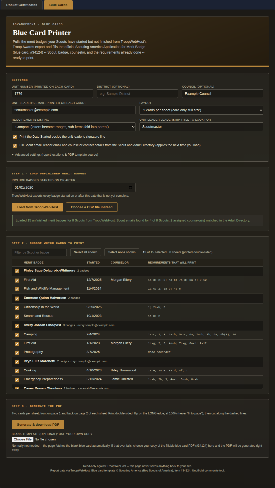

# Merit Badge Print Tools

One TroopWebHost custom page with two tabs, so a leader has a single place for advancement printing:

| Tab | What it prints | Details |
|---|---|---|
| **Pocket Certificates** | Merit Badge Pocket Certificates (item #33414) from the Award Report | [`../Merit_Badge_Pocket_Cert/`](../Merit_Badge_Pocket_Cert/README.md) |
| **Blue Cards** | Application for Merit Badge blue cards (item #34124) for unfinished badges, from the Troop Awards export | [`../Blue_Card/`](../Blue_Card/README.md) |



The Pocket Certificates tab is the current version of that tool (including its unit-leader detection and pre-printed cardstock mode). Required roles, endpoints and troubleshooting are exactly those of the two tools (see their READMEs); the tabs add nothing new to what TroopWebHost is asked for.

## Installation

1. Open `merit-badge-print-tools.html` and copy its entire contents.
2. In TroopWebHost go to **Manage Custom Pages**, create (or edit) a Custom Page, paste the whole block into the HTML editor, and save.

It must be pasted into TroopWebHost itself (same-origin), like every other page in this repo. You can keep the two standalone pages as well; they are unaffected.

**Size.** The page is about 127 KB (the two tools together are 122 KB). If TroopWebHost's editor ever refuses it, `node build.js --slim` leaves out the duplicated "read before using" notes and saves about 7 KB.

**Libraries.** pdf-lib (both tabs) and SheetJS (the Pocket tab's directory parsing) are each loaded once from their CDNs.

## How the page behaves

- **Tabs.** Pocket Certificates is the default. The page remembers the last tab you used in this browser, and the URL can select one directly: `...#pocket` or `...#blue` (handy for a menu link straight to Blue Cards). Tabs work with the keyboard (Left/Right arrows, Home, End).
- **Independent tools.** Each tab is the standalone tool, embedded unmodified, with its own settings, saved values, report loading and PDF generation. Loading a report on one tab never touches the other, and a tab keeps its loaded table while you look at the other.
- **Shared settings.** Four boxes mean the same thing on both tabs and are kept in step: **Unit number**, **Council**, **Adult Directory Menu_Item_ID**, and the **Leadership title** used to find the unit leader (an exact match, so "Assistant Scoutmaster" is never taken for "Scoutmaster"). A value entered on one tab fills the other tab's box when it is empty, and later edits are mirrored across. Everything else (District, leader email, the Pocket tab's leader *name*, pre-printed mode, layouts) stays per-tab. The Pocket tab still only saves its own settings when you press its **Save settings**.
- **Theming.** Each tool still resolves its own colours from the live site. The tab bar copies the active tool's resolved palette, so it matches automatically in light and dark sites.

## This file is generated. Rebuild it when either tool changes.

`merit-badge-print-tools.html` is produced by `build.js` from the two standalone tool files. **Edit the standalone tools, not this file**, then regenerate. The build reads `../Merit_Badge_Pocket_Cert/merit-badge-pocket-cert.html` and `../Blue_Card/blue-card.html`, so make sure those repo copies are the current versions first:

```
cd Merit_Badge_Print_Tools
node build.js
```

The build embeds each tool exactly as written (nothing inside either tool is rewritten). It lifts each tool's leading notes comment into one combined header, loads shared libraries such as pdf-lib once, and adds the tab bar and a small wrapper script. It **stops with an error instead of producing a subtly broken page** if the sources stop fitting the assumptions (a duplicate element id, a root element that isn't first, an unrecognised kind of script tag, non-ASCII characters that TroopWebHost's editor would corrupt). Options: `--pocket <file> --blue <file> --out <file>` for custom paths, and `--slim` (above).

Adding a third tool later means adding one line to `TOOLS` at the top of `build.js` (and, if useful, a pair to `SHARED_FIELDS`).

## Implementation notes

- **Why embed rather than merge.** Both tools already isolate themselves: unique id/class/storage prefixes (`mbc-` and `bcp-`), everything inside an IIFE, no globals. Embedding them unchanged means a bug fix in either standalone tool reaches the tabbed page with a rebuild, with nothing to re-apply by hand.
- **A hidden tab is `display:none`, not removed.** Its script has already run, its loaded data is kept, and its theme probe (which measures elements in `<body>`, not inside the tool) is unaffected by being hidden.
- **The tools' own root margin is overridden** only inside a tab (`#mbt-root .mbt-panel > div[id]`) so the tool sits flush under the tab bar; the standalone files are untouched.
- **Shared-field mirroring guards against loops** by only propagating when the partner's value differs, so a change on one tab causes exactly one change event on the other.

## Testing

`test_combined.js` (48 checks) runs in headless Chromium against the local TroopWebHost stand-in from `../Blue_Card/` (real `302`s), with synthetic data only:

- the generated file: unique ids, pdf-lib loaded once, ASCII, both tools embedded verbatim, and **the checked-in page is byte-identical to a fresh rebuild** (this catches "I updated a tool but forgot to rebuild"),
- tabs: default, switching, `aria-selected`, URL hash, remembered tab, hash-over-memory, arrow/Home/End keys,
- shared settings: unit auto-detect, pre-fill, mirroring in both directions with no loop, and a cross-tab proof (change the leader title on the Blue Cards tab, then the Pocket tab's **Detect** finds a different person),
- a complete workflow on **each** tab inside the combined page (load, select, generate, validate the PDF with `qpdf`/`pdftotext`), including the Pocket tab's leader auto-detect and pre-printed cardstock mode.

```
npm i playwright pdf-lib xlsx
node test_combined.js
node gen_screenshots.js
```
