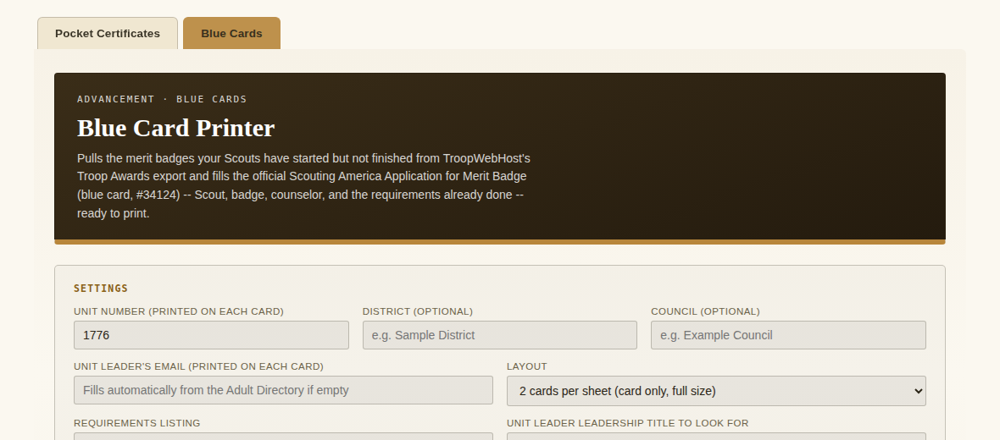
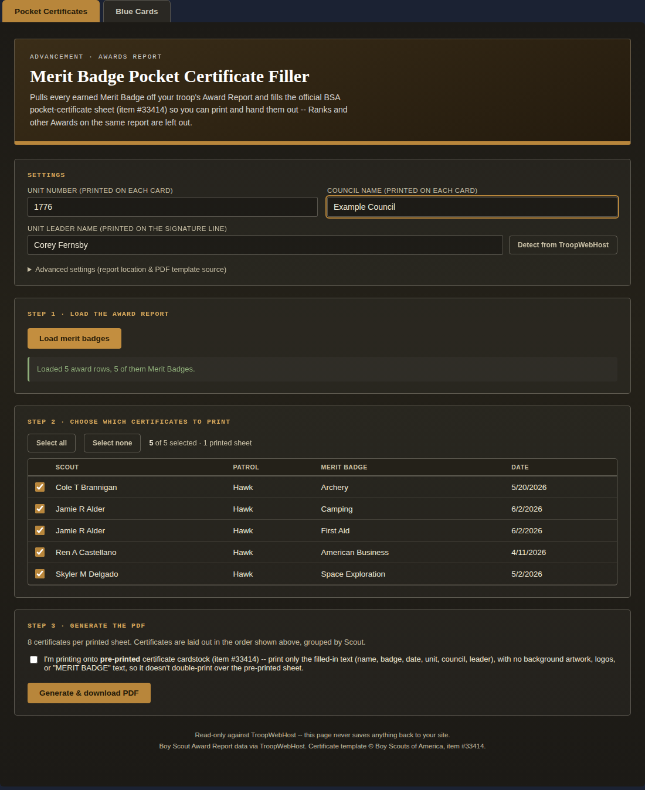
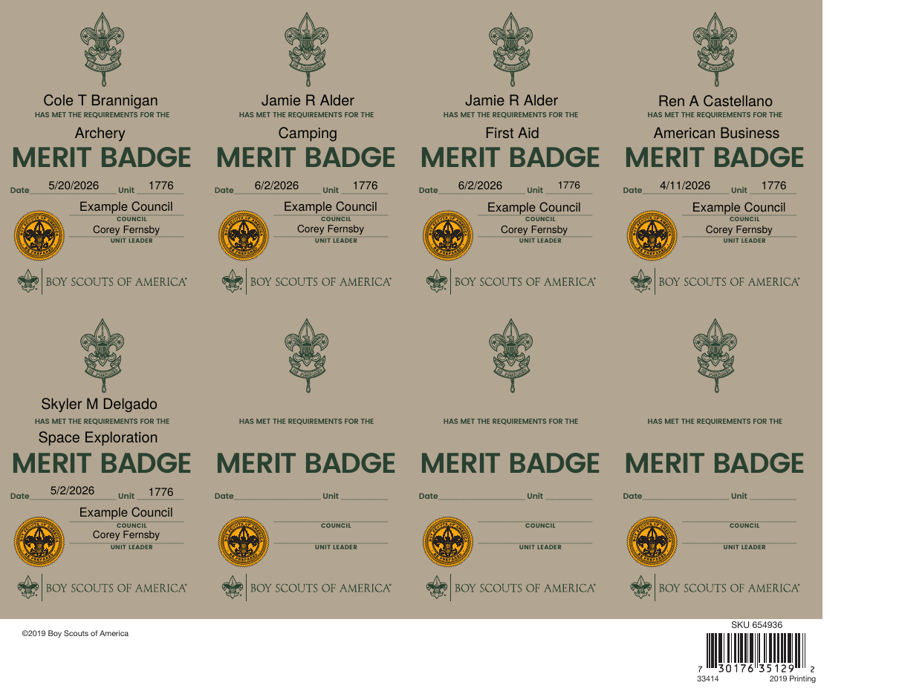
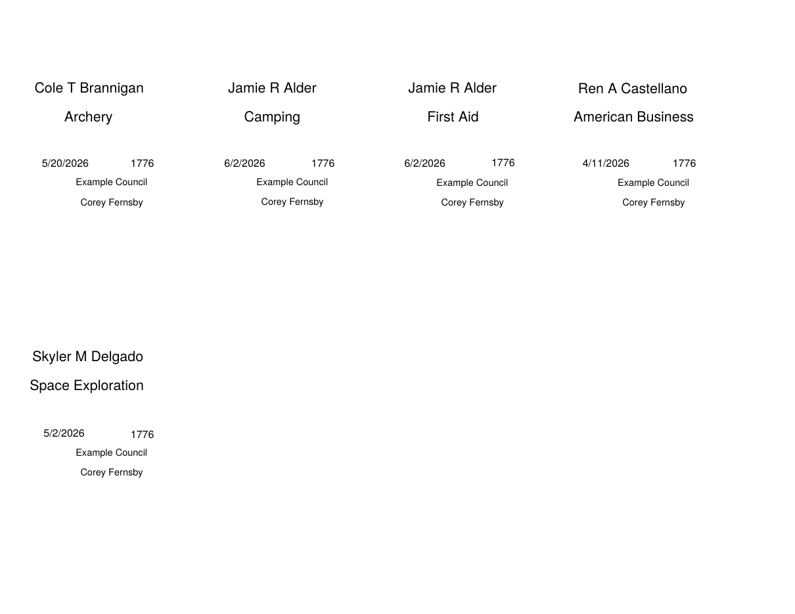
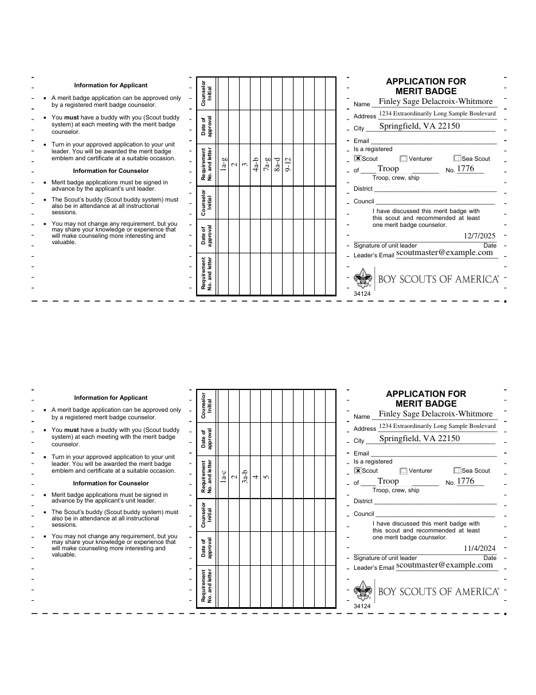
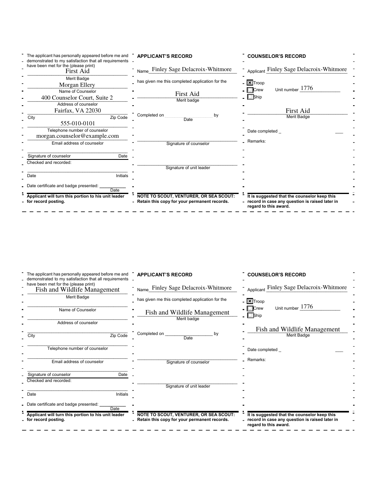
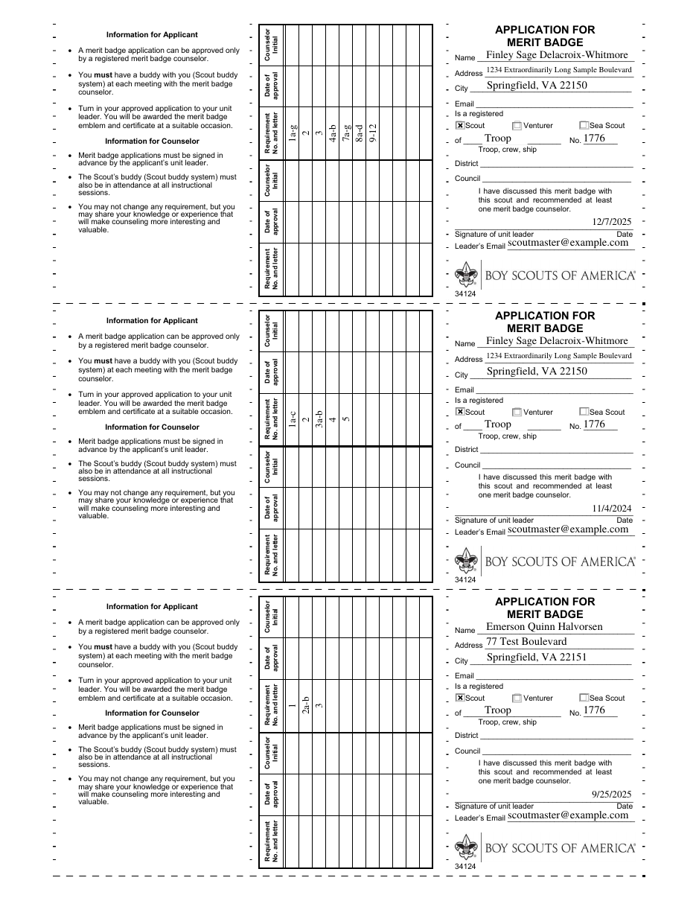

# Merit Badge Print Tools

One TroopWebHost custom page, `merit-badge-print-tools.html`, with two tabs for advancement printing:

| Tab | Prints | From |
|---|---|---|
| **Pocket Certificates** | Merit Badge Pocket Certificates (item #33414), 8 per sheet | The troop's Award Report |
| **Blue Cards** | Application for Merit Badge blue cards (item #34124), for badges started but not finished | TroopWebHost's Troop Awards "Blue Cards" export |

Only one file is pasted into TroopWebHost. Everything below documents that one file; there is nothing else to install.


## Installation

1. Open `merit-badge-print-tools.html` and copy its entire contents.
2. In TroopWebHost go to **Manage Custom Pages**, create (or edit) a Custom Page, paste the whole block into the HTML editor, and save.

This only works pasted directly into TroopWebHost's own site (same-origin) — it relies on your logged-in session to fetch reports. It will not work copied into an external site or previewed elsewhere.

**Size.** The page is about 128 KB. If TroopWebHost's editor ever refuses it, `node build.js --slim` leaves out the two tools' "read before using" notes (kept in this README instead) and saves a few KB.

**Libraries.** pdf-lib (both tabs) and SheetJS (the Pocket tab's directory parsing) are each loaded once from their CDNs at runtime — nothing is bundled.

## How the page behaves

- **Tabs.** Pocket Certificates is the default. The page remembers the last tab you used in this browser, and the URL can select one directly: `...#pocket` or `...#blue` (handy for a menu link straight to Blue Cards). Tabs work with the keyboard (Left/Right arrows, Home, End).
- **Independent tools.** Each tab has its own settings, saved values, report loading and PDF generation. Loading a report on one tab never touches the other, and a tab keeps its loaded table while you look at the other.
- **Shared settings.** Four boxes mean the same thing on both tabs and are kept in step: **Unit number**, **Council**, **Adult Directory Menu_Item_ID**, and the **Leadership title** used to find the unit leader (an exact match, so "Assistant Scoutmaster" is never taken for "Scoutmaster"). A value entered on one tab fills the other tab's box when it is empty, and later edits are mirrored across. Everything else (District, leader email, the Pocket tab's leader *name*, pre-printed mode, layouts) stays per-tab.
- **Theming.** Each tool resolves its own colours from the live site (light or dark). The tab bar copies the active tool's resolved palette, so it matches automatically.



Restricted: both reports live behind TroopWebHost roles (see below). A login without access is detected automatically — TroopWebHost redirects it — and shown a plain "restricted" message rather than a guessed-at scoped view.

---

# Pocket Certificates tab

Pulls the troop's Award Report, keeps only the rows where Type is "Merit Badge" (Ranks and other Awards on the same report are left out), lets a leader check off which ones to print, then fills the official BSA "Merit Badge Pocket Certificate" PDF (item #33414, 8 cards per sheet). Unit Leader name can auto-detect from TroopWebHost's own Adult Directory instead of being typed by hand.



## Required roles

| Report | Menu_Item_ID | Needed for | Roles that can reach it |
|---|---|---|---|
| Award Report (via Pending Awards) | 45952 (Form_ID 253) | Required | Adult Leader, Rank Advancement |
| Adult Directory | 46013 | Optional (Unit Leader auto-detect; type the name by hand otherwise) | Adult, Scout, Membership, Rank Advancement |

To load the merit badges you need the **Adult Leader** or **Rank Advancement** role. Rank Advancement also reaches the Adult Directory, so Unit Leader auto-detect works. A login that holds only Adult Leader can still load badges and print, but Unit Leader has to be typed in unless that login also holds Adult (or another role in the table).

Roles come from the site's Task Role and Task Menu Items exports, matched on `Menu_Item_ID`, and were checked against a login that holds only the Adult role. A site administrator can change which tasks each role holds (**Menu > Administration > Security Configuration > Assign Tasks to Roles**), so confirm against your own site.

## What it does

1. **Settings.** Unit number auto-fills from the site's own page title; Council name is a one-time manual entry (TroopWebHost has no Council field to read); Unit Leader name can be typed by hand or auto-detected. Advanced settings expose the Award Report's `Menu_Item_ID`/`Form_ID`, the Adult Directory's `Menu_Item_ID`, the Leadership title to search for, and the PDF template source URL, all remembered per-browser.
2. **Load the Award Report** — fetches every Adult/Scout Rank, Award, and Merit Badge row, keeps only Type = "Merit Badge", strips the trailing `*` TroopWebHost appends to mark a badge Eagle-required, and lists the result sorted by Scout then badge name so a Scout's certificates print together.
3. **Choose which certificates to print** — every row is checked by default; uncheck anyone who shouldn't be on this batch (already printed, awaiting a Court of Honor, etc.). The running count and printed-sheet estimate update live.
4. **Unit Leader auto-detect** — reads TroopWebHost's Adult Directory report and looks for whoever has the configured Leadership title (default "Scoutmaster"). Matching is exact-token, not substring, so "Assistant Scoutmaster" is never mistaken for "Scoutmaster". Runs once automatically if the field is empty, and any time the "Detect from TroopWebHost" button is clicked; zero or multiple matches leaves the field for manual entry instead of guessing.
5. **Generate the PDF** — fills the real, unmodified BSA #33414 form, 8 certificates per sheet, extra sheets added automatically for larger batches.
6. **Pre-printed cardstock mode** — for troops that already stock BSA's pre-printed #33414 cards, a checkbox switches generation to data-only: no background artwork, logos, or "MERIT BADGE" text, just the same fields at the same positions, so it can print directly onto the pre-printed sheet without doubling up the artwork.




*(Every name, patrol, and date above is fictional — none of it is a real troop's data.)*

No separate PDF upload is needed — the page fetches the official certificate template live from BSA's Scout Shop media host at runtime (with a GitHub-staged fallback copy, `src/merit-badge-pocket-cert-template.pdf`, used automatically if that fetch ever fails) — except in pre-printed cardstock mode, which never fetches the template at all.

## Endpoints used

| Purpose | Menu_Item_ID / Form_ID | Read/Write |
|---|---|---|
| Award Report (Adult+Scout Ranks/Awards/Merit Badges) | 45952 (Form_ID 253) | Read |
| Adult Directory (Leadership column) | 46013 | Read |

Both are read-only. The Award Report uses TroopWebHost's own grid-resubmit paging (fetch the page, resubmit its `<form id="easyform">` with `NewRowsPerPage=ALL`) since it's the on-page-grid style of report; the Adult Directory is a plain single-GET `FormReport.aspx?...&ReportFormat=XLS` export instead. Every value above has a matching field in the page's "Advanced settings" panel.

## Implementation notes (durable warnings, not just history)

- **The Award Report's Type column also contains "Rank" and "Award" rows, not just "Merit Badge".** Filtering is a plain case-insensitive equality check against Type, not a substring or fuzzy match — deliberately strict, since this report is the one place all three advancement categories are mixed together.
- **TroopWebHost appends a trailing `*` to a Merit Badge's Award text to mark it Eagle-required.** Printed as-is, that asterisk looks like a typo on a certificate, so it's stripped before it ever reaches the PDF or the on-screen table.
- **The Award Report and Adult Directory are fetched two completely different ways**, and that's deliberate: the Award Report is TroopWebHost's on-page-grid style (no `FormReport.aspx` export exists for it), needing the fetch-the-page-then-resubmit-with-`NewRowsPerPage=ALL` dance; the Adult Directory is a plain single-GET export.
- **Leadership-title matching is exact-per-token, not substring.** A person can hold more than one position (e.g. "Scoutmaster, Committee Member"), so the Leadership cell is split on `[,;/|]` and the word "and", then each token is compared with an exact, case-insensitive match.
- **Certificate generation builds each 8-card sheet from a *fresh* copy of the template**, fills it, and *flattens the form* (bakes values into static page content) before merging it into the final output. Merging multiple *un-flattened* copies of the same template would collide on AcroForm field names (`Name 1`, `Badge 1`, etc. are identical across every sheet).
- **Pre-printed cardstock mode draws directly on blank pages — it never loads the template PDF at all.** Field positions and the page size were read directly from the template's own AcroForm `/Rect` entries and `/MediaBox`, not estimated. Every field on this template is center-aligned (`/Q 1`), confirmed the same way, so blank mode centers each value the same way with a manual shrink-to-fit font size standing in for the AcroForm's own auto-size (font size 0) behavior.
- **The PDF template is fetched at runtime from BSA's own Scout Shop media host**, not embedded as base64 — a GitHub-staged fallback copy (`src/merit-badge-pocket-cert-template.pdf`) is tried automatically, silently, if the primary fetch fails.
- **Access control here is a redirect, not an HTTP error.** `fetch()` follows redirects transparently, so the tell that a login can't reach a given page is `res.redirected`, not a non-2xx status.

## Troubleshooting

- **"The Award Report page didn't have the expected columns"**: TroopWebHost may have changed this report, or the Menu_Item_ID/Form_ID in Advanced settings may be wrong — open Membership Hub → Advancement Hub → Award Report on your own site and copy the IDs out of the URL.
- **"Restricted"**: the Award Report requires Adult Leader or Rank Advancement; the Adult Directory (auto-detect only) requires Adult, Scout, Membership or Rank Advancement.
- **Unit Leader doesn't auto-fill**: either nobody (or more than one person) on your Adult Directory has the configured Leadership title exactly — check the exact wording your installation uses (e.g. some troops use "Scoutmaster (SM)") and adjust "Leadership title to detect", or just type the name in by hand.
- **"Could not generate the PDF" / network or CORS error**: the primary PDF source may be temporarily blocking the fetch; the page automatically falls back to the GitHub-staged copy — check that `src/merit-badge-pocket-cert-template.pdf` is pushed and current.
- **Pre-printed cardstock mode text looks misaligned**: try adjusting your printer's scaling/margins to "actual size" / "100%" (never "fit to page") before assuming the coordinates are wrong.

---

# Blue Cards tab

Runs TroopWebHost's own **Troop Awards "Blue Cards" export** (every merit badge your Scouts have started but not yet completed), lets a leader check off which ones to print, then fills the official Scouting America **Application for Merit Badge** ("blue card", item #34124, fillable PDF) with the Scout's name and address, the badge, the counselor (when one is assigned), and the requirements already completed.

You can still use this tab with a CSV that someone with access downloaded (**Choose a CSV file instead**), if your own login can't reach the export.

## Required roles

| Report | Menu_Item_ID | Needed for | Roles that can reach it |
|---|---|---|---|
| Export Troop Awards Advancement Files (Blue Cards) | 45954 (Form_ID 1689 -> 1690) | Required (or use a CSV file instead) | **Not yet verified.** It sits in the same Awards menu group as Pending Awards (45952, Adult Leader / Rank Advancement), so those are the likely roles. |
| Scout Directory | 46012 | Optional (Scout email) | Adult, Scout, Membership, Rank Advancement |
| Adult Directory | 46013 | Optional (leader email, counselor contact details) | Adult, Scout, Membership, Rank Advancement |

The Blue Cards row could not be checked from the files this tab was built from (a HAR capture and a sample CSV carry no role information). To confirm it, match `Menu_Item_ID` 45954 in your site's **Task Menu Items** export against the **Task Role** export, the same way the Pocket tab's table above was built.

The two directory lookups are pure enrichment. If either is unavailable the cards are still produced with those boxes left blank, and the page says which lookup was skipped.

## What it does

1. **Settings.** Unit number auto-fills from the page title (e.g. "Troop 123 Town" -> `123`). Council and District are one-time manual settings remembered in your browser.
2. **Step 1 - Load.** Pick a "started on or after" date (default: Jan 1 of six years ago) and click **Load from TroopWebHost**. The page performs the same three requests your browser makes on the Troop Awards export page and reads the CSV that comes back.
3. **Step 2 - Choose.** Badges are grouped by Scout. Tick individual badges, a whole Scout, or use the filter box with **Select all / none shown**. The last column previews exactly which requirement labels will print.
4. **Step 3 - Generate.** Downloads one PDF. A single card is named `<Scout> <Badge> <Unit>.pdf`; several cards download as `Blue_Cards.pdf`.




*(Every name, address, and email above is fictional — none of it is a real troop's data.)*

### What gets printed

| On the card | Comes from |
|---|---|
| Name (all three panels), Address, City/State/Zip | CSV: `ScoutName`, `ScoutAddress`, `ScoutCity`/`ScoutState`/`ScoutZip` |
| Merit badge (all three panels) | CSV: `MeritBadge` (a trailing `*` Eagle marker is stripped) |
| Requirement grid | CSV: `CompletedRequirements` (see below) |
| Name of counselor | CSV: `CounselorName` (blank for most badges) |
| Counselor address, city/zip, phone, email | Adult Directory, only if the counselor is a registered adult in your troop |
| Scout email | Scout Directory (matched by name; `Email`, else `Email #2`) |
| Unit number, District, Council | Settings |
| Leader's email | Settings, or auto-detected from the Adult Directory |
| Date beside the unit leader's signature line | CSV: `DateStarted` (optional checkbox, on by default) |

**Left blank on purpose:** signatures, *Counselor Initial*, *Date of approval*, *Date completed*. Those are for people to write.

### The requirement grid

The card has 22 requirement columns. TroopWebHost can record far more items than that (a nearly finished First Aid badge has ~97), so the default **Compact** listing:

- treats a listed parent as covering its children (`03.` plus `03.a`-`03.e` -> `3`; `2.b` plus `2.b.01`-`2.b.03` -> `2b`),
- turns runs of letters into ranges (`01.a`...`01.g` -> `1a-g`, `5.a`,`5.c` -> `5a,c`),
- keeps unfinished sub-items visible (`09.b.1`,`09.b.3`,`09.b.4` with no `09.b` -> `9b(1,3-4)`),
- folds runs of three or more whole requirements (`11.`-`14.` -> `11-14`).

The top block of the card (template columns 12-22) fills first, then the bottom block (columns 1-11). Anything that still does not fit is written into the Counselor's Record **Remarks** box as "Also completed: ..." and flagged in the table, never silently dropped. **As recorded** mode skips the compaction and prints one cell per recorded item.

### Layout

- **3 cards per sheet:** the same crop as 2-up, reduced to **96%** so three fit. The artwork is 3.58 in tall, and three at full size would leave only about 0.13 in of margin, inside most printers' unprintable zone, so the outer cut lines would be clipped. At 96% the margin is about 0.29 in top and bottom (verified by measuring the rendered PDF). Cards come out about 3.4 in tall, which makes no practical difference once cut out. Uses a third of the cardstock.
- **2 cards per sheet (default):** crops just the card strip out of each template page and stacks two per sheet at full size, front on page 1 and back on page 2. The template's instruction text is left off.
- **1 card per page:** the whole template page (card plus the instructions text), front then back.

Either way: print **double-sided, flip on the long edge, at 100% / "Actual size"** (not "fit to page"), then cut along the dashed lines. Every card's back is placed at exactly the same position and scale as its front, so each back lands behind its own front. Print one test sheet before a big batch.



The blank template is fetched at run time from this repo's staged copy, `src/blue-card-template.pdf` (via `raw.githubusercontent.com`, which allows cross-origin reads). No stable official Scouting America URL for the *fillable* version was identified, so none is assumed. If that fetch is ever blocked, use the always-visible **Blank template** file box in Step 3 to supply your own copy of the fillable #34124 PDF (generation then runs immediately). It is the same file. The staged PDF's own metadata credits Tom Stalnaker, Chester County Council, as author of this fillable version; the form content is (c) Scouting America.

## Endpoints used

Reverse-engineered from a captured HAR, not from documentation.

| Purpose | Request | Read/Write |
|---|---|---|
| Prompt page (date + button) | `GET FormDetail.aspx?Menu_Item_ID=45954&Stack=2` | Read |
| Run the export | `POST FormDetail.aspx` (the page's own `<form id="easyform">`, "Started Since" date set, button `BUTTON7` "Download Blue Cards File") -> `302` -> `FormCSV.aspx?Menu_Item_ID=45954&Form_ID=1690&Stack=2&ID=1&FK=0` | Read (generates a file; saves nothing) |
| Scout Directory | `FormReport.aspx?Menu_Item_ID=46012&Stack=1&ReportFormat=XLS` | Read |
| Adult Directory | `FormReport.aspx?Menu_Item_ID=46013&Stack=1&ReportFormat=XLS` | Read |

The CSV has the columns `ScoutName, MeritBadge, DateStarted, ScoutAddress, ScoutCity, ScoutState, ScoutZip, CounselorName, CompletedRequirements` (requirements separated by `;`). Every ID has a matching field under **Advanced settings**.

## Implementation notes (durable warnings, not just history)

- **A redirect means two different things here.** Elsewhere in this page `res.redirected` means "access denied". This export is the exception: a successful POST *is* a `302` to `FormCSV.aspx`. So the initial page GET treats any redirect as denied, and the POST treats a redirect as denied only if it does not land on `FormCSV.aspx`. Do not "fix" this to the usual rule.
- **The date box and the button are found by label, not by hard-coded `ENTRY` id.** The row containing "Started Since" is located on the fetched page (falling back to the only `ENTRY` text box), and the button by its "Blue Cards" title. The whole `easyform` is then serialized with `FormData`, so every hidden field travels exactly as the browser sends it. The POST this tab builds was checked field-for-field against the browser's own POST in the original HAR (22 of 22 fields identical).
- **The CSV is parsed by a small RFC 4180 parser, not SheetJS.** A spreadsheet library would coerce cells: `10.` could become the number `10`, `01.a` and zero-padded tokens are at risk, and `DateStarted` could collapse to a 2-digit year.
- **Text is decoded as UTF-8 with a Windows-1252 fallback**, so an accented name never turns into replacement characters.
- **`DateStarted` keeps its calendar date.** Values like `5/19/2024 11:59:00 PM` are not time-zone converted.
- **pdf-lib gotchas found with this template:**
  - `Remarks1` is a *rich-text* field. pdf-lib refuses to regenerate its appearance unless it has been set, so it is always set (to `''` when unused).
  - `form.flatten()` deletes the template's kid widgets but leaves their references in each page's `/Annots`, producing dangling references. They are pruned after flattening.
  - `embedFont` writes the font dictionary only at `save()`. Embedding pages from an unsaved document leaves font references dangling and the text vanishes, so each flattened card is round-tripped through `save()` + `load()` first.
  - Requirement cells are rotated 90 degrees, so available text length is the widget's *height*, not its width.
- **Blank card + tiny overlays.** The blank flattened template is embedded once per PDF; each card is only a text overlay drawn on top. A 15-card job is under 1 MB instead of ~3 MB, and it scales to a whole troop.
- **Template fetch retries once with `?v=<timestamp>` and `cache: 'no-store'`.** raw.githubusercontent.com caches 404s (about 5 minutes) and browsers can too, so a template pushed moments earlier could otherwise fail spuriously.
- **Name matching between the CSV and the directories** compares word tokens ("First Middle Last" vs "Last, First"), supports multi-word surnames and directory nicknames, ignores accents and apostrophes, and returns *no match* rather than guessing when two people fit.
- **Privacy:** the directories are read only to look up emails and counselor contact details for the cards being printed; the directory data itself is discarded after matching. Nothing is written back to TroopWebHost or sent anywhere except to your own browser.

## Troubleshooting

- **"Restricted"**: your login cannot reach the Troop Awards export. Ask your TroopWebHost administrator for access, or get the CSV from someone who has it and use **Choose a CSV file instead**.
- **"Could not find the 'Started Since' date box"**: TroopWebHost may have changed the export page, or the Menu_Item_ID under Advanced settings is wrong for your site.
- **"...no unfinished merit badges..."**: nothing was started on or after that date. Try an earlier date.
- **Scout emails or counselor details are blank**: the directory lookups are best-effort. A Scout goes unmatched if the export's name differs from the directory's, or if two people match. Type the value in by hand on the printed card.
- **Leader email is blank**: nobody in the Adult Directory holds the exact Leadership title in Settings. Adjust the title or type the email.
- **"Could not generate the PDF ... (HTTP 404)"**: the template fetch failed. GitHub caches "not found" answers for a few minutes (and so can your browser), which is common right after the PDF is first pushed. The page already retries once with a cache-busting parameter; if it doesn't clear, confirm `src/blue-card-template.pdf` exists on the `main` branch, or choose your own copy in the **Blank template** box in Step 3.
- **Text looks off on the physical card**: check that you printed at 100% (not "fit to page") and double-sided on the long edge.

---

# Development

This section covers the page as a whole. It is only needed if you plan to change the tool; using it in TroopWebHost needs nothing here.

## Repository layout

```
Merit_Badge_Print_Tools/
├── merit-badge-print-tools.html   <- the one file to paste into TroopWebHost
├── README.md                       <- this file
├── build.js                        <- assembles the HTML file from src/
├── test.js                         <- the full test suite
├── gen_screenshots.js              <- regenerates the images above
├── src/                            <- the two tools' source, plus test fixtures
│   ├── blue-card.html
│   ├── blue-card-template.pdf
│   ├── merit-badge-pocket-cert.html
│   ├── merit-badge-pocket-cert-template.pdf
│   ├── fake_twh.js
│   └── fixtures.js
└── screenshots/
```

`merit-badge-print-tools.html` is a **generated file**. Edit `src/blue-card.html` or `src/merit-badge-pocket-cert.html`, never the generated file directly, then rebuild:

```
node build.js
```

The build embeds each tool exactly as written (nothing inside either one is rewritten). It lifts each tool's leading notes comment into one combined header (unless `--slim`), loads shared libraries such as pdf-lib once, and adds the tab bar and a small wrapper script. It **stops with an error instead of producing a subtly broken page** if the sources stop fitting the assumptions (a duplicate element id, a root element that isn't first, an unrecognised kind of script tag, non-ASCII characters that TroopWebHost's editor would corrupt). Options: `--pocket <file> --blue <file> --out <file>` for custom paths, `--slim` to drop the notes comments.

## Implementation notes

- **Why embed rather than merge.** Both tools isolate themselves: unique id/class/storage prefixes (`mbc-` and `bcp-`), everything inside an IIFE, no globals. Embedding them unchanged means a bug fix in either tool reaches the tabbed page with a rebuild, with nothing to re-apply by hand.
- **A hidden tab is `display:none`, not removed.** Its script has already run, its loaded data is kept, and its theme probe (which measures elements in `<body>`, not inside the tool) is unaffected by being hidden.
- **The tools' own root margin is overridden** only inside a tab (`#mbt-root .mbt-panel > div[id]`) so the tool sits flush under the tab bar; the source files are untouched.
- **Shared-field mirroring guards against loops** by only propagating when the partner's value differs, so a change on one tab causes exactly one change event on the other.

## Testing

`test.js` (126 checks: 32 unit assertions + 94 end-to-end) runs in headless Chromium against the local TroopWebHost stand-in `src/fake_twh.js` (real `302`s), with synthetic data only:

- unit tests of the Blue Cards tab's requirement-compaction logic, CSV parsing, and name matching,
- the generated file: unique ids, pdf-lib and SheetJS each loaded once, ASCII, both tools embedded verbatim, and **the checked-in page is byte-identical to a fresh rebuild** (this catches "I edited a source file but forgot to rebuild"),
- tabs: default, switching, `aria-selected`, URL hash, remembered tab, hash-over-memory, arrow/Home/End keys,
- shared settings: unit auto-detect, pre-fill, mirroring in both directions with no loop, and a cross-tab proof (change the leader title on the Blue Cards tab, then the Pocket tab's **Detect** finds a different person),
- Pocket Certificates: report loading, leader auto-detect, generation, pre-printed cardstock mode,
- Blue Cards: the happy path (enrichment, filtering, selection, all three layouts, single-card filename, overflow into Remarks), access denied on the GET, a POST redirected elsewhere, directories denied, CSV upload (including empty and wrong files), the template-fetch fallback (visible file box, automatic retry after choosing a file), a stale-404 retry, and a measured check that the 3-up layout clears a 0.25 in margin on every edge with front and back aligned.

PDFs are checked with `qpdf --check`, `pdftotext`, and `pdftoppm` (zero warnings).

```
npm i playwright pdf-lib xlsx
node test.js
node gen_screenshots.js
```
