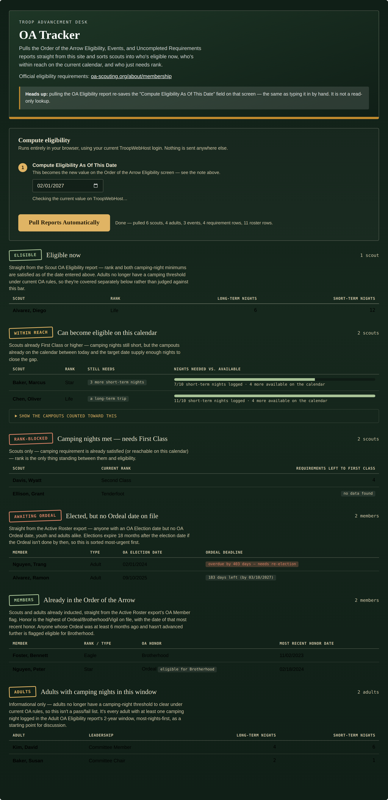
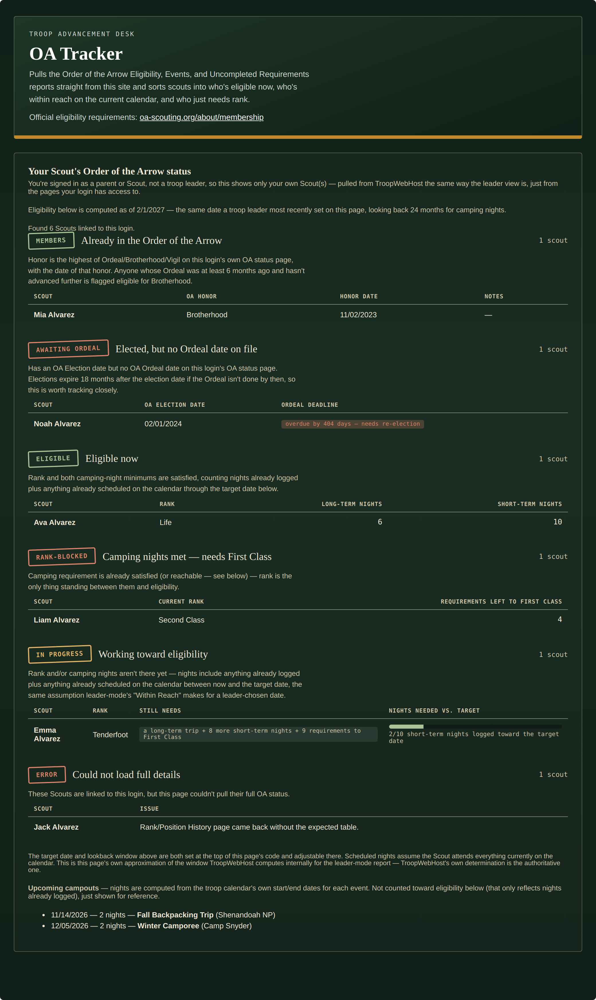

# OA Tracker

A single-file custom page for TroopWebHost that automatically pulls the reports needed for Order of the Arrow eligibility and First Class advancement, cross-references them, and sorts every scout and adult leader into one of six buckets — no manual exports, no spreadsheet wrangling.

It adapts to who's logged in:

- **Troop leaders** get the full troop-wide report below, pulled automatically with one click.
- **Scouts and parents** get an automatic, read-only view scoped to just their own household's Scout(s) — no button to click, no leader access required.

Official OA eligibility requirements: [oa-scouting.org/about/membership](https://oa-scouting.org/about/membership) — a link to this also appears near the top of the page itself.

## Leader mode: what it shows

1. **Eligible now** — scouts only. Rank and both camping-night minimums are already met.
2. **Within reach** — scouts already First Class or higher whose camping nights are short, but the campouts already on the calendar between today and your target date supply enough nights to close the gap.
3. **Camping nights met — needs First Class** — scouts only. Camping requirement is satisfied (or reachable), rank is the only blocker. Shows how many Tenderfoot + Second Class + First Class requirements are still open.
4. **Awaiting Ordeal** — anyone with an OA Election date but no Ordeal date yet, youth and adults alike. Sorted most-urgent first, since **elections expire 18 months after the election date** if the Ordeal isn't completed — past that, the member needs to be elected again. Overdue members are flagged accordingly.
5. **Already in the Order of the Arrow** — fully inducted members, with their OA Honor (Ordeal, Brotherhood, or Vigil — whichever is highest on file) and the date of that most recent honor. Anyone whose current honor is Ordeal-only and at least 6 months old is flagged eligible for Brotherhood.
6. **Adults with camping nights in this window** — informational only, not a pass/fail list. Adults no longer have a camping-night threshold under current OA rules, so this just surfaces every adult with any camping nights logged in the 2-year window, most-nights-first, as a starting point for discussion rather than a determination.

**A member appears in exactly one section.** Anyone in Awaiting Ordeal — overdue or not — is excluded from every other section; that's their one home until their Ordeal is resolved (or their election expires). Section 6 also excludes anyone already shown in Section 4 or 5.

*(Fake/placeholder data shown above — not a real troop's records.)*

## Self-service mode (Scout / Parent login): what it shows

If TroopWebHost redirects the OA Eligibility screen away from you — which it does for Scout and parent logins — the page automatically switches to a scoped view of just your own household, using the same visual sections as leader mode:

- **Already in the Order of the Arrow** — your Scout's own OA Honor and date, straight from their own status page.
- **Awaiting Ordeal** — an OA Election date with no Ordeal date yet, with the same 18-month deadline tracking as leader mode.
- **Eligible now** — rank and camping nights both satisfied.
- **Camping nights met — needs First Class** — rank is the only blocker, with a live count of Tenderfoot/Second Class/First Class requirements still open.
- **Working toward eligibility** — neither rank nor camping nights are there yet, with a progress bar and a plain-language list of what's still needed.
- **Error** — if a page couldn't be parsed for one of your Scouts, it's called out by name rather than silently dropped.

A bucket only renders if at least one Scout in your household falls into it, so a household with one Scout only ever sees one section.

*(Fake/placeholder data shown above — not a real family's records.)*

### How self-service eligibility is computed

Leaders get a real "Compute Eligibility As Of This Date" number straight from TroopWebHost's own OA Eligibility report. Scouts and parents have no equivalent report to read that number from, so this page approximates it:

- **Target date**: if a leader has recently pulled the leader-mode report on this same page, self-service mode uses the *exact same date* they set (see "Staying in sync with leader mode" below). Otherwise it falls back to the troop's next OA election window — February 1st by default, configurable via `OATRK_SELF_TARGET_MONTH` / `OATRK_SELF_TARGET_DAY` near the top of the script.
- **Camping nights**: nights already logged in the Scout's own Rank/Activity History within a rolling lookback window before the target date (`OATRK_SELF_CAMPING_WINDOW_MONTHS`, 24 months by default), plus nights from campouts already on the troop calendar between today and the target date — the same "assume they'll go" logic leader-mode's "Within Reach" bucket already uses. The raw logged/scheduled numbers are always shown alongside the total, so it's never a black box.
- **Upcoming campouts are only fetched when needed**: the calendar (and the four sequential month-fetches behind it) are only pulled if at least one Scout in the household is still short on camping nights after counting what's already logged — the only case where a scheduled-but-not-yet-happened campout could change the outcome. A Scout who's already eligible, rank-blocked on rank alone, already a member, or awaiting Ordeal skips the calendar call entirely.
- **Rank progress**: for any Scout not yet First Class, the Tenderfoot/Second Class/First Class requirement tabs are fetched and summed the same way leader mode's Uncompleted Requirements export is used — but only if the Scout isn't First Class yet, since a Scout who's already cleared rank has nothing to check there.

TroopWebHost's own determination (visible to leaders on the OA Eligibility screen) is always the authoritative one; this page's self-service math is its own best approximation of that window, and says so on the page.

### Direct Scout logins

A Scout logged in *directly* (no parent account) can't reach the parent "My Scout(s)" list at all — TroopWebHost redirects it home for that login type. This page detects that redirect and falls back automatically to the endpoints a direct Scout login *can* reach: their own OA-fields profile and their own rank/activity history and requirement tabs. Everything downstream (the eligibility computation, the bucket rendering) is identical either way — only how the Scout's raw data gets fetched differs.

### Staying in sync with leader mode

After a leader successfully pulls the full report, this page writes the date they used into a hidden marker inside its own saved Custom Page source. Any Scout or parent who opens the page afterward automatically uses that same date instead of the February 1st default, and the page states plainly on-screen which one it's using.

This write-back is a plain, targeted edit — TroopWebHost's Custom Page editor is asked for this page's current saved source, one line (the date marker) is swapped, and the result is saved back unchanged otherwise. It's a real save, but it only touches this page's own source, not any TroopWebHost report or record.

**This requires Custom Page *editing* rights**, which is narrower than being able to pull the OA Eligibility report — a leader without that permission simply won't trigger the write-back. Nothing else breaks; self-service mode just falls back to its own default date, same as if no leader had pulled a report yet.

## Installation

1. Open the file and copy its entire contents.
2. In TroopWebHost, go to **Manage Custom Pages**.
3. Create a new Custom Page (or edit an existing one) and paste the whole block into the HTML editor.
4. Save, then open the page.

This only works pasted directly into TroopWebHost's own site (same-origin) — it relies on your logged-in session to fetch reports. It will not work copied into an external site or previewed elsewhere.

## How to use it (leader mode)

1. On load, the page does one read-only check of the OA Eligibility screen and shows you whatever date is currently saved there, pre-filling the date field with it.
2. Change the date if needed — this is the "Compute Eligibility As Of This Date" you want to evaluate against.
3. Click **Pull Reports Automatically**.

Scouts and parents don't do anything — their view loads and computes automatically as soon as the page opens.

## ⚠️ Important: this is not entirely read-only

Clicking **Pull Reports Automatically** re-submits TroopWebHost's own Order of the Arrow Eligibility form to set "Compute Eligibility As Of This Date" to whatever you entered. **This is a real save**, identical to a leader typing that date into the field by hand — it will overwrite that value for anyone else who opens that screen. The Events, Uncompleted Requirements, and Active Roster pulls are plain read-only report links with no side effects. The shared-date write-back described above is also a real save, scoped to this page's own source, and only happens if that leader has Custom Page editing rights.

## Reports Used

Every report URL below was reverse-engineered from captured network requests, not from official documentation, since TroopWebHost has no public API.

**Leader mode**

| Report | Menu_Item_ID |
|---|---|
| Scout OA Eligibility | 53654 (Form_ID 8400, BUTTON6) |
| Adult OA Eligibility | 53654 (Form_ID 8400, BUTTON7) |
| Events export | 53104 |
| Uncompleted Requirements | 46046 |
| Active Roster | 53747 |

**Self-service — parent login**

| Report | Menu_Item_ID |
|---|---|
| My Scout(s) list | 45899 |
| Scout OA-fields profile | 45899 (Form_ID 209) |
| Rank/Position + Activity History | 45899 (Form_ID 432) |
| Uncompleted requirement tabs (Tenderfoot / Second Class / First Class) | 45899 (Form_IDs 433 / 430 / 428) |
| Upcoming Event Summary (fallback only, dates without nights) | 51898 |
| Calendar (real per-event nights) | 45922 (Form_ID 271) |

**Self-service — direct Scout login**

| Report | Menu_Item_ID |
|---|---|
| OA-fields profile | 45902 |
| Current rank + Rank/Activity History | 45911 |
| Uncompleted requirement tabs (Tenderfoot / Second Class / First Class) | 45911 (Form_IDs 222 / 223 / 224) |

**Shared-date write-back** (Custom Page editing rights required)

| Action | Endpoint |
|---|---|
| Read this page's own saved source | `formCustomEdit.aspx` (`Selected_Action=EditSectionSource`, `Form_ID=7323`) |
| Save the edited source back | `formCustomEdit.aspx` (`Selected_Action=SaveContentEdit`, `Form_ID=7323`) |

If something needs correcting, the values live in one place — search this file for `CONFIG` near the top of the `<script>` block.

## Implementation notes (durable warnings, not just history)

These are lessons from real bugs, kept here so they aren't reintroduced by a future edit:

- **Never fetch multiple calendar months in parallel.** TroopWebHost's month-navigation POST reads and writes shared session state. Two concurrent month requests can race, and the "later" request can silently come back with an *earlier* month's grid, still labeled as if it were the month asked for. All month fetches here are strictly sequential, and events are additionally grouped into contiguous day-runs (not just a min/max date span) so even a reused event ID can't produce a bogus multi-month event.
- **Always send an explicit target for "the current month" too.** A bare, un-targeted month request doesn't reflect today's month — it returns whatever month the session's calendar was last left at, which can be residual state from earlier browsing. Every month fetch, including the current one, sends an explicit target for this reason.
- **Access control here is a redirect, not an HTTP error.** `fetch()` follows redirects transparently, so the tell that a login can't reach a given page is `res.redirected` / a changed final URL, not a non-2xx status. This is how leader-vs-self-service mode is detected, and how the parent-vs-direct-Scout self-service fallback is detected.

## Troubleshooting

- **A pull comes back empty with no error message**: open Tools → Reporting Options on TroopWebHost. If it's set to "PDF only," these report links may return a PDF instead of data, which the parser can't read.
- **Adults come back empty**: the Adult OA Eligibility report's columns were verified once against a real export, but if TroopWebHost changes that report's layout, re-check `ADULT_OA_EXPECTED_COLS` in CONFIG.
- **The date field looks wrong on load**: that's the value *currently saved* on the live OA Eligibility screen, not necessarily your intended target date — it's a starting point, not a recommendation. Change it before pulling.
- **Someone in "Already in the Order of the Arrow" shows "no honor date on file"**: their roster record has `OA Member = Y` but no date in Ordeal, Brotherhood, or Vigil — a real data gap on TroopWebHost, not a bug here. Worth fixing at the source.
- **A Scout/parent sees "couldn't find any Scouts linked to this login"**: either the login genuinely has no Scout(s) attached in TroopWebHost, or (for a direct Scout login) the direct-login fallback itself failed — check that Menu_Item_ID 45902/45911 still resolve for a Scout-direct session on your site.
- **Self-service mode is using the wrong target date**: it only follows a leader's date once a leader with Custom Page editing rights has successfully pulled the report on this page at least once. Until then, it uses its own default (next Feb 1st, or whatever `OATRK_SELF_TARGET_MONTH`/`OATRK_SELF_TARGET_DAY` are set to).

## OA Eligibility Requirements:

- Long-term camping = 5+ nights in a single trip; short-term = 1–4 nights. Eligibility needs at least one qualifying long-term trip and 10+ short-term nights within the window TroopWebHost itself computes for your chosen date (leader mode) or this page's own approximation of it (self-service mode — see above).
- Adults: no camping-night requirement, must be nominated by the unit committee. The number of adults nominated can be no more than two-thirds of the number of youth candidates elected.
- Section 6 (leader mode) is informational, not a determination.
- Ordeal window: 18 months from the OA Election date (`OATRK_ORDEAL_WINDOW_MONTHS` in CONFIG).
- Brotherhood eligibility: 6 full months since the Ordeal date, and no higher honor (Brotherhood or Vigil) already earned (`OATRK_BROTHERHOOD_WAIT_MONTHS` in CONFIG).
