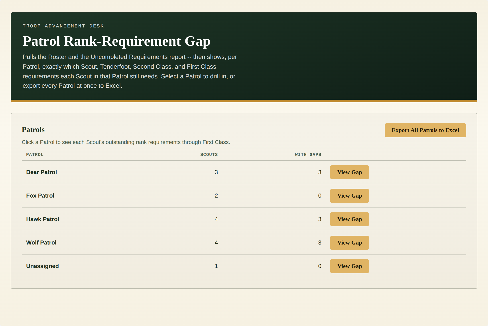
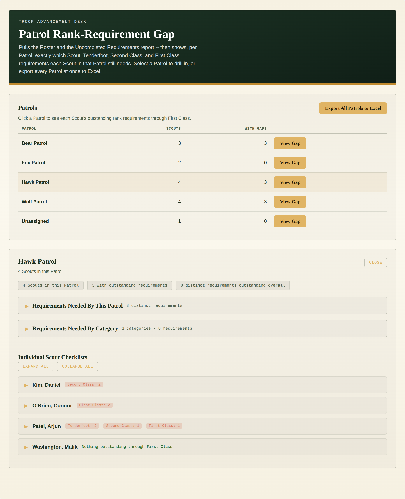
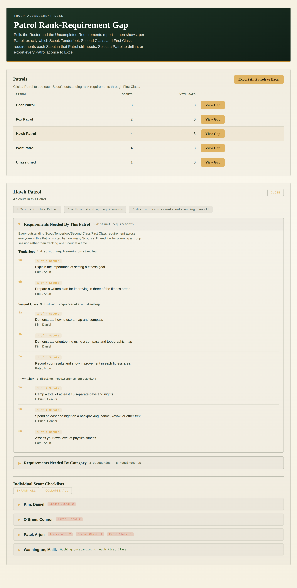
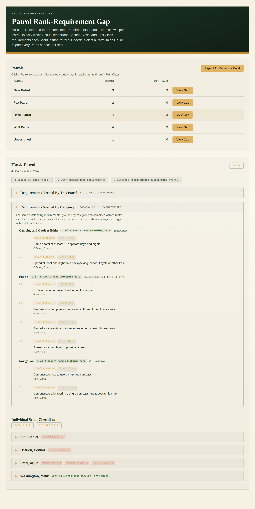
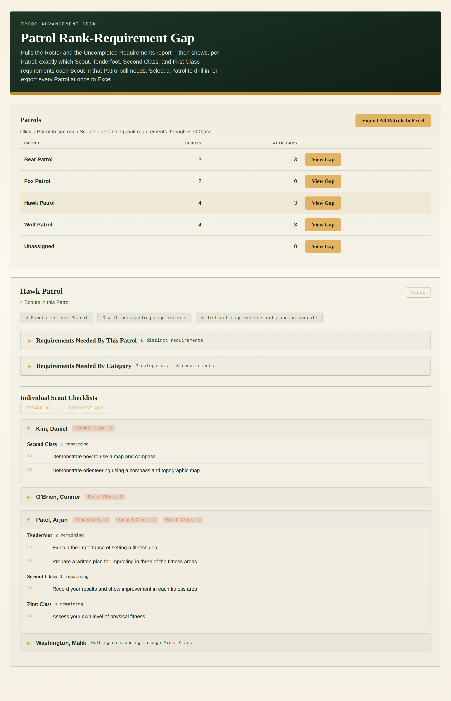
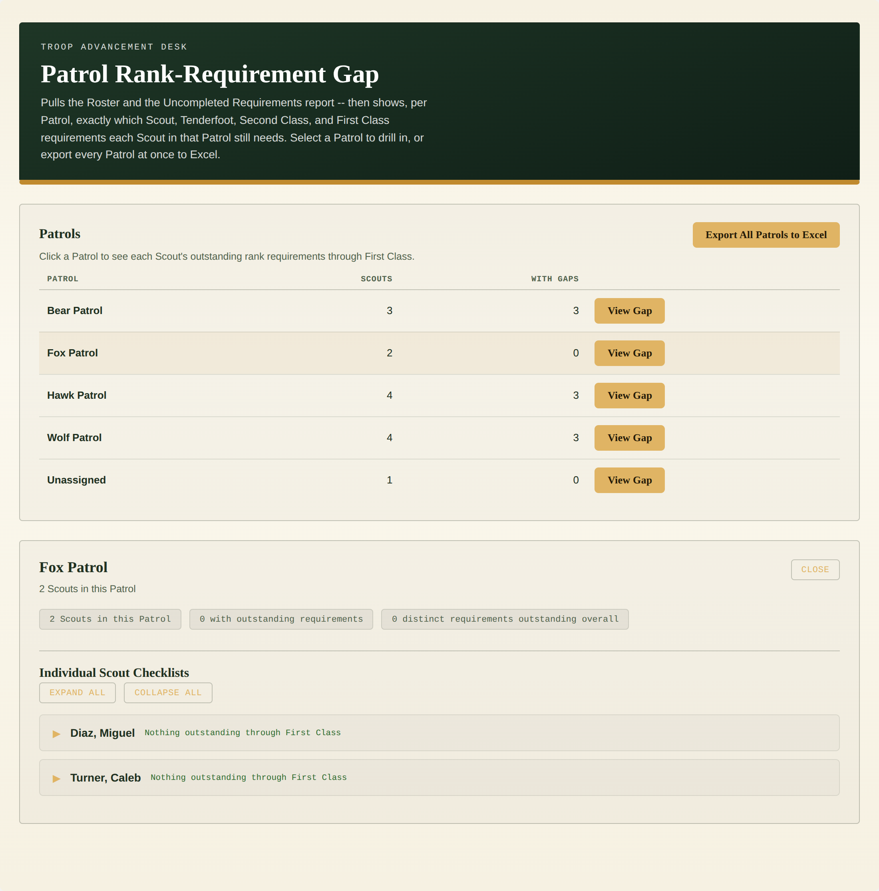
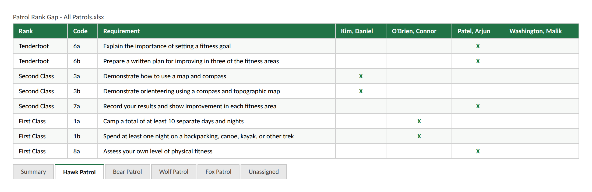

# Patrol Rank-Requirement Gap

A single-file custom page for TroopWebHost that pulls the full Roster and
the Uncompleted Requirements report, groups active Scouts by Patrol, and
shows exactly which Scout, Tenderfoot, Second Class, and First Class
requirements each Scout still needs -- one Patrol at a time, or all of
them at once as an Excel workbook.

Leader-only: both the Roster export and the Uncompleted Requirements
report require Adult Leader access on TroopWebHost. A Scout or parent
login is detected automatically (the same redirect-based check the other
tools in this repo use) and shown a plain "restricted" message rather
than a guessed-at scoped view.

All screenshots below use synthetic, fake Scout/Patrol data -- generated
with real headless Chromium (`gen_screenshots.js`, `puppeteer-core` +
`@sparticuz/chromium`) running the actual shipped `patrol-rank-gap.html`,
with only the Roster and Uncompleted Requirements network fetches swapped
for canned CSV text. No real troop data appears anywhere in this repo.

## Screenshots

**Patrol list** -- every Patrol on the Roster, with a headcount and how
many Scouts in it have at least one outstanding requirement, plus the
"Export All Patrols to Excel" button:

**Gap overview** -- clicking a Patrol shows summary chips, two collapsible
group-level sections, and one collapsible card per Scout:

**Requirements Needed By This Patrol** -- every outstanding requirement
across the Patrol, sorted by how many Scouts still need it, for planning
a group instruction session:

**Requirements Needed By Category** -- the same requirements grouped by
the official rank-requirement category and combined across ranks; note
"Fitness" here pulls together one Scout's Tenderfoot, Second Class, and
First Class Fitness requirements into a single group, each line tagged
with which rank it's for:

**Individual Scout Checklists** -- each Scout's own card expands to their
full requirement list by rank; a Scout with nothing outstanding is shown
as such rather than an empty card:

**All clear** -- a Patrol where every Scout is caught up through First
Class:

**Excel export** -- one tab per Patrol, laid out like Campout
Rank-Requirement Gap's "By Requirement" tab but with a column per Scout
in that Patrol -- an "X" marks that the row's requirement is still
outstanding for that Scout, sorted by rank then by how many Scouts still
need each row:

## What it shows

1. **Patrols** -- every Patrol found on the current Roster, with a headcount
   and how many of those Scouts have at least one outstanding requirement.
   Adults and departed members are excluded automatically. A Scout with no
   Patrol on the Roster lands in an "Unassigned" bucket rather than being
   silently dropped.
2. **Individual Scout Checklists** -- click a Patrol to see, per Scout, their
   outstanding Scout/Tenderfoot/Second Class/First Class requirements,
   grouped by rank, in a collapsible card. A Scout with nothing outstanding
   through First Class is shown as such rather than an empty card.
3. **Requirements Needed By This Patrol** -- the same requirements inverted:
   one row per requirement, sorted by how many Scouts in that Patrol still
   need it, for planning a group session instead of tracking one Scout at
   a time.
4. **Requirements Needed By Category** -- the same requirements grouped into
   the official rank-requirement categories, combined across ranks when the
   category name is identical (e.g. one "Fitness" group covering
   Tenderfoot/Second Class/First Class together, each line tagged with
   which rank it's for).
5. **Export All Patrols to Excel** -- downloads one workbook covering every
   Patrol at once: a Summary tab (headcount + gap count per Patrol) plus
   one tab per Patrol laid out like Campout Rank-Requirement Gap's "By
   Requirement" tab -- one row per distinct outstanding requirement
   (Rank, Code, Requirement text), sorted by rank then by how many
   Scouts in that Patrol still need it -- but with one column per Scout
   in the Patrol instead of a single names column, marked "X" wherever
   that Scout still needs that row's requirement. Unlike the per-Patrol
   screen view, this doesn't require selecting a Patrol first -- both
   reports are already loaded for the whole troop.

## Installation

1. Open `patrol-rank-gap.html` and copy its entire contents.
2. In TroopWebHost, go to **Manage Custom Pages**.
3. Create a new Custom Page (or edit an existing one) and paste the whole
   block into the HTML editor.
4. Save, then open the page.

This only works pasted directly into TroopWebHost's own site (same-origin)
-- it relies on your logged-in session to fetch reports. It will not work
copied into an external site or previewed elsewhere.

## How to use it

1. The page loads the Roster and the Uncompleted Requirements report
   automatically -- nothing to click to get started.
2. Click a Patrol row (or its **View Gap** button) to see each Scout's
   requirement gaps. No extra fetch happens on click -- both reports were
   already pulled once for the whole troop.
3. Click **Requirements Needed By This Patrol** or **Requirements Needed
   By Category** to expand those sections; click a Scout's card to expand
   their individual checklist. **Expand All** / **Collapse All** apply to
   the Scout cards only.
4. Click **Export All Patrols to Excel** at any time (it's enabled as soon
   as the page finishes loading) to download the full multi-tab workbook.
5. Click **Close** to collapse the results and pick a different Patrol.

Everything this page does is read-only report fetches -- no TroopWebHost
data is ever modified.

## Reports used

Every URL below was reverse-engineered from captured network requests, not
from official documentation, since TroopWebHost has no public API.

| Report | Menu_Item_ID |
|---|---|
| Roster (current + departed) | 45897 -- the same report Troop Stats already uses for its own Patrols table |
| Uncompleted Requirements for Rank Advancement | 46046 -- the same report OA Tracker's and Campout Rank-Requirement Gap's advancement sections already use |

Roster column names (Name, Patrol, Adult?, Left Unit) are auto-detected by
keyword, the same fuzzy-match approach `Troop Stats/Troop_Stats.html`
already uses (`PRG_GUESS` near the top of the `<script>` block), rather
than hardcoded -- only Name and Patrol are required for the page to work;
Adult? and Left Unit are used defensively to exclude adults and departed
members when present. The category-to-code mapping (`PRG_CATEGORIES`) is
identical to the one already cross-checked in
`Campout_Rank_Req/campout-rank-gap.html` against a real Uncompleted
Requirements export.

## Implementation notes

- **Name matching between the Roster and the Requirements report** uses
  the same last-name + first-word-of-first-name approach as every other
  tool in this repo, with one addition: it also tolerates a plain
  "First Last" value (no comma) defensively, in case a given troop's
  Roster export doesn't follow TroopWebHost's usual "Last, First"
  convention. Worth a spot-check against a real Roster export the first
  time this runs.
- **Excel sheet names** are sanitized and de-duplicated (`sanitizeSheetName()`)
  since Excel forbids `\ / ? * [ ] :` in a sheet name and caps names at 31
  characters -- a Patrol named something longer, or two Patrols that
  collide after truncation, still produce a valid, unique workbook.
- **Per-Patrol export sheets use `aoa_to_sheet()`, not `json_to_sheet()`**
  (`buildPatrolSheetAoa()`), since the column set is dynamic -- one column
  per Scout in that specific Patrol -- rather than a fixed set of object
  keys. The requirement-to-scout matrix itself is built by
  `buildPatrolRequirementMatrix()`, which keys "who needs this" by Scout
  *key* (the same normalized last+first key used everywhere else in this
  file) rather than display name, so two Scouts who happen to share a
  printed name still get distinct columns and correct marks.
- **No per-Patrol network request.** Unlike Campout Rank-Requirement Gap
  (which has to fetch a separate attendee list per campout), both reports
  here cover the whole troop up front, so selecting a Patrol or exporting
  everything is purely a local re-render of already-loaded data.
- Verified against synthetic fake data in a jsdom harness (`test_harness.js`,
  not needed to use the page -- kept for future edits) covering: adults
  excluded, departed members excluded, a Scout with zero outstanding
  requirements, an unmapped requirement code falling into "Other /
  Uncategorized", and the Unassigned-Patrol bucket. The README screenshots
  are generated the same way, against real headless Chromium instead of
  jsdom (`gen_screenshots.js`, also not needed to use the page).
- Same WebForms/theming conventions as every other page in this repo:
  every `<button>` has explicit `type="button"`, the file is pure ASCII,
  and the live-site color probe/adapt logic is ported unchanged from
  Campout Rank-Requirement Gap.

## Troubleshooting

- **A pull comes back empty with no error message**: open Tools ->
  Reporting Options on TroopWebHost. If it's set to "PDF only," a report
  may return a PDF instead of data, which SheetJS can't read.
- **"Roster export didn't have a recognizable Patrol column"**: your
  troop's Roster export uses a header that doesn't contain "patrol" in
  any form -- add it to the `patrol` list in `PRG_GUESS` near the top of
  the `<script>` block.
- **A Scout's name doesn't match between the Roster and the Uncompleted
  Requirements report**: matching is deliberately loose (see "Name
  matching" above) -- a Scout listed under meaningfully different names
  in the two exports (e.g. a nickname vs. a legal name) won't match.
  Worth a spot-check the first time this runs against real data.
- **Export to Excel doesn't trigger a download**: if TroopWebHost's page
  environment has a restrictive Content-Security-Policy or iframe
  sandboxing, it could block the client-side download `XLSX.writeFile()`
  normally triggers. Check the browser console for a CSP error.
