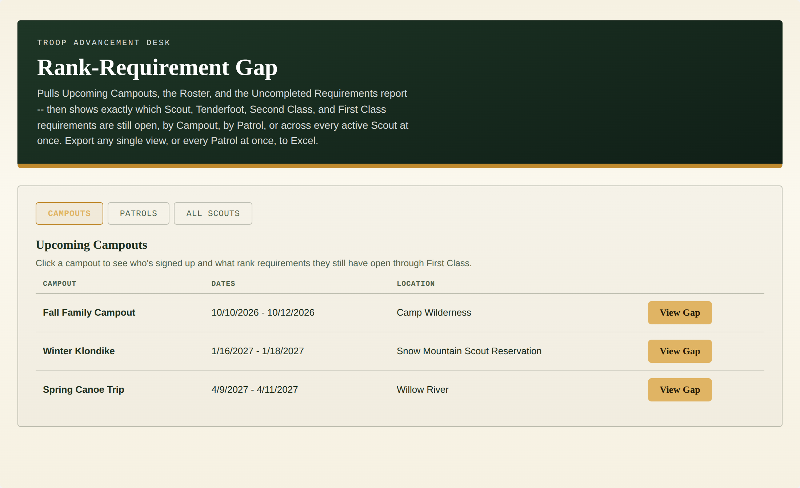
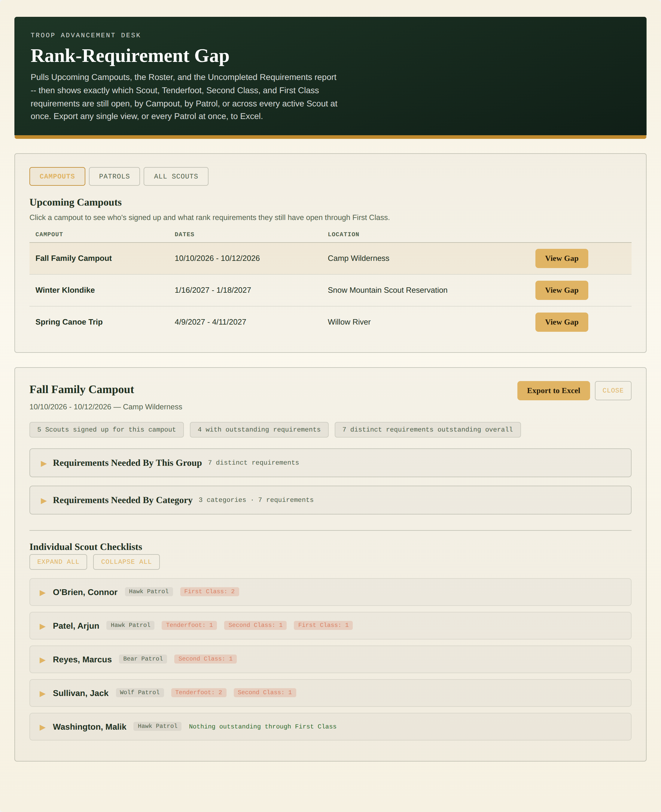
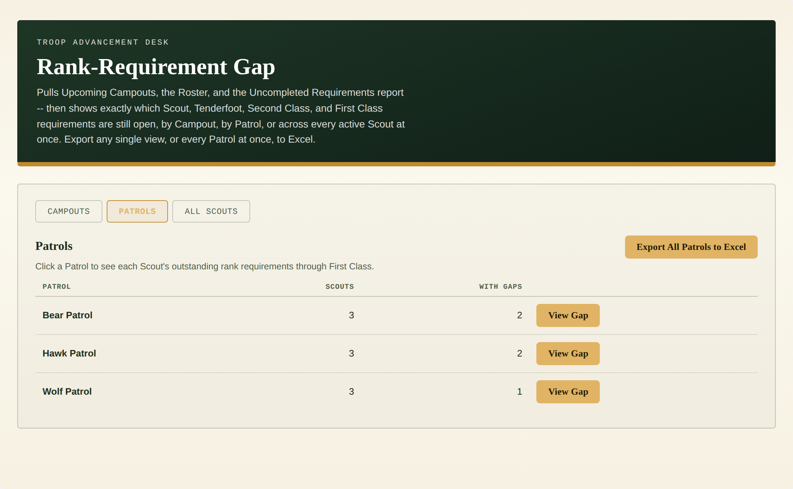
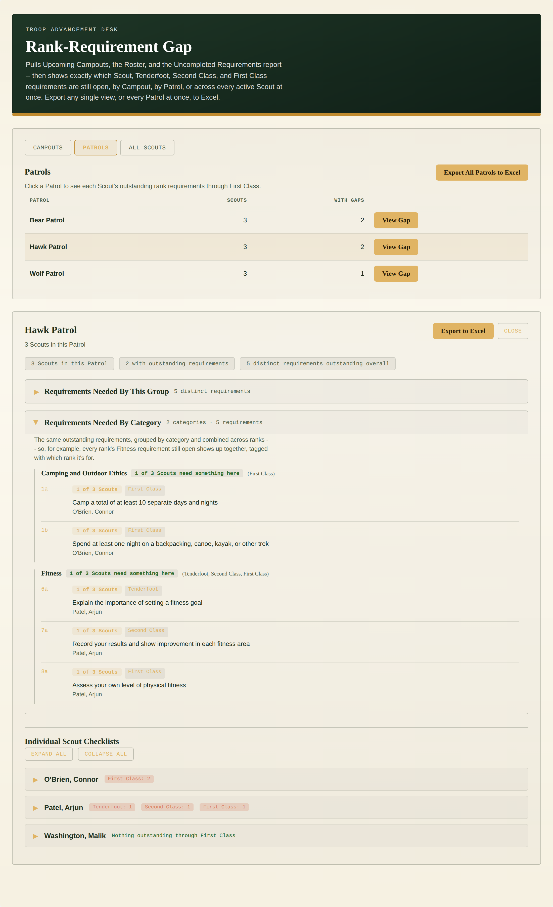
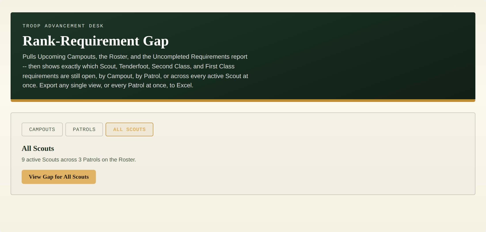
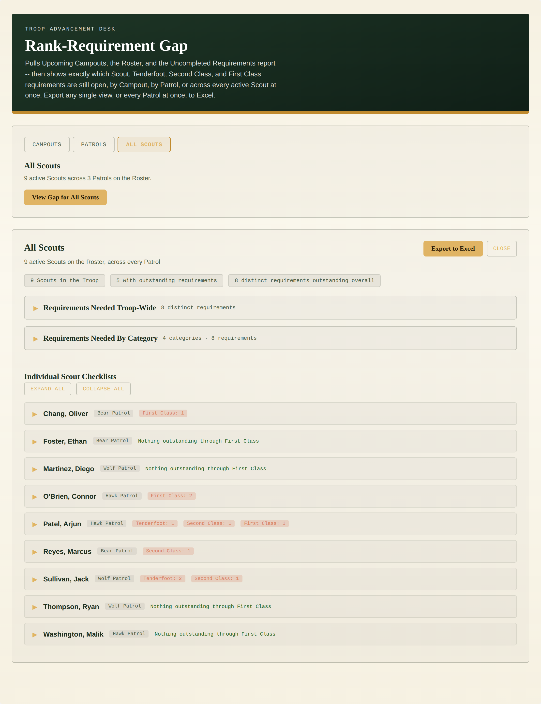
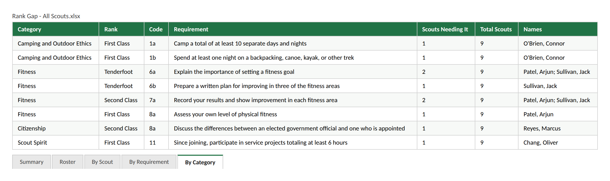
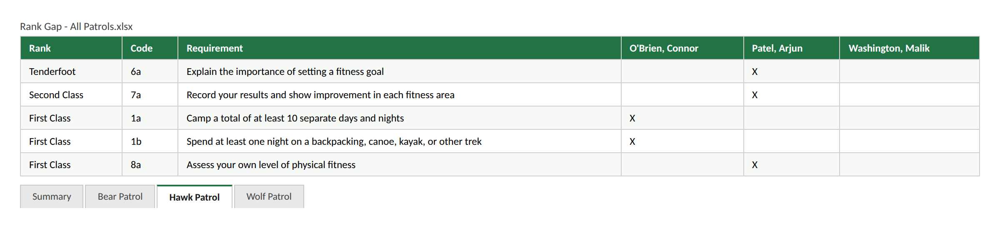

# Rank-Requirement Gap

A single-file custom page for TroopWebHost that shows exactly which Scout,
Tenderfoot, Second Class, and First Class requirements are still open --
by Campout, by Patrol, or across every active Scout on the Roster at
once. This merges what used to be two separate tools
(`Campout_Rank_Req/campout-rank-gap.html` and
`Patrol_Rank_Req/patrol-rank-gap.html`) into one page with a tab
switcher, so a troop only needs to paste one Custom Page instead of two.
Both standalone files are left in the repo for reference, but this one
supersedes them.

Restricted: the Upcoming Events list needs the Event Planner role, and the
Roster export and Uncompleted Requirements report need Rank Advancement (or
Site Administrator) on TroopWebHost -- see [Required roles](#required-roles). A Scout or parent login is detected automatically (the
same redirect-based check the other tools in this repo use) and shown a
plain "restricted" message rather than a guessed-at scoped view.

All screenshots below use synthetic, fake Scout/Patrol/Campout data --
generated with real headless Chromium (`gen_screenshots.js`,
`puppeteer-core` + `@sparticuz/chromium`) running the actual shipped
`rank-requirement-gap.html`, with only the three network sources (Roster,
Uncompleted Requirements, Upcoming Events + attendees) swapped for canned
CSV/HTML. No real troop data appears anywhere in this repo.

## Required roles

| Report | Menu_Item_ID | Roles that can reach it |
|---|---|---|
| Upcoming Events list and campout attendee detail | 56931 (Form_ID 163 / 259) | Event Planner |
| Roster export | 45897 | Membership, Rank Advancement, Site Administrator |
| Uncompleted Rank Requirements | 46046 | Adult Leader, Rank Advancement, Site Administrator |

The page loads all three when it opens, so a login needs all three: **Event Planner** plus **Rank Advancement**
(or plus **Site Administrator**). Rank Advancement or Site Administrator alone covers the Roster and Uncompleted
Requirements but not the Events Hub, so the page will report the restriction.

Roles come from the site's Task Role and Task Menu Items exports, matched on `Menu_Item_ID`, and were checked against a login that holds only the Adult role. They describe how one troop's TroopWebHost site is configured. A site administrator can change which tasks each role holds (**Menu > Administration > Security Configuration > Assign Tasks to Roles**), so confirm against your own site. A login that lacks access is redirected by TroopWebHost, which this tool detects and reports.

## Screenshots

**Campouts tab** (the default landing view) -- every upcoming campout on
the calendar:

**Campout gap** -- clicking a campout shows who's signed up (pooled from
multiple Patrols, so each Scout's card is tagged with their Patrol),
summary chips, two collapsible group-level sections, and a per-selection
**Export to Excel** button:

**Patrols tab** -- every Patrol on the Roster, with a headcount, a gap
count, and the bulk **Export All Patrols to Excel** button:

**Patrol gap, Requirements Needed By Category expanded** -- note
"Fitness" here merges one Scout's Tenderfoot, Second Class, and First
Class Fitness requirements into a single group, each line tagged with
which rank it's for; individual Scout cards in this view have no Patrol
tag since everyone shown is already in the same one:

**All Scouts tab** -- a one-button prompt to see every active Scout on
the Roster at once, regardless of Patrol:

**All Scouts gap** -- the same drill-down as a Campout or a Patrol, but
troop-wide; Patrol tags are back since Scouts are pooled from every
Patrol:

**Export to Excel** (the shared, per-selection export -- works the same
for a Campout, a Patrol, or All Scouts) -- Summary, Roster/Attendees, By
Scout, By Requirement, and By Category tabs; shown here is the By
Category tab for an All Scouts export:

**Export All Patrols to Excel** (the separate bulk export, Patrols tab
only) -- one tab per Patrol laid out as a Rank/Code/Requirement grid with
one column per Scout in that Patrol, marked "X" wherever that Scout still
needs the row's requirement:

## What it shows

**Campouts tab**
1. Every upcoming campout from the "Upcoming Events" widget (the same one
   on the TroopWebHost home page), filtered to the "Campout" event type.
2. Selecting one fetches (and caches) that campout's attendee list, then
   shows each attending Scout's outstanding requirements, tagged with
   their Patrol since attendees are pooled from across the troop.

**Patrols tab**
1. Every Patrol found on the Roster, with a headcount and how many of
   those Scouts have at least one outstanding requirement. Adults and
   departed members are excluded automatically. A Scout with no Patrol
   on the Roster lands in an "Unassigned" bucket rather than being
   silently dropped.
2. Selecting a Patrol needs no extra fetch -- the Roster and Uncompleted
   Requirements report are already loaded for the whole troop, so this
   is a local re-render.
3. **Export All Patrols to Excel** -- a bulk export, independent of
   whatever's currently selected: a Summary tab (headcount + gap count
   per Patrol) plus one tab per Patrol laid out as a
   Rank/Code/Requirement grid with one column per Scout in that Patrol,
   marked "X" wherever they still need that row.

**All Scouts tab**
- The same drill-down as selecting one Campout or Patrol, but built from
  every active Scout on the Roster at once, flattened across every
  Patrol (sorted alphabetically). No extra fetch either -- purely a local
  re-render of already-loaded data.

**Shared across all three tabs, once something is selected**
- **Individual Scout Checklists** -- each Scout's own card expands to
  their outstanding Scout/Tenderfoot/Second Class/First Class
  requirements, grouped by rank. A Scout with nothing outstanding through
  First Class is shown as such rather than an empty card.
- **Requirements Needed By This Group** -- the same requirements
  inverted: one row per requirement, sorted by how many Scouts in the
  current selection still need it, for planning a group session instead
  of tracking one Scout at a time. (Labeled "Requirements Needed
  Troop-Wide" in the All Scouts view.)
- **Requirements Needed By Category** -- the same requirements grouped
  into the official rank-requirement categories, combined across ranks
  when the category name is identical (e.g. one "Fitness" group covering
  Tenderfoot/Second Class/First Class together).
- **Export to Excel** -- a per-selection workbook (Summary,
  Attendees/Roster, By Scout, By Requirement, By Category tabs) for
  whatever's currently displayed, whether that's one Campout, one
  Patrol, or All Scouts.

The bulk Patrol-matrix export stays separate from the shared per-selection
export on purpose: a troop-wide matrix sheet would just be the union of
the per-Patrol ones with an extra column, so it wasn't added as a fourth
export path.

## Installation

1. Open `rank-requirement-gap.html` and copy its entire contents.
2. In TroopWebHost, go to **Manage Custom Pages**.
3. Create a new Custom Page (or edit an existing one) and paste the whole
   block into the HTML editor.
4. Save, then open the page.

This only works pasted directly into TroopWebHost's own site (same-origin)
-- it relies on your logged-in session to fetch reports. It will not work
copied into an external site or previewed elsewhere.

## How to use it

1. The page loads Upcoming Campouts, the Roster, and the Uncompleted
   Requirements report automatically -- nothing to click to get started.
2. Use the **Campouts / Patrols / All Scouts** tabs to switch views. Only
   selecting a Campout triggers a network fetch (for that campout's
   attendee list, cached after the first click); switching tabs or
   selecting a Patrol is instant.
3. Click a row's **View Gap** button (or **View Gap for All Scouts**) to
   drill in. Click **Requirements Needed By This Group** /
   **Requirements Needed By Category** to expand those sections; click a
   Scout's card to expand their individual checklist. **Expand All** /
   **Collapse All** apply to the Scout cards only.
4. Click **Export to Excel** in the results panel at any time to download
   a workbook for whatever's currently displayed, or, from the Patrols
   tab, **Export All Patrols to Excel** for the bulk multi-tab matrix
   regardless of selection.
5. Click **Close** to collapse the results and pick something else.

Everything this page does is read-only report fetches -- no TroopWebHost
data is ever modified.

## Reports used

Every URL below was reverse-engineered from captured network requests, not
from official documentation, since TroopWebHost has no public API.

| Report | Menu_Item_ID |
|---|---|
| Upcoming Events widget | 56931, Form_ID 163 -- the same "Upcoming Events" list shown on the TroopWebHost home page |
| Campout attendee detail | 56931, Form_ID 259, keyed by event ID -- linked from the row above |
| Roster (current + departed) | 45897 -- the same report Troop Stats already uses for its own Patrols table |
| Uncompleted Requirements for Rank Advancement | 46046 -- the same report OA Tracker's advancement section already uses |

Roster column names (Name, Patrol, Adult?, Left Unit) are auto-detected by
keyword, the same fuzzy-match approach `Troop Stats/Troop_Stats.html`
already uses (`RG_GUESS` near the top of the `<script>` block), rather
than hardcoded -- only Name and Patrol are required for the page to work;
Adult? and Left Unit are used defensively to exclude adults and departed
members when present. A campout's attendee list instead gets each
Scout's Patrol directly from that campout's own attendee table -- it
doesn't touch the Roster export at all for that. The category-to-code
mapping (`RG_CATEGORIES`) was cross-checked against a real Uncompleted
Requirements export when this was first built as two separate tools.

## Implementation notes

- **This file is a merge, not a rewrite.** It started from
  `patrol-rank-gap.html` with every `prg`/`PRG` identifier mechanically
  renamed to `rg`/`RG` (a plain, safe find-and-replace, since the prefix
  never appeared as a substring of anything else in that file), then had
  Campout Rank-Requirement Gap's event-list/attendee-fetch/HTML-table-parsing
  code layered in. The shared rendering functions
  (`buildRequirementGroups`, `buildCombinedCategoryGroups`, `renderGap`,
  etc.) were already written generically enough in the Patrol tool (via a
  `scope` parameter) to serve all three tabs without a rewrite.
- **Two different exports, on purpose.** The results panel's **Export to
  Excel** button reads from `currentGapExport`, a snapshot `renderGap()`
  refreshes on every selection -- the same shape regardless of whether
  the selection came from a Campout, a Patrol, or All Scouts, so one
  `buildGapExportWorkbook()` (ported from Campout Rank-Requirement Gap's
  original `buildExportWorkbook()`) covers all three. The bulk **Export
  All Patrols to Excel** button is unrelated to any selection --
  `buildPatrolsMatrixWorkbook()` reads straight from `rosterByPatrol`.
- **Name matching** uses the same last-name + first-word-of-first-name
  approach as every other tool in this repo, with one addition: it also
  tolerates a plain "First Last" value (no comma) defensively, in case a
  given troop's Roster export doesn't follow TroopWebHost's usual
  "Last, First" convention.
- **Excel sheet names** are sanitized and de-duplicated
  (`sanitizeSheetName()`) since Excel forbids `\ / ? * [ ] :` in a sheet
  name and caps names at 31 characters.
- **Patrol tags on Scout cards are conditional** (`scope.showPatrolTag`):
  shown for Campout and All Scouts selections, where Scouts are pooled
  from multiple Patrols, but suppressed for a single-Patrol selection
  where every Scout shown already shares the same one.
- Verified against synthetic fake data in a jsdom harness
  (`test_harness.js`, not needed to use the page -- kept for future
  edits) covering all three tabs: campout attendee fetch and its empty
  state, adults/departed exclusion, the Patrol tag showing/hiding
  correctly, and both export shapes. The README screenshots are
  generated the same way, against real headless Chromium instead of
  jsdom (`gen_screenshots.js`, also not needed to use the page).
- Same WebForms/theming conventions as every other page in this repo:
  every `<button>` has explicit `type="button"`, the file is pure ASCII,
  and the live-site color probe/adapt logic is unchanged from the two
  source tools.
- **Switching tabs clears the results panel.** `setMode()` tracks the
  currently active tab and, when the tab actually changes, calls the
  same `closeGapResults()` helper the results panel's own Close button
  uses -- hiding the results panel, dropping any selected-row
  highlighting in the Campouts/Patrols tables, and resetting the shared
  Export to Excel button (`currentGapExport = null`, disabled). Clicking
  a tab that's already active is a no-op for the results panel, so a
  fresh selection isn't wiped out by re-clicking the same tab.
- **Tab switching doesn't change the page width.** TWH's old WebForms
  table chrome has no fixed width for the area a custom page renders
  into -- it shrink-wraps to whatever's currently visible inside it, so
  swapping in a narrower or wider panel visibly resizes the whole page.
  Two things could each trigger that on their own, and both needed the
  same fix: (1) the Campouts/Patrols/All Scouts panels naturally differ
  in width, and merely toggling them with `display:none` removes the
  inactive ones from layout entirely, so the page is only ever as wide
  as whichever one is currently active; (2) the results panel is often
  the widest thing on the page (requirement grids, wrapping chips, mono
  req codes), so closing it the same way -- via the Close button or via
  `closeGapResults()` on a tab switch -- has the same effect in reverse.
  The fix in both cases is to never remove the element from layout:
  the three mode panels live in `#rg-modeStack` (`display:grid`, all
  three panels pinned to the same cell via `grid-area:1 / 1`), which
  sizes that shared cell to the union of all three panels' natural
  sizes regardless of which is active, and the inactive ones are
  hidden with `visibility:hidden` rather than `display:none` so they
  still count toward that sizing. `#rg-results` uses the same
  `visibility:hidden` swap for the same reason -- once it's rendered
  content, its last-rendered box stays in flow (just invisible) so
  closing it never shrinks the page either. Trade-off, in both cases:
  the container is permanently as tall as its tallest state, so a
  shorter tab (or no results shown yet) leaves blank space below.

## Troubleshooting

- **A pull comes back empty with no error message**: open Tools ->
  Reporting Options on TroopWebHost. If it's set to "PDF only," a report
  may return a PDF instead of data, which SheetJS can't read.
- **"Roster export didn't have a recognizable Patrol column"**: your
  troop's Roster export uses a header that doesn't contain "patrol" in
  any form -- add it to the `patrol` list in `RG_GUESS` near the top of
  the `<script>` block.
- **A Scout's name doesn't match between two sources**: matching is
  deliberately loose (see "Name matching" above) -- a Scout listed under
  meaningfully different names in two exports (e.g. a nickname vs. a
  legal name) won't match. Worth a spot-check the first time this runs
  against real data.
- **Export to Excel doesn't trigger a download**: if TroopWebHost's page
  environment has a restrictive Content-Security-Policy or iframe
  sandboxing, it could block the client-side download `XLSX.writeFile()`
  normally triggers. Check the browser console for a CSP error.
- **A campout's attendee list won't load**: check the campout's ID is
  still valid on the "Upcoming Events" widget -- if the event's Menu/Form
  IDs ever change on your installation, update `RG_EVENT_MENU_ITEM_ID`
  / `RG_EVENT_DETAIL_FORM_ID` near the top of the `<script>` block.
