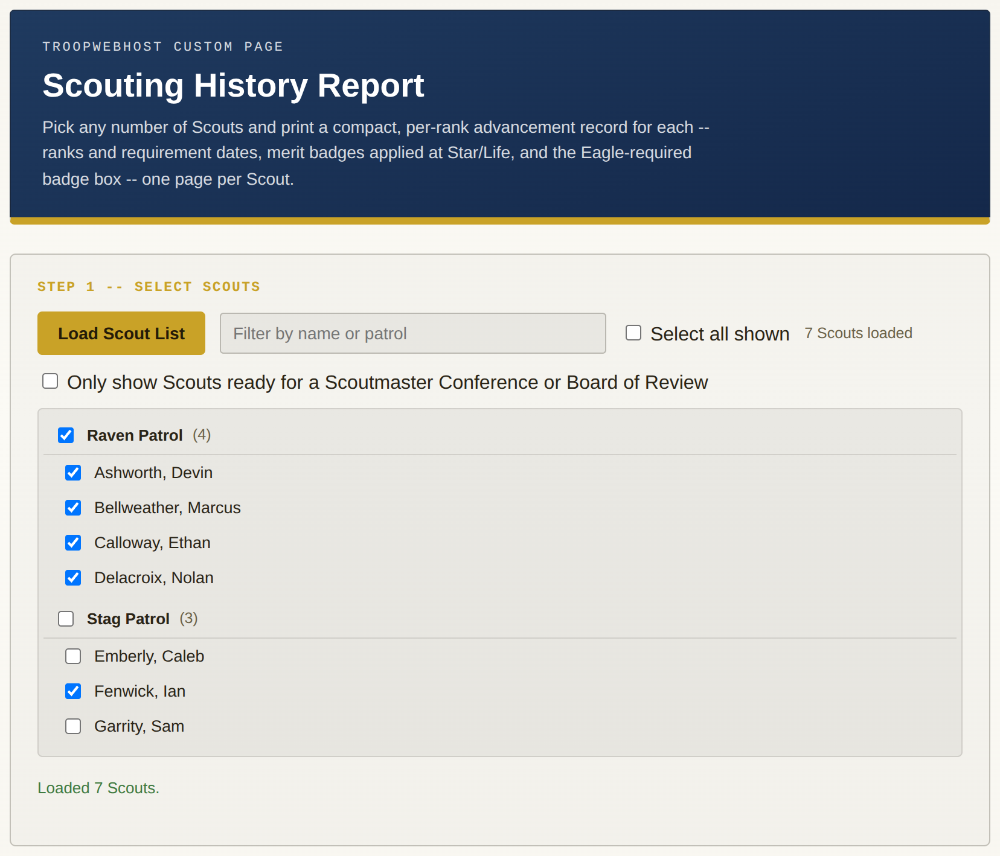
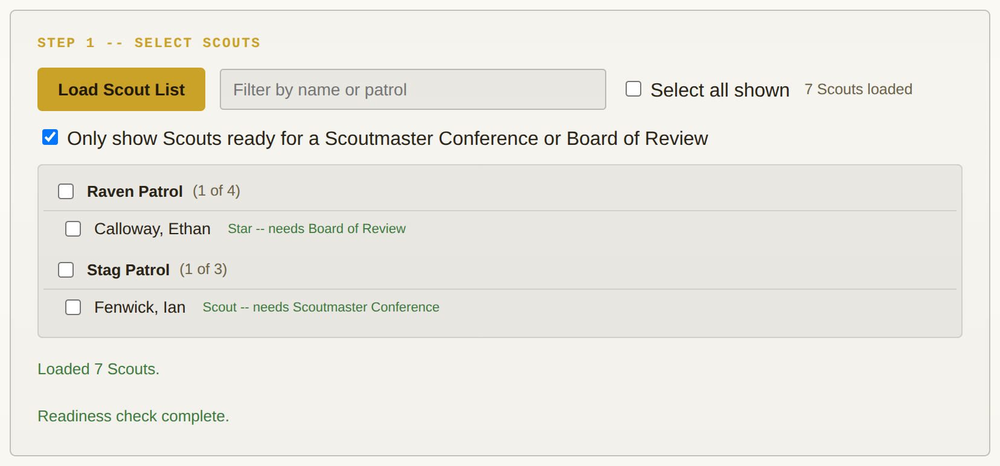
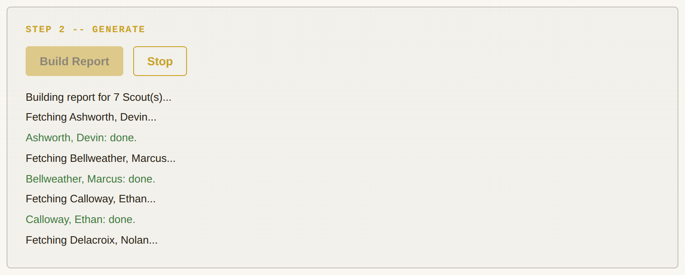
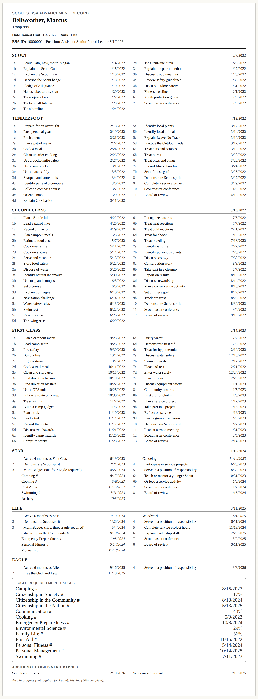
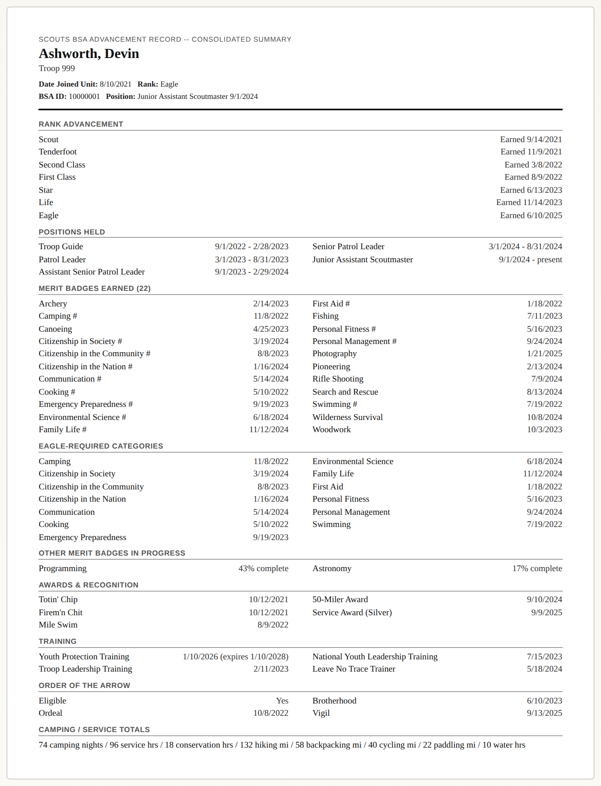
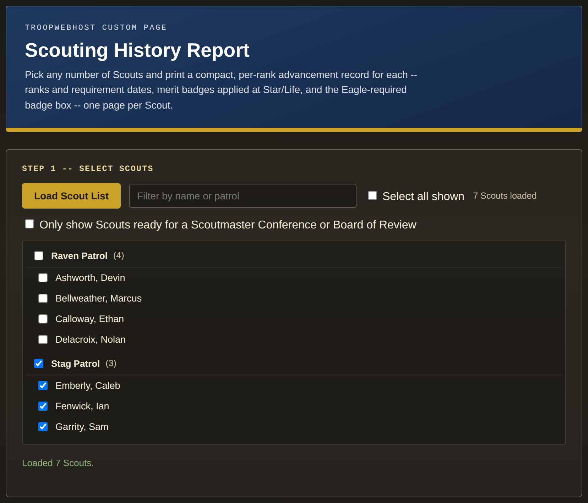

# Scouting History Report

A TroopWebHost (TWH) Custom Page that prints a compact **Scouts BSA Advancement Record** for any number of Scouts you pick -- current rank, BSA ID, unit position, every rank's requirement completion dates, the merit badges applied toward Star and Life, and an Eagle-required merit badge box. Each Scout gets their own printed page, in either of two views:

- **Detailed (per-requirement)** -- every rank with its numbered requirements and dates, in a two-column layout modeled on a Scoutbook-style individual advancement record.
- **One-Page Summary** -- a denser single page per Scout: rank list, full merit badge list, positions, awards, training, Order of the Arrow status, and camping/service totals, auto-shrunk to fit one Letter page.

It is read-only against TroopWebHost. Nothing is saved anywhere, and nothing leaves your browser.

> **All screenshots below use entirely synthetic data** -- invented Scouts, patrols, BSA IDs, dates, and unit number. No real member, troop, or location information appears anywhere in this folder.

---

## Screenshots

### Step 1 -- Pick your Scouts

The Scout list loads automatically as soon as the page opens, grouped by Patrol. Each Patrol has its own checkbox that selects everyone currently visible in that group, and the filter box narrows the list by name or patrol.

<p align="center">
  
</p>

### Find Scouts who are ready for a conference or board of review

Tick **Only show Scouts ready for a Scoutmaster Conference or Board of Review** and the tool checks each loaded Scout's advancement data, then keeps only those whose *only* remaining items for their next rank are the conference and/or board of review. Each match is tagged with the rank and which step is still outstanding. Patrol counts update live (for example "1 of 4").

<p align="center">
  
</p>

### Step 2 -- Build the report

Reports are fetched one Scout at a time (never concurrently -- TWH's session state races under concurrent requests). A **Stop** button appears while building; it lets the Scout currently being fetched finish and skips the rest, so an over-large selection doesn't have to be waited out.

<p align="center">
  
</p>

### Detailed view

One page per Scout. Each rank lists its completed requirements with dates in two columns. Star and Life list the merit badges applied to that rank under the "Merit Badges" line (Eagle-required badges marked `#`). Eagle adds a box of the Eagle-required badge categories -- each showing its earned date, or a percent complete if still in progress -- plus a list of other earned badges and any non-required badges still in progress.

<p align="center">
  
</p>

### One-Page Summary

The same Scouts, one dense page each. The page's font size steps down (10pt to a 6pt floor) based on the real rendered height until everything fits one printed Letter page.

<p align="center">
  
</p>

### Follows your site's theme

Like the other pages in this repo, it probes the live TWH theme at load and adapts its colors -- including switching between light and dark.

<p align="center">
  
</p>

---

## Installing

1. In TroopWebHost, go to **Manage Custom Pages** and open (or create) a Custom Page.
2. Open the page's **HTML editor** and paste the **entire contents** of `scouting-history-report.html`.
3. Save and view the page.

The page must run **on troopwebhost.org** so its requests inherit your logged-in session. It will not work pasted into an external site or previewed from a local file -- the requests are blocked without your session cookie.

## Using it

1. **Select Scouts.** The list loads on its own. Check individual Scouts, a whole Patrol, or **Select all shown**. Use the filter box and/or the readiness checkbox to narrow the list first if you like.
2. **Build Report.** Fetches each selected Scout's Scouting History Report and builds both views at once.
3. **Choose a view.** Toggle **Detailed** and **One-Page Summary** instantly -- no re-fetch.
4. **Print / Save as PDF.** Uses your browser's own print dialog. Each Scout starts on their own page. No PDF library is involved.

## What it fetches

Three things per run, in this order:

| # | Purpose | TroopWebHost endpoint |
|---|---------|-----------------------|
| 1 | Scout Directory (name, patrol, BSA number) -- builds the checklist | `FormReport.aspx?Menu_Item_ID=46012` |
| 2 | Scout BSA ID admin grid -- maps each Scout to TWH's internal person ID | `FormList.aspx?Menu_Item_ID=56934&Form_ID=3547` |
| 3 | Scouting History Report, once per selected Scout | `FormReportMultiSection.aspx?Menu_Item_ID=56926&Form_ID=1005&FK=<id>&ID=<id>&Stack=2&ReportFormat=XLS` |

Step 2 is required, not optional: the per-Scout report is fetched by internal person ID, and that grid is the only place TWH exposes it. Scouts are matched to the grid by BSA number first (immune to nickname/preferred-name differences), then by name for anyone without a BSA number on file. Anyone who still can't be matched is listed with an "ID not found" note and can't be selected.

Despite the `.XLS` extension, the history report (unlike most other `ReportFormat=XLS` exports on TWH, which are plain CSV) is a genuine binary Excel workbook. It is parsed client-side with [SheetJS](https://sheetjs.com/). Sheet 1 holds the member info, rank table, merit badge tables, awards, positions, training, totals, and OA status; Sheet 2 ("Rank Requirement Completion Dates") holds one row per completed requirement.

## Required access

Your TroopWebHost login must be able to open all three reports above -- in practice, **Leader-level access**, including the Membership Hub's Scout BSA ID admin grid. If a fetch is redirected (TWH's way of denying access), the tool shows a **Restricted** message explaining what's missing instead of failing silently; if only the per-Scout history report is denied, that Scout is reported as "access denied" in the build log and the rest continue.

## Good to know

- **Only completed requirements are shown.** TWH's export records a date only once a requirement is done and doesn't include the full official checklist. A rank a Scout is still working on lists just what's finished -- there are no blank "still to do" lines like a Scoutbook printout might show.
- **Rank date is "earned," not "awarded."** The awarded (ceremony) date isn't always recorded even once a rank is fully earned, so the earned date is used and the awarded date is only a fallback.
- **The "Position" line** shows whichever position(s) currently have no end date on file (or a future one). If none do, it falls back to the most recently held position. The one-page summary shows full position history.
- **Eagle-required badges come from TWH itself.** They are detected via TWH's own leading `*` on the badge name in the earned table. For badges still *in progress* (which carry no `*`), whether one counts toward Eagle is checked against a fixed list of the official Eagle-required categories built into the page.
- **"Additional Earned Merit Badges"** on the Eagle page means earned badges that are neither Eagle-required nor applied to Star or Life -- a simplification, since TWH's data model doesn't cleanly recover a three-tier grouping.
- **Readiness filter uses a built-in copy of the official requirement codes** (Scout through Eagle). It compares them against what TWH shows completed for a Scout's next rank and flags the Scout when only that rank's final conference and/or board of review remain. If BSA revises a rank's requirements, that copy needs a manual update. The check fetches each not-yet-checked Scout once, sequentially, and caches the result until the Scout list is reloaded.
- **One page isn't always possible.** A very advanced Scout's history may not fit one page even at the 6pt floor. That Scout then spills cleanly onto a second page, and a note names who.
- **Only `cdn.sheetjs.com` is used for scripts.** This repo's pages can only reliably load scripts from that host on TWH; other CDNs have been blocked in live testing (an earlier jsPDF-from-CDN attempt for the one-pager failed that way), which is why printing relies on the browser rather than a PDF library.
- **Undocumented endpoints.** TWH has no public API; these endpoints were discovered from HAR captures and can change without notice.

This is an unofficial community tool. It is not affiliated with or endorsed by Scouting America, Scouts BSA, or TroopWebHost, and its layout is modeled on -- not copied from -- any particular vendor's report.

## Regenerating the screenshots

`gen_screenshots.js` runs the actual shipped `scouting-history-report.html` in headless Chromium against an in-memory fake TroopWebHost: a synthetic Scout Directory (7 Scouts across two patrols at different advancement stages, including one Scout ready for a Board of Review and one ready for a Scoutmaster Conference), a fake BSA ID grid, and genuine binary `.xls` history workbooks in TWH's two-sheet layout. Nothing touches a real TWH site.

```bash
npm init -y
npm i puppeteer-core @sparticuz/chromium xlsx@0.18.5
node gen_screenshots.js            # expects scouting-history-report.html beside it
node gen_screenshots.js path/to/scouting-history-report.html
```

PNGs are written to `screenshots/`. SheetJS is served to the page from the local `xlsx` package, so the script doesn't need to reach the CDN.
