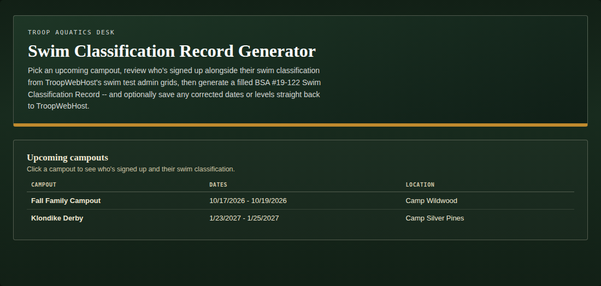
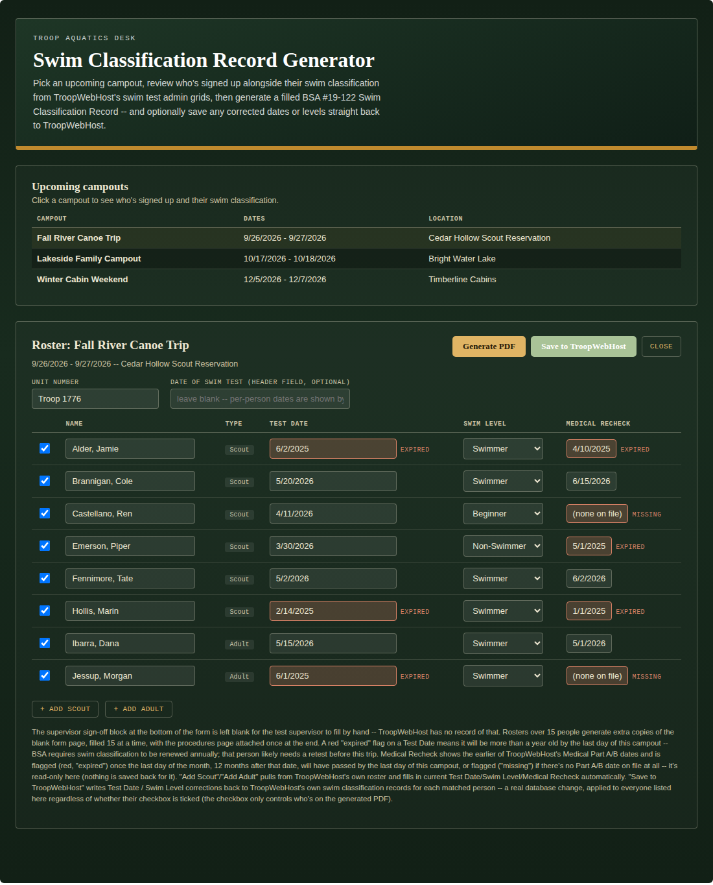
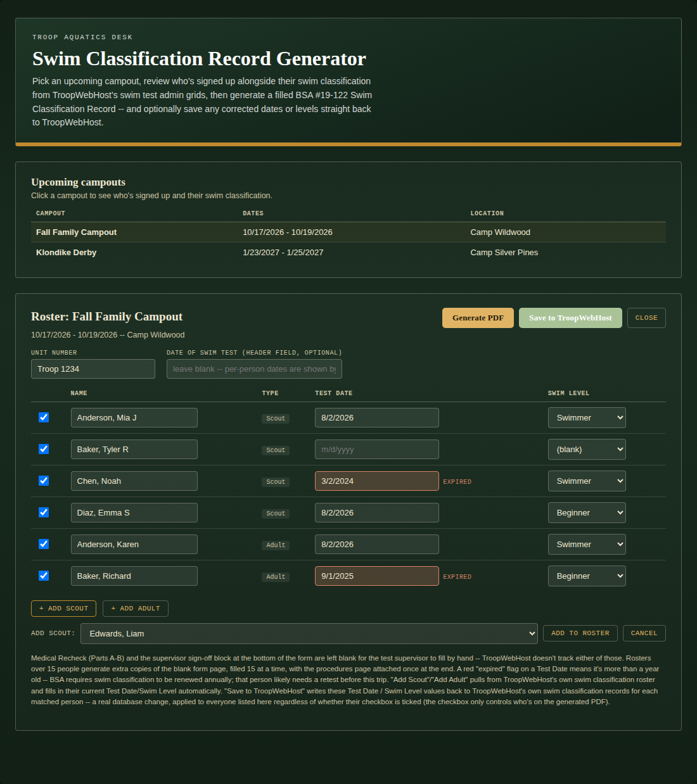
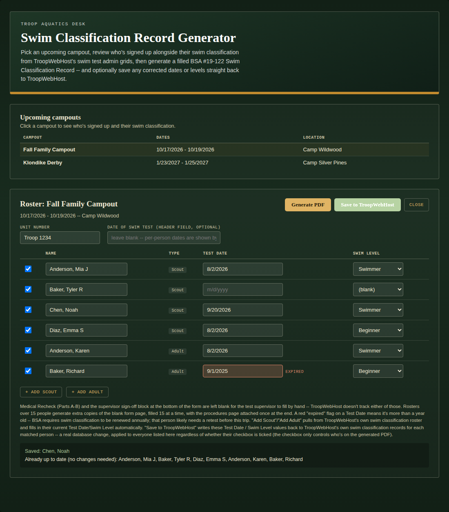
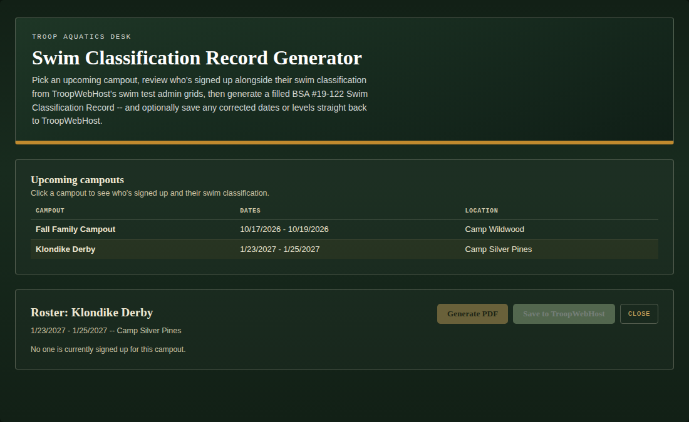
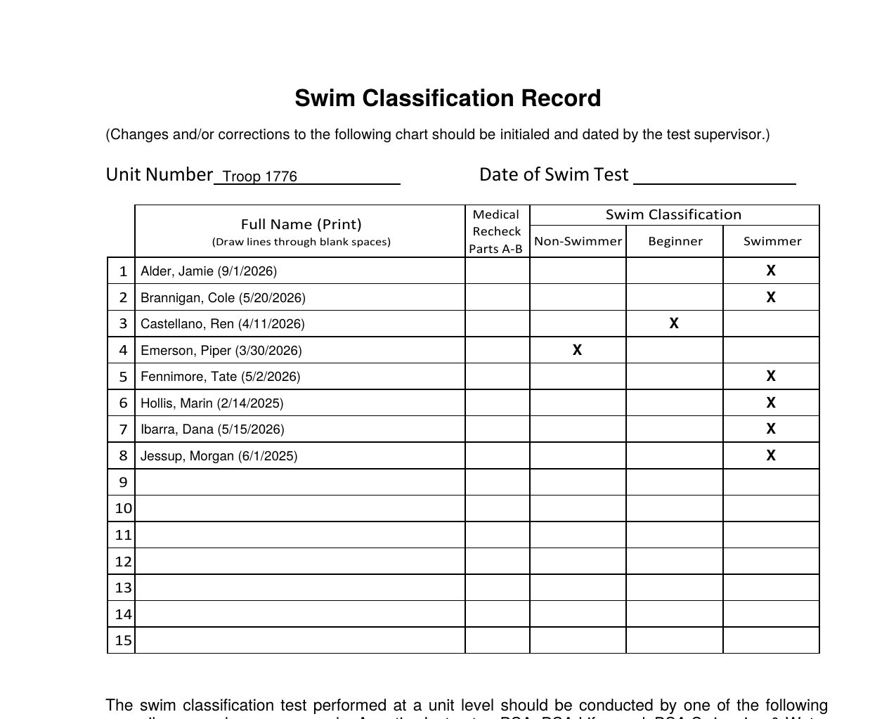

# Swim Classification Record Generator

A single-file custom page for TroopWebHost that pulls an upcoming campout's sign-up list, joins it against TroopWebHost's own swim classification and medical recheck records for both Scouts and Adults, flags anyone whose swim test or medical clearance will have lapsed by the trip, and generates a filled BSA #19-122 Swim Classification Record — ready to print and hand to the test supervisor. Corrected swim dates or levels can be saved straight back to TroopWebHost from the same screen.

Restricted: the Upcoming Events list needs the Event Planner role, and the swim classification / medical recheck admin grids need the Membership or Rank Advancement role, on TroopWebHost (see [Required roles](#required-roles)). A Scout or parent login is detected automatically (the same redirect-based check the other tools use) and shown a plain "restricted" message rather than a guessed-at scoped view.

## Required roles

| Data | Menu_Item_ID / Form_ID | Read/Write | Roles that can reach it |
|---|---|---|---|
| Upcoming Events list | 56931 (Form_ID 163) | Read | Event Planner |
| Campout event detail (attendee list) | 56931 (Form_ID 259) | Read | Event Planner |
| Swim classification grids (Scouts, Adults) | 56934 (Form_ID 2052 / 7322) | Read + Write | Membership, Rank Advancement |
| Medical Recheck grids | 56934 (Form_ID 2065 / 3545) | Read | Membership, Rank Advancement |

The page needs both halves, so a login needs **Event Planner** (Events Hub) plus **Membership** or
**Rank Advancement** (Membership Hub). No single role covers both. **Adult Leader** and **Site Administrator**
reach neither hub on their own.

Roles come from the site's Task Role and Task Menu Items exports, matched on `Menu_Item_ID`, and were checked against a login that holds only the Adult role. They describe how one troop's TroopWebHost site is configured. A site administrator can change which tasks each role holds (**Menu > Administration > Security Configuration > Assign Tasks to Roles**), so confirm against your own site. A login that lacks access is redirected by TroopWebHost, which this tool detects and reports.

## What it does

1. **Upcoming campouts** — every calendar event of type "Campout," click one to drill in.
2. **Roster** — everyone currently signed up (Scouts and Adults both), each row pre-filled with their current Test Date and Swim Level pulled directly from TroopWebHost's own "Update Swim Test Dates" admin grids — not a static export, the same live data a leader would edit by hand.
3. **Medical Recheck column** — the earlier of TroopWebHost's Medical Part A / Part B dates for each person, pulled from the same kind of admin grid. Read-only: there's no save path for this column, only the swim data.
4. **Expiration flagging, measured against the campout itself** — a Test Date more than a year old *by the last day of the campout* is highlighted red with an "expired" badge, since BSA requires swim classification to be renewed annually. Medical Recheck uses the real BSA rule instead — good through the last day of the month, 12 months after the date — checked against that same last-day-of-campout reference point, and flagged "missing" if there's no Part A/B date on file at all. Either way, the point is the same: a leader reviewing the roster *before* the trip sees whether something will have lapsed *during* it, not just whether it's lapsed as of today.
5. **Add Scout / Add Adult** — pulls a name from TroopWebHost's full swim classification roster (not just this campout's attendees) and auto-fills their current Test Date, Swim Level, and Medical Recheck date, for anyone who needs to be added to the trip roster after the fact. Type (Scout vs. Adult) is fixed once a row exists — a same-named Scout and Adult are different database records, so it's not left editable.
6. **Generate PDF** — fills the real, unmodified BSA #19-122 form with everyone checked, appending each person's own test date after their name (the printed form only has one date field at the top, and dates vary per person). The form's "Medical Recheck Parts A-B" column is left blank on purpose — the medical date is tracked and flagged on-screen only, not printed. Rosters over 15 people get extra copies of the blank form page.
7. **Save to TroopWebHost** — writes any corrected Test Date / Swim Level back to TroopWebHost's real swim classification records, for everyone on the roster regardless of whether their checkbox is ticked (the checkbox only controls who's on the generated PDF). Asks for confirmation first, and refetches afterward to confirm each change actually stuck before reporting success.

*(Fake/placeholder data shown above — not a real troop's calendar.)*

*(All names, patrols, and dates above are made up for these screenshots.)* Alder and Hollis show red "expired" swim tests, Castellano and Jessup show "missing" Medical Recheck dates, and Emerson and Hollis show "expired" Medical Recheck dates — every flag measured against this campout's own dates, not today's.

Adding someone who isn't on the campout's attendee list yet pulls from TroopWebHost's full swim classification roster and fills in their current data automatically:

Saving reports exactly what changed, per person:

A campout nobody's signed up for yet shows a plain empty state instead of an empty table:

And the actual generated PDF — the real, unmodified BSA form with names, per-person dates, and classification marks overlaid at measured coordinates. Note the "Medical Recheck Parts A-B" column stays blank by design, even though it's tracked and flagged on-screen:

*(Every name, patrol, and date across all six screenshots above is fictional — none of it is a real troop's data.)*

## Installation

1. Open `swim-classification-form.html`, copy its entire contents. No separate PDF upload needed — the page fetches the official BSA form live from `scouting.org` at runtime, confirmed working from a live TWH site.
2. In TroopWebHost, go to **Manage Custom Pages**.
3. Create a new Custom Page (or edit an existing one) and paste the whole block into the HTML editor.
4. Save, then open the page.

This only works pasted directly into TroopWebHost's own site (same-origin) — it relies on your logged-in session to fetch and save records. It will not work copied into an external site or previewed elsewhere.

## How to use it

1. Click an upcoming campout to load its roster. Unit Number auto-fills from your site's page title; edit it if it guesses wrong.
2. Review each row — a red "expired" Test Date means it will be more than a year old by the last day of *this* campout, not just as of today. Medical Recheck follows the same last-day-of-campout logic, using BSA's own good-through-end-of-month rule; "missing" means no Part A/B date is on file at all. Edit any Test Date or Swim Level directly if TroopWebHost's swim record is out of date (Medical Recheck is read-only here).
3. Use **+ Add Scout** / **+ Add Adult** to bring in anyone not already on the attendee list; their current swim and medical data fills in automatically.
4. Uncheck anyone who shouldn't be on the printed form (their swim data still gets saved if you use Save to TroopWebHost — the checkbox only affects the PDF).
5. Click **Generate PDF** to download the filled form, or **Save to TroopWebHost** to write any swim corrections back to the real records first (or do both, in either order).

## Endpoints used

Every URL below was reverse-engineered from captured network requests, not from official documentation, since TroopWebHost has no public API.

| Purpose | Menu_Item_ID / Form_ID | Read/Write |
|---|---|---|
| Upcoming Events list | 56931 (Form_ID 163) | Read |
| Campout event detail (attendee list, Scouts + Adults) | 56931 (Form_ID 259, keyed by event `ID`) | Read |
| Swim classification admin grid — Scouts | 56934 (Form_ID 2052) | **Read + Write** |
| Swim classification admin grid — Adults | 56934 (Form_ID 7322) | **Read + Write** |
| Medical Recheck admin grid — Scouts | 56934 (Form_ID 2065) | Read only |
| Medical Recheck admin grid — Adults | 56934 (Form_ID 3545) | Read only |

The swim classification grids are both read **and written** — this is the first tool in this repo that saves data back to TroopWebHost rather than only reading reports. The Medical Recheck grids are read-only: there's no save path for Medical Part A/B, only the on-screen flag and (deliberately) nothing on the PDF. See the implementation notes below for how the swim save actually works.

If something needs correcting, the values live in one place — search the file for `CONFIG` near the top of the `<script>` block.

## Implementation notes (durable warnings, not just history)

These are lessons from real bugs or deliberate design decisions, kept here so they aren't reintroduced by a future edit:

- **The swim classification grids are TroopWebHost's own "easyform" mechanism, not an ASP.NET postback.** There's no `__VIEWSTATE` or `__EVENTVALIDATION` anywhere on that page. It's a single `<form id="easyform">` holding an OLD-value hidden input plus a live input/select for every editable cell across every row on the page (all Scouts or all Adults at once), with the server diffing OLD vs. submitted-new per field to decide what changed. The only sane way to save one person's update is to fetch the whole page fresh, mutate just that person's input(s) in the fetched DOM, and serialize the page's own `<form>` element with a real `FormData` — never hand-build the field list. `fetchSwimGrid()` / `scrSaveChangesToTwh()` do exactly this.
- **Column IDs (e.g. `44039` for Scout Swim Date) are internal database IDs specific to one troop's TWH install.** Never hardcoded — each row's date input, level select, and read-only name cell are found by DOM shape (an `input[type=text]` and a `<select>` inside a `<tr>`), the same never-hardcode-site-specific-IDs reasoning as `discoverSelfSectionId()`.
- **A real database write deserves verification, not just a 200 response.** After posting, this page refetches the same grid fresh and confirms the field actually reflects the new value before reporting success to the leader.
- **The campout detail page can render more than one table matching "Participant" + a type column** (e.g. a waitlist widget alongside the real attending table) — attendees are de-duplicated by Type+Name after collecting all qualifying tables, keeping the first occurrence, so nobody shows up twice on the roster or the PDF.
- **Type (Scout/Adult) is fixed once a row exists, not an editable dropdown.** A same-named Scout and Adult are different database rows on TroopWebHost; letting a leader flip a row's type after the fact risked silently routing a save to the wrong person's record.
- **Both expiration checks are measured against the campout's own last day, not today's date.** A swim test or medical clearance that's still valid today but would lapse mid-trip should already read as expired when a leader reviews the roster beforehand — checking against "today" would let that slip through unflagged until it's too late to fix. Both `scrIsDateStale()` (swim) and `scrIsMedicalExpired()` (medical) pull their reference date from `currentEvent.end` via a shared `scrGetExpirationReferenceDate()`, falling back to today only if no campout is selected.
- **Medical expiration math is deliberately different from swim's.** Swim uses a rolling 365-day cutoff. Medical clearance is valid through the *last day of the month*, 12 months after the earlier of Part A/B — a real BSA rule, not a rounding shortcut. See `scrMedicalExpirationDate()`.
- **The Medical Recheck grid is read-only by design, and intentionally left off the printed PDF.** TroopWebHost's Medical Part A/B dates are tracked and flagged on-screen so a leader can catch a lapsed clearance before the trip, but there's no write path for it here (only swim data saves back), and the generated form's "Medical Recheck Parts A-B" column is left blank rather than printed — a deliberate choice, not an oversight, so double check with your own council/unit's paperwork practice if you'd rather it appear on the form.
- **The real #19-122 PDF has no fillable AcroForm fields** — it's a plain Word export. Text is drawn on top of the unmodified original at coordinates measured directly from the form's own PDF text layer plus a rendered test overlay, using pdf-lib in the browser.
- **The PDF template is fetched at runtime, not embedded as base64.** It's fetched straight from BSA's own official host (`scouting.org`), confirmed working from a live TWH site — despite an earlier version of this file assuming (incorrectly, or based on since-changed hosting) that scouting.org blocked cross-origin fetches and routing around it via a copy of the PDF staged on `raw.githubusercontent.com` instead. That staged copy (`Swim-Classificaiton-record-430-122.pdf` in this folder) is kept as a fallback — if scouting.org ever does start blocking this fetch, point `SCR_TEMPLATE_PDF_URL` at your own fork's raw.githubusercontent.com copy instead. Fetching directly from scouting.org also keeps the pasted custom-page HTML around 60KB instead of 240KB+, same as the GitHub-hosted approach did.
- **The printed form has only one "Date of Swim Test" field and 15 numbered rows.** Since test dates vary across a real roster, each person's own date is appended after their name in parentheses instead. Rosters over 15 people get additional copies of the blank template page, with the static procedures page attached once at the very end.
- **Access control here is a redirect, not an HTTP error.** Same as every other tool in this repo: `fetch()` follows redirects transparently, so the tell that a login can't reach a given page is `res.redirected`, not a non-2xx status.

## Troubleshooting

- **"Could not fetch the template PDF"**: check that `SCR_TEMPLATE_PDF_URL` in CONFIG is reachable and returns a PDF — the default points at BSA's own official `scouting.org` host, which was confirmed working from a live TWH site, but a firewall, ad-blocker, or a future change on BSA's end could still block it. If so, switch the URL to the `raw.githubusercontent.com` copy of `Swim-Classificaiton-record-430-122.pdf` staged in this folder (see the comment above `SCR_TEMPLATE_PDF_URL` in the file).
- **"This page is restricted to Adult Leaders"** on a login you believe should have access: the Upcoming Events list needs the Event Planner role, and the swim classification and Medical Recheck admin grids need the Membership or Rank Advancement role, on TroopWebHost itself (Adult Leader alone is not enough) — this page doesn't add any new restriction, it just detects and reports TroopWebHost's own.
- **A name on the roster shows blank Test Date/Swim Level/Medical Recheck** even though you know they've tested: check the spelling matches exactly between the campout attendee list and the swim/medical admin grids on your site — matching is exact-name (not fuzzy) since both come from the same underlying TroopWebHost database on this page, unlike the last-name-plus-first-word matching some of this repo's other tools use across *different* reports.
- **A test date looks fine to me but shows "expired"**: check the campout's own end date, not today's — the cutoff is measured back from the last day of the selected campout, so a test that's still current today can already show expired if it will lapse before the trip is over.
- **Save reports "could not save (see below)"**: either no matching record was found for that name in the relevant grid (check spelling), or the save posted successfully but the refetch didn't confirm the new value — worth checking that person's record directly on TroopWebHost before assuming the write silently failed.
- **The generated PDF's text looks misaligned**: this would mean BSA has revised the #19-122 form's layout since March 2022. The coordinates in `scrDrawHeader`/`scrDrawRow` were measured against that specific revision and will need re-measuring against a new one.
