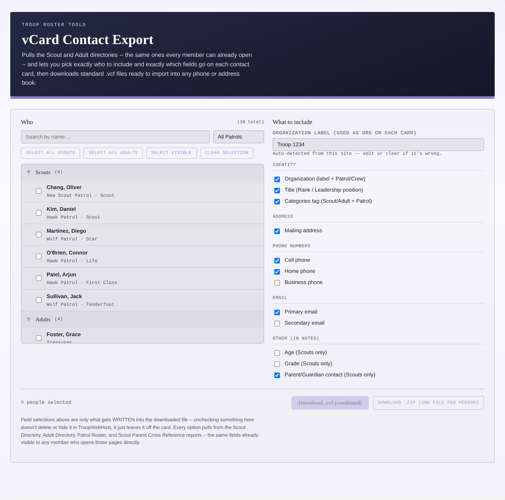
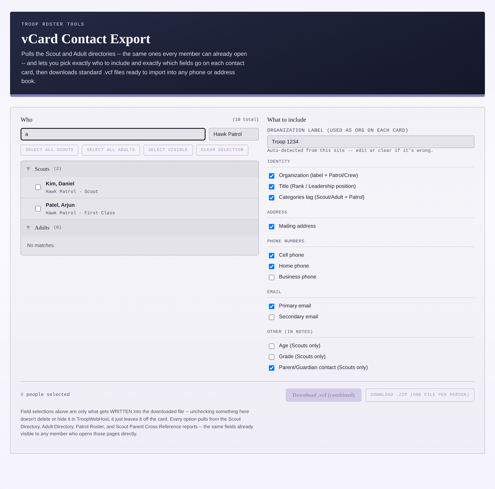
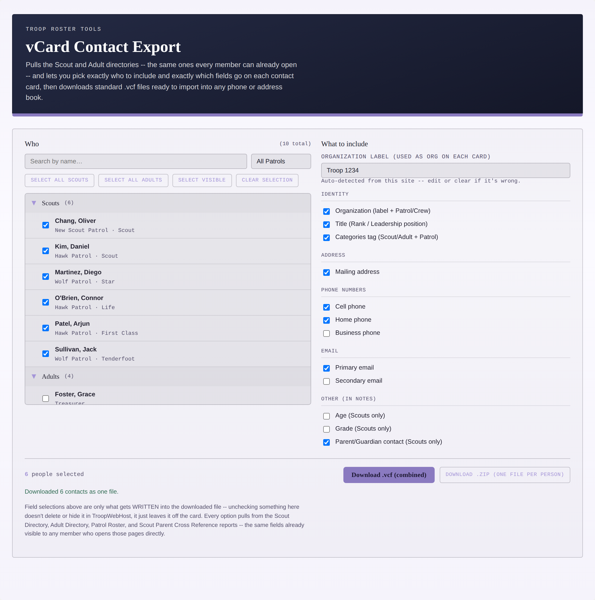
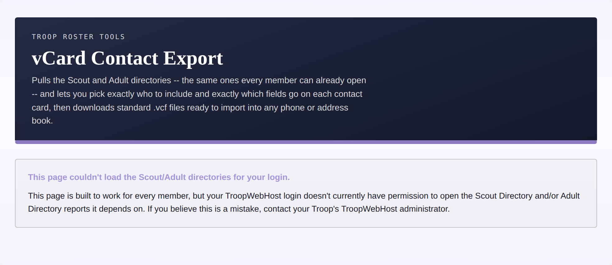
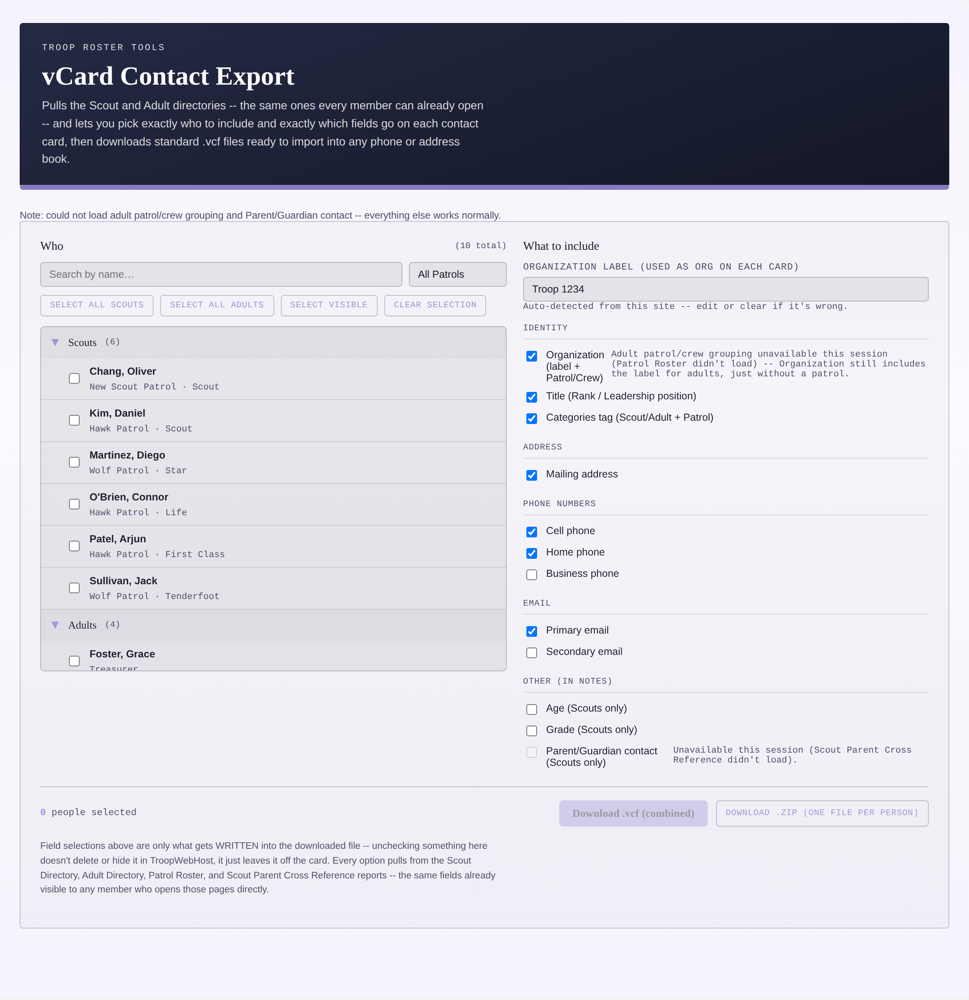

# vCard Contact Export

A single-file custom page for TroopWebHost that pulls the Scout Directory and Adult Directory — the same reports every member can already open — and lets you pick exactly who to include and exactly which fields go on each card, then downloads standard vCard (`.vcf`) files ready to import into any phone or address book.

**Member-accessible, not leader-only.** Every other data-pulling tool in this repo depends on at least one report that's restricted to Adult Leaders. This one is deliberately built around reports that ordinary Scout and parent logins can already open, so it works for anyone in the troop, not just leaders. A leader-only sibling exists with a richer field set pulled from the full roster export (BSA ID, birthday, emergency contacts, bio) for anyone who specifically needs those — this file trades that richness for universal access.

## What it does

1. **Who** — search by name, filter by patrol, and select people individually or in bulk (**Select All Scouts** / **Select All Adults** / **Select Visible** / **Clear Selection**). Selections persist across filtering.
2. **What to include** — independent checkboxes for Organization (troop label + Patrol/Crew), Title (Rank or Leadership position), a Categories tag, mailing address, Cell/Home/Business phone, primary/secondary email, and — in Notes — Age, Grade, and Parent/Guardian contact for Scouts. Nothing is forced on; every field is opt-in.
3. **Download** — either one combined `.vcf` (most contact apps import multi-card files fine) or a `.zip` with one `.vcf` per person.



*(Fake/placeholder Scouts, Adults, and troop number shown above — not a real troop's roster.)*

Search and the patrol dropdown narrow the Who list without losing anything already selected elsewhere:



Selecting people enables the download buttons and updates the count live:


Downloading shows a plain confirmation rather than leaving you guessing whether anything happened:



*(All names, addresses, and phone numbers in every screenshot above are made up for this README.)*

## Access

Confirmed that Scout Directory and Adult Directory are readable by ordinary Scout/parent logins on this site — the whole reason this version exists. The page still checks `res.redirected` on every fetch and shows a plain restricted message if that's ever wrong for a given login, rather than assuming a fixed pattern of access:



Two of the four reports this page uses are optional enrichments (adult patrol/crew grouping, and the Parent/Guardian contact field) rather than required — if either is unavailable for a given login, the page still works fully on the two required directories and just disables the one feature that depends on the missing report, with a plain note saying so:



## Installation

1. Open `vcard-export.html` and copy its entire contents.
2. In TroopWebHost, go to **Manage Custom Pages**.
3. Create a new Custom Page (or edit an existing one) and paste the whole block into the HTML editor.
4. Save, then open the page.

This only works pasted directly into TroopWebHost's own site (same-origin) — it relies on your logged-in session to fetch reports. It will not work copied into an external site or previewed elsewhere.

## How to use it

1. The page loads the Scout and Adult directories automatically — nothing to click to get started.
2. Narrow the **Who** list with the search box and/or patrol dropdown, then check the people you want. **Select All Scouts** / **Select All Adults** / **Select Visible** act on the underlying data regardless of what's currently filtered into view; **Clear Selection** empties it.
3. In **What to include**, check whatever fields you want written onto the cards. The **Organization label** field is prefilled from this site's own page title (e.g. "Troop 1234") — edit or clear it if that's wrong.
4. Click **Download .vcf (combined)** for one file with every selected person, or **Download .zip (one file per person)** for separate files. Both are disabled until at least one person is selected.

Everything this page does is read-only report fetches — no TroopWebHost data is ever modified. The moment a file downloads, though, it's outside TroopWebHost's own access controls — handle and share it the way you would any other export containing member contact info.

## Sample output

The output below came from actually running the shipped `buildVCard()` function against sample data (all names, addresses, and numbers made up) — not hand-written.

A Scout with every field checked:

```text
BEGIN:VCARD
VERSION:3.0
N:Sullivan;Jack;;;
FN:Jack Sullivan
ORG:Troop 1234;Wolf Patrol
TITLE:Tenderfoot
CATEGORIES:Scout,Wolf Patrol
ADR;TYPE=HOME:;;118 Birchwood Ln;Rivergrove;OH;44120;
TEL;TYPE=HOME:(216) 555-0142
EMAIL;TYPE=INTERNET:jack.sullivan.scout@example.com
NOTE:Age: 12\nGrade: 7\nParent/Guardian: Sullivan\, Mark (Parent) - H: 216-
 555-0142\; C: 216-555-0143 - mark.sullivan@example.com\nParent/Guardian: S
 ullivan\, Rachel (Parent) - C: 216-555-0177 - rachel.sullivan@example.com
REV:2026-09-12T18:17:23.366Z
END:VCARD
```

A phone or contacts app renders this as the Scout's name, organization "Troop 1234, Wolf Patrol", title "Tenderfoot", home phone, email, home address, and a Notes field with one line per Age/Grade/parent — the app unfolds the wrapped `NOTE` line and unescapes `\,` `\;` `\n` back into normal punctuation and line breaks automatically. That long `NOTE` line is the 75-character line folding in action: each continuation line starts with a single leading space, per the vCard spec.

An Adult with every field checked, patrol picked up via the Patrol Roster join:

```text
BEGIN:VCARD
VERSION:3.0
N:Martinez;Elena;;;
FN:Elena Martinez
ORG:Troop 1234;Old Goat
TITLE:Assistant Scoutmaster
CATEGORIES:Adult,Old Goat
ADR;TYPE=HOME:;;204 Sycamore Ct;Rivergrove;OH;44120;
TEL;TYPE=CELL:(216) 555-0201
TEL;TYPE=HOME:(216) 555-0198
EMAIL;TYPE=INTERNET:elena.martinez@example.com
REV:2026-09-12T18:17:23.376Z
END:VCARD
```

The same Scout again, but with only Cell and Primary Email checked and Organization cleared — showing how sparse the card gets with most boxes unchecked:

```text
BEGIN:VCARD
VERSION:3.0
N:Sullivan;Jack;;;
FN:Jack Sullivan
EMAIL;TYPE=INTERNET:jack.sullivan.scout@example.com
REV:2026-09-12T18:17:23.376Z
END:VCARD
```

No `TEL` line appears here even though Cell was checked, since this particular fake Scout has no cell number on file — every optional field is simply skipped when empty, never written out blank.

## Reports used

Every URL below was reverse-engineered from captured network requests, not from official documentation, since TroopWebHost has no public API. Two of the four are inferred from this site's Reports menu rather than directly HAR-captured — see the comment at the top of `vcard-export.html` for exactly how, and the near-duplicate report names to watch for if either ever needs re-diagnosing.

| Report | Menu_Item_ID | Required? |
|---|---|---|
| Scout Directory | 46012 | Required |
| Adult Directory | 46013 | Required |
| Patrol Roster | 46017 | Optional — adult patrol/crew grouping |
| Scout Parent Cross Reference With Contact Info | 52053 | Optional — Parent/Guardian contact field |

If something needs correcting, the values live in one place — search the file for `CONFIG` near the top of the `<script>` block.

## Implementation notes (durable warnings, not just history)

These are lessons from real bugs found while building and testing this page, kept here so they aren't reintroduced by a future edit:

- **No shared ID across these reports.** Unlike the leader-only roster export, these directory-style reports expose only a "Last, First Middle" display name — no BSA ID, no other stable identifier. Every person is keyed on row position (`scoutN` / `adultN`), and Patrol Roster / Parent Cross Reference are joined onto that name-based data rather than an ID.
- **The Cross Reference report formats names differently from the Directory reports, and a plain string match misses real people because of it.** Directory substitutes a Scout's preferred name directly (e.g. "Lastname, Nickname M"), while Cross Reference gives the legal first name with any nickname in quotes (e.g. "Lastname, Legalname M \"Nickname\""). `buildMatchKey()` treats both the first real word and any quoted nickname as valid match candidates for exactly this reason — confirmed against a real export (zero unmatched, zero ambiguous joins across dozens of parent rows).
- **A same-named parent and child can make a "confirmed unique match" wrong, not just ambiguous.** Patrol Roster has one row per patrol membership, so a parent and child sharing an identical "Last, First MiddleInitial" string (a real case on the troop roster used to build this) produces two different rows that both name-match the same adult. Checking "does this row match exactly one adult" isn't enough — both rows pass that check independently, so whichever came later in the CSV silently won, actually assigning a scout's own patrol to that scout's same-named parent. Fixed by excluding any Patrol Roster row that name-matches a *known Scout* at all before ever trying to match it against adults — the tradeoff is that a genuinely ambiguous adult is left with no patrol shown rather than a wrong one, which is the same "skip rather than guess" rule this repo uses everywhere else for uncertain joins.
- **Check `res.redirected` before `res.ok`, not after.** An earlier version checked `!res.ok` first, so if a redirect ever landed on a page that itself returned a non-200 (an access-denied page returning its own error status, for instance), the tool reported a generic "responded HTTP 403" message instead of correctly recognizing it as an access restriction. Found while building the screenshot harness below, where the mock "access denied" response surfaced exactly this case. Fixed by checking `res.redirected` first, unconditionally.
- **Sequential fetches required.** Same as every other tool in this repo: concurrent fetches race TroopWebHost's shared session state and can silently return empty data. All four report fetches here happen one after another, never via `Promise.all`.
- **No CDN dependency for the ZIP download.** The "one file per person" option is a hand-rolled ZIP writer (store method, no compression) rather than pulling in a new library — a flat folder of `.vcf` files doesn't need real compression, and it keeps this file dependency-free apart from SheetJS.
- **Access control here is a redirect, not an HTTP error.** `fetch()` follows redirects transparently, so the tell that a login can't reach a given report is `res.redirected`, not a non-2xx status — same pattern as every other tool in this repo.

## Screenshot generation

`gen_screenshots.js` drives the actual shipped `vcard-export.html` with Playwright, feeding it synthetic fake CSV data through intercepted network requests rather than reimplementing any of the page's own logic. It runs three separate passes — normal, "optional reports redirected" (degraded mode), and "required reports redirected" (restricted state) — to capture all six screenshots above.

`test_harness.js` is the non-visual counterpart, checking for exceptions, duplicate keys, and correct field/join output before any of this ships. It's fully self-contained — every row of data in it is invented for the test, including two deliberate edge cases (a nickname mismatch between Scout Directory and the Cross Reference report, and a parent/child sharing an identical name) that real exports have been observed to contain. It needs the page's own logic pulled out into a plain `logic_only.js` first, since the shipped file also contains DOM/fetch code that only makes sense running inside TroopWebHost:

```bash
python3 -c "
content = open('vcard-export.html').read()
s = content.index('/* ================= FETCH HELPERS')
e = content.index('/* ================= STATE / RENDER ================= */')
open('logic_only.js','w').write(content[s:e])
"
node test_harness.js
```

## Troubleshooting

- **A pull comes back empty with no error message**: open Tools → Reporting Options on TroopWebHost. If it's set to "PDF only," a report link may return a PDF instead of data, which SheetJS can't read.
- **Adult patrol grouping or Parent/Guardian contact is unavailable for everyone, every session**: check that Patrol Roster (46017) and Scout Parent Cross Reference With Contact Info (52053) are still open to the same login that can reach Scout/Adult Directory — they might have different permissions configured than the two required reports even though this tool otherwise treats "member-accessible" as one bucket.
- **A Scout's Parent/Guardian contact is missing even though they clearly have one on file**: matching between Scout Directory and the Cross Reference report is name-based (see Implementation notes above) — a Scout listed under meaningfully different names in the two reports beyond a simple nickname (e.g. a completely different name on file for one vs. the other) won't match. Worth a spot-check against a live export the first time this runs on a new site.
- **An adult you know has a patrol assignment shows none**: if that adult shares an exact "Last, First MiddleInitial" string with a Scout on the same roster, the join deliberately leaves it blank rather than risk assigning the wrong person's patrol — see the same-named parent/child case in Implementation notes.
